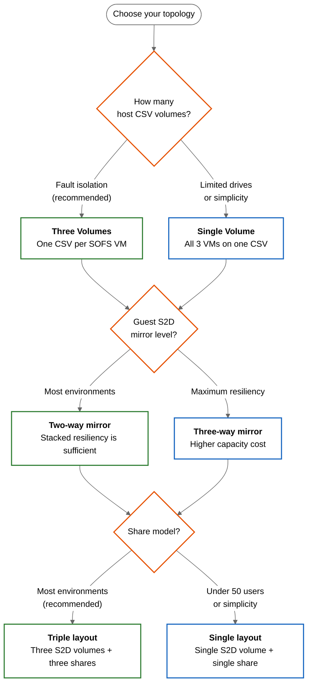
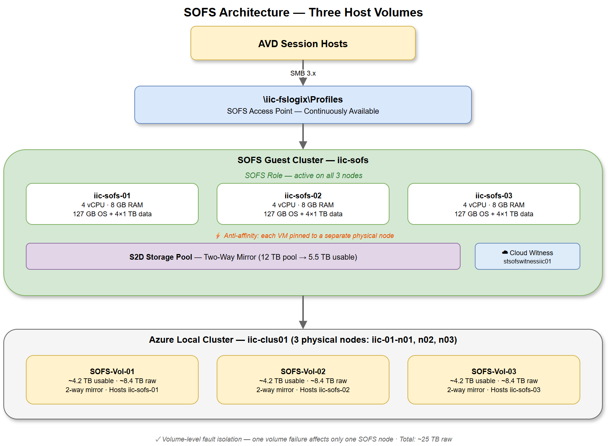
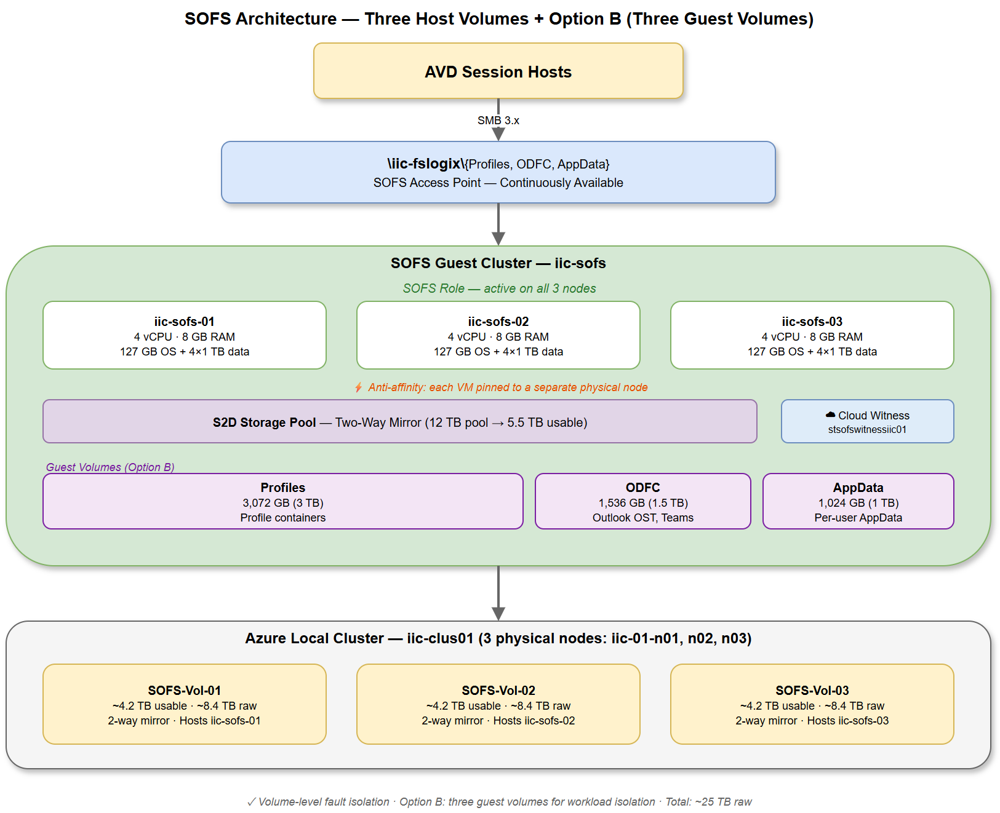
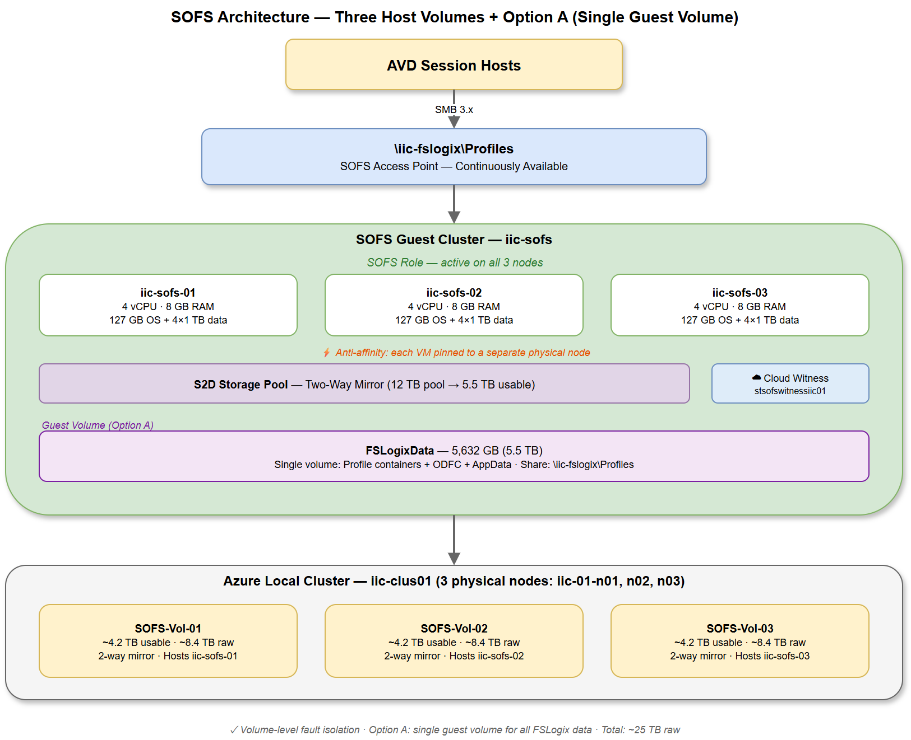
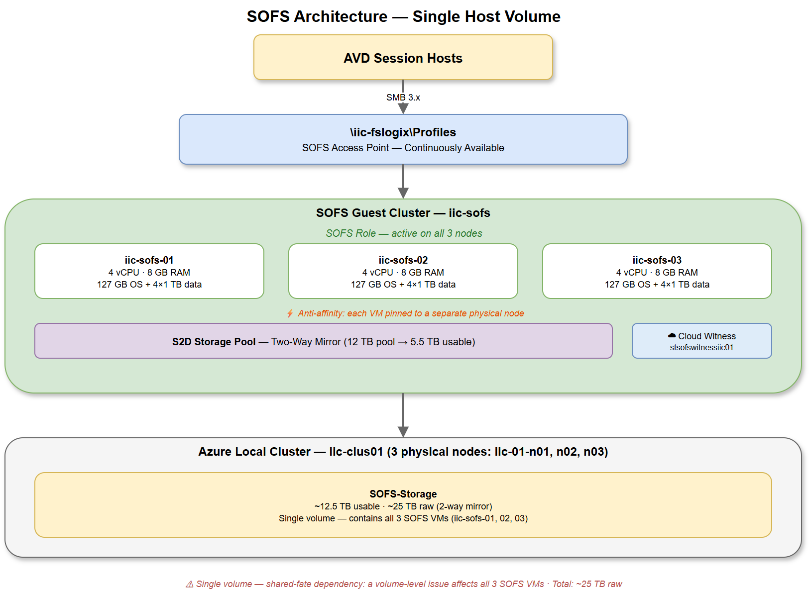
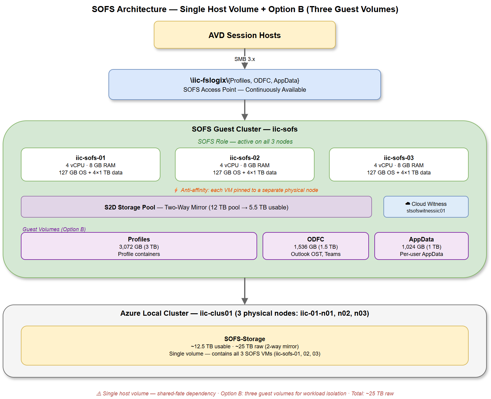
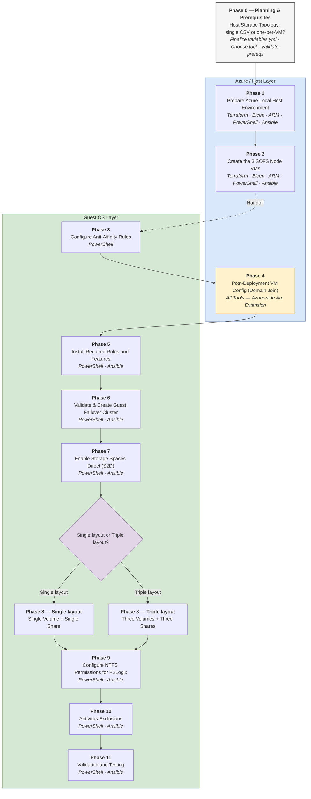
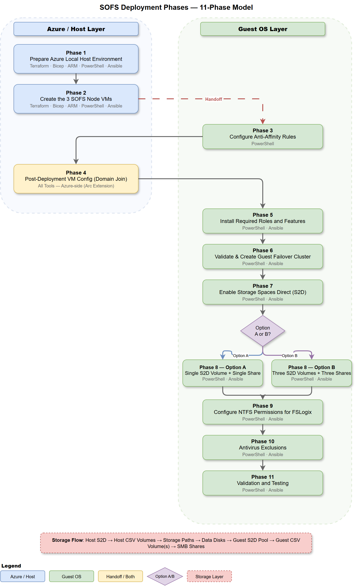

# Architecture Overview

This solution deploys a **3-node Scale-Out File Server (SOFS) guest cluster** running Storage Spaces Direct (S2D) on Azure Local, purpose-built to host FSLogix profile containers for Azure Virtual Desktop (AVD) session hosts.

---

## Solution Architecture

Three independent design decisions determine the storage topology:

1. **Host volume layout** — Place all 3 SOFS VMs on one CSV volume, or one VM per CSV for fault isolation?
2. **Guest S2D mirror level** — Two-way mirror (recommended) or three-way mirror?
3. **Guest share model** — Triple layout (three S2D volumes, three shares — recommended) or Single layout (one S2D volume, one share)?

Each decision is independent — pick one option from each row and deploy the matching combination. See [Storage Design](storage-design.md) for the full rationale, capacity impact, thin-provisioning warnings, and S2D tuning.

### Decision Flowchart

### Three Host Volumes (Recommended)

Each SOFS VM resides on its own Azure Local CSV volume. A volume-level failure affects only one VM — the guest S2D cluster survives on the remaining two nodes with zero interruption.

=== "Triple layout — Three Shares (Recommended)"

    Three separate guest S2D volumes (Profiles, ODFC, AppData) with dedicated SMB shares for each. NTFS metadata isolation and independent monitoring — recommended for most environments.

    

=== "Single layout — Single Share"

    One guest S2D volume and one SMB share hold all FSLogix data (profiles, ODFC, AppData). Simplest deployment — suitable for very small environments under 50 users.

    

### Single Host Volume

All three SOFS VMs share one Azure Local CSV volume. Simpler but without host-layer fault isolation — use only when the cluster cannot accommodate three separate volumes.

=== "Triple layout — Three Shares (Recommended)"

    Three volumes and three shares for workload isolation, even without host-layer fault isolation.

    

=== "Single layout — Single Share"

    One guest S2D volume and one SMB share — the simplest possible deployment.

    

### Recommended Combination by Environment

| Environment | Host Volumes | Mirror | Share Model |
|-------------|-------------|--------|-------------|
| Under 50 users, personal desktops | Single or Three | Two-way | Single layout or Triple layout |
| 50–500 users, mixed workloads | Three | Two-way | **Triple layout** |
| 500+ users, pooled session hosts | Three | Two-way | **Triple layout** |
| Maximum resiliency required | Three | Three-way | **Triple layout** |

---

## Key Design Points

| Component | Specification |
|-----------|---------------|
| **SOFS VMs** | 3 × Windows Server 2025 Datacenter: Azure Edition Core (Gen2) — 4 vCPU, 8 GB RAM each |
| **Guest Cluster** | Windows Failover Cluster with Storage Spaces Direct (S2D) |
| **SOFS Role** | Scale-Out File Server — single continuously available SMB endpoint |
| **Host Resiliency** | Azure Local two-way mirror CSV volumes |
| **Guest Resiliency** | S2D two-way mirror (recommended) or three-way mirror |
| **Client Access** | SMB3 with transparent failover via persistent handles |
| **Quorum** | Azure Storage Account cloud witness |

---

## Stacked Resiliency

Resiliency is applied at **two stacked layers** — a two-way mirror at the Azure Local host layer and a two-way mirror at the guest S2D layer — providing defense in depth without going overboard.

| Layer | Protection | Failure Tolerance |
|-------|-----------|-------------------|
| **Azure Local (host)** | Two-way mirror CSV volumes | Survives 1 physical node or disk failure |
| **Guest S2D** | Two-way mirror inside the VMs | Survives 1 SOFS VM failure |
| **Combined** | Stacked mirrors | A physical node failure takes out one SOFS VM; the guest S2D mirror continues serving profiles from the remaining two nodes with zero interruption |

The stacked approach means raw capacity requirements multiply — see [Capacity Planning](capacity-planning.md) for the full calculation methodology.

---

## Component Relationships

The solution builds through a layered stack:

1. **Azure Local cluster** (3+ physical nodes) provides the compute and storage substrate
2. **Host CSV volumes** (Azure Local two-way mirror) carve out dedicated storage for each SOFS VM
3. **SOFS VMs** (3 × Arc VMs) run Windows Server with Failover Clustering and S2D
4. **Guest S2D pool** aggregates data disks across all 3 VMs into a single storage pool
5. **Guest S2D volume(s)** are carved from the pool as two-way mirrored ReFS volumes
6. **SOFS role** presents a single, highly available SMB endpoint (`\\<sofs-access-point>\<share>`)
7. **AVD session hosts** connect to the SOFS SMB share(s) for FSLogix profile containers

---

## Deployment Phases

The solution begins with a **Phase 0 planning checkpoint** — finalize the host storage topology decision, populate `variables.yml`, and choose your deployment tool — then progresses through 11 execution phases spanning two layers: **Azure / Host** provisioning and **Guest OS** configuration. The handoff between layers happens after VM creation (Phase 2), with Domain Join (Phase 4) crossing back to the Azure layer briefly.

> [!TIP]
> **Full-resolution diagram**
> A draw.io source file is available at `docs/assets/diagrams/sofs-deployment-phases.drawio` for editing. The exported PNG is at [sofs-deployment-phases.png](../assets/images/sofs-deployment-phases.png). See [Deployment Paths](../deployment/paths.md) for guidance on choosing your tool combination.
>

---

## Why a Guest Cluster

This design uses a guest cluster (S2D running inside VMs on Azure Local) rather than hosting FSLogix shares directly on the Azure Local cluster's own SOFS. The separation provides:

- **Workload isolation** — The SOFS guest cluster is independent of the Azure Local infrastructure workloads. Maintenance, patching, and troubleshooting happen without touching the host cluster.
- **Dedicated resources** — CPU, memory, and storage are reserved specifically for FSLogix. No contention with other VMs running on the same cluster.
- **Independent scaling** — Guest S2D volumes can grow by adding or expanding data disks without modifying host-layer storage.
- **Portability** — The guest cluster design can be replicated across Azure Local clusters with different hardware configurations.

---

## Anti-Affinity

Each SOFS VM **must** run on a separate Azure Local physical node. Anti-affinity rules ensure the cluster scheduler never places two SOFS VMs on the same host.

Without anti-affinity, a single physical node failure could take out two (or all three) SOFS VMs simultaneously — defeating the entire purpose of the guest S2D cluster.

Anti-affinity is configured at the Azure Local host cluster level using:

- `New-ClusterAffinityRule` with `DifferentNode` type (Azure Local 23H2+ / Windows Server 2025)
- `AntiAffinityClassNames` as a fallback for older builds

---

## Cloud Witness

A 3-node cluster requires a quorum witness for majority voting. An Azure Storage Account cloud witness is the recommended model because:

- It does not consume an additional VM or file share
- It operates independently from the Azure Local cluster's own quorum
- Latency to Azure is acceptable for quorum heartbeats (small blob writes)
- It eliminates the need for a separate witness infrastructure

The cloud witness storage account is created in the same Azure resource group as the SOFS resources.

---

## Network Architecture

All SOFS VMs are connected to the compute logical network — the same network as the AVD session hosts.

### Required Ports — Between SOFS VMs

| Port | Protocol | Purpose |
|------|----------|---------|
| 445 | TCP | SMB — S2D replication, CSV redirected I/O |
| 5445 | TCP | SMB over QUIC (if used) |
| 5985–5986 | TCP | WinRM / PowerShell Remoting |
| 135 | TCP | RPC Endpoint Mapper — cluster communication |
| 49152–65535 | TCP | RPC dynamic ports — cluster and S2D |
| 3343 | UDP | Cluster network driver |

### Required Ports — SOFS to AVD Session Hosts

| Port | Protocol | Purpose |
|------|----------|---------|
| 445 | TCP | SMB — FSLogix profile access |

### Network Recommendations

- **Same VLAN** — Place SOFS VMs and AVD session hosts on the same compute network/VLAN for optimal latency. Routing hops add latency that impacts logon/logoff performance.
- **SMB encryption** — Enabled by default on the CA shares. All FSLogix traffic between session hosts and the SOFS is encrypted in transit.
- **Dedicated storage VLAN** — Optional. For very high-throughput environments, a second NIC on each SOFS VM for intra-cluster S2D replication traffic. Not required for most deployments.

---

## Identity and Authentication

### AD Domain Join Requirement

On Azure Local, all VMs — including the SOFS nodes and AVD session hosts — **must be AD domain-joined**. Pure Entra ID join is not supported for Azure Local Arc VMs.

### Authentication Flow

| Component | Identity | Auth to SOFS |
|-----------|----------|-------------|
| AVD session host | AD domain member | Kerberos — native |
| User at logon | AD domain user | Kerberos TGS for the SOFS access point |
| SOFS cluster | AD domain member | Kerberos — native |

Because both sides (session hosts and SOFS) are in the same AD domain, Kerberos authentication works automatically. No extra trust configuration is needed.

### Hybrid Entra ID Join

Hybrid Entra ID Join (domain-joined + registered in Entra ID) is supported and recommended for SSO to the AVD gateway. It does **not** change the SOFS authentication path — session hosts still use AD Kerberos for SMB access.

> [!NOTE]
> **Plan identity before deploying**
> The NTFS and SMB share permissions reference AD domain groups. If your AVD users are in a different domain or OU, adjust the group references during the [permissions configuration](../configuration/permissions.md).
>
---

## What's Next

| Topic | Link |
|-------|------|
| Host and guest volume layout decisions | [Storage Design](storage-design.md) |
| Raw-to-usable capacity calculations | [Capacity Planning](capacity-planning.md) |
| AVD identity, Cloud Cache, session host density | [AVD Considerations](avd-considerations.md) |
| Worked examples at different scales | [Deployment Scenarios](scenarios.md) |
