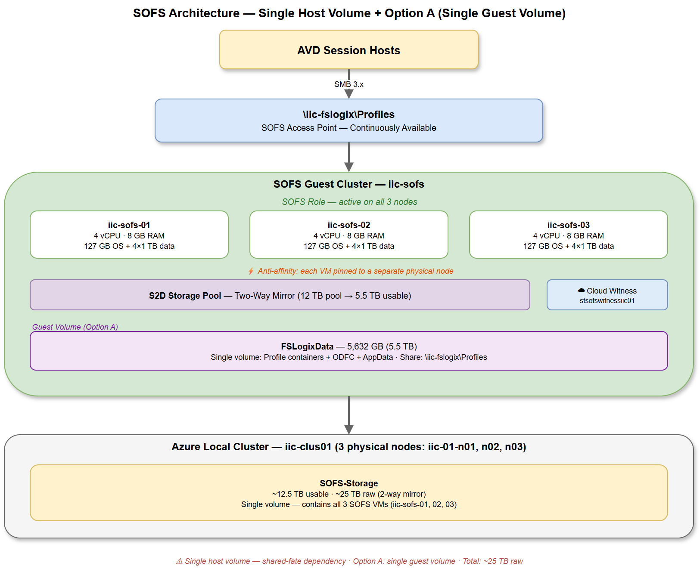

# Deployment Scenarios

## Overview

Three worked deployment scenarios demonstrate how the architecture decisions from the previous pages translate into concrete sizing and configuration. Each scenario starts with business requirements, makes design choices, works through the capacity math, and ends with the key variable values you would use.

Each scenario references its matching architecture diagram so you can see exactly what the deployment looks like.

---

## Scenario A: Small Shop — 5 Users, Personal Desktops

### Business Requirements

- 5 users with personal (persistent) AVD desktops
- Light office work — web browsing, Microsoft 365, light document editing
- Single Azure Local cluster with 3 nodes
- Budget-conscious — minimize raw disk consumption

### Design Choices

| Decision | Choice | Rationale |
|----------|--------|-----------|
| Host volume layout | **Single volume** | 5 users on personal desktops — the risk/complexity trade-off of three volumes isn't justified |
| Guest S2D resiliency | **Two-way mirror** | Standard protection; Azure Local mirror underneath provides the second layer |
| Guest share model | **Option A — single share** | 5 users generate negligible NTFS contention; one share is simplest |

### Architecture

<figure markdown="span">
  
  <figcaption>Single host volume with Option A — recommended for small environments</figcaption>
</figure>

### Capacity Math

| Metric | Calculation | Result |
|--------|-------------|--------|
| Per-user profile size | Light worker @ 10 GB | 10 GB |
| Total profile space | 5 × 10 GB | 50 GB |
| Growth buffer (20%) | 50 GB × 1.2 | **60 GB usable** |
| Guest S2D two-way mirror | 60 GB × 2 | 120 GB raw in S2D pool |
| Per-VM data disks | 3 VMs × 4 disks = 12 disks | 4 × 50 GB per VM (minimum practical size) |
| Azure Local volume (usable) | 1 × ~750 GB (OS + data for all 3 VMs) | ~750 GB |
| Azure Local two-way mirror (raw) | 750 GB × 2 | **~1.5 TB physical disk** |

**Raw-to-usable ratio: ~25 : 1**

!!! note "Minimum practical sizes"
    The ratio looks extreme because the usable space is tiny (60 GB) but the infrastructure overhead is fixed (3 VMs × OS disks, S2D metadata, host volume overhead). For very small deployments, the capacity tax is proportionally larger. However, the absolute raw footprint (~1.5 TB) is trivial for any Azure Local cluster.

### Key Variable Values

```yaml
# Scenario A — 5 users, personal desktops
vm:
  prefix: "iic-sofs"
  count: 3
  processors: 4
  memory_mb: 8192

data_disks:
  count: 4
  size_gb: 50

s2d:
  volume_name: "FSLogixData"
  volume_size_gb: 60
  data_copies: 2

sofs:
  name: "FSLogixSOFS"
  cluster_name: "sofs-cluster"
  share_name: "Profiles"
```

---

## Scenario B: Mid-Size — 200 Users, Pooled Desktops

### Business Requirements

- 200 knowledge workers using pooled (non-persistent) AVD session hosts
- ~10 session hosts at 20 users each
- Microsoft 365 with Outlook, Teams, OneDrive
- Moderate logon storm risk (shift-based work, morning peak)
- Organization requires fault isolation for storage

### Design Choices

| Decision | Choice | Rationale |
|----------|--------|-----------|
| Host volume layout | **Three volumes** | 200 users on pooled desktops — SOFS availability is critical; fault isolation justified |
| Guest S2D resiliency | **Two-way mirror** | Standard protection; three-way not justified for profile data |
| Guest share model | **Option A — single share** | 200 users is below the 500-user threshold; Outlook/Teams usage is moderate |

### Architecture

<figure markdown="span">
  
  <figcaption>Three host volumes with Option A — fault isolation without share complexity</figcaption>
</figure>

### Capacity Math

| Metric | Calculation | Result |
|--------|-------------|--------|
| Per-user profile size | Knowledge worker @ 20 GB | 20 GB |
| Total profile space | 200 × 20 GB | 4 TB |
| Growth buffer (10%) | 4 TB × 1.1 | **4.4 TB usable** |
| Guest S2D two-way mirror | 4.4 TB × 2 | 8.8 TB raw in S2D pool |
| Per-VM data disks | ~9 TB pool ÷ 3 VMs = 3 TB/VM → 4 × 800 GB | 4 × 800 GB per VM (12 disks total) |
| Azure Local volumes (usable) | 3 × ~3.3 TB (OS + data per VM) | ~10 TB total |
| Azure Local two-way mirror (raw) | 10 TB × 2 | **~20 TB physical disk** |

**Raw-to-usable ratio: ~4.5 : 1**

### Key Variable Values

```yaml
# Scenario B — 200 users, pooled desktops
vm:
  prefix: "iic-sofs"
  count: 3
  processors: 4
  memory_mb: 8192

data_disks:
  count: 4
  size_gb: 800

s2d:
  volume_name: "FSLogixData"
  volume_size_gb: 4505    # 4.4 TB + overhead
  data_copies: 2

sofs:
  name: "FSLogixSOFS"
  cluster_name: "sofs-cluster"
  share_name: "Profiles"
```

---

## Scenario C: Enterprise — 2000 Users, High-Density Pooled

### Business Requirements

- 2000 users across multiple departments
- 40 pooled session hosts at 50 users each
- Heavy Microsoft 365 usage — large Outlook mailboxes, Teams meetings, OneDrive sync
- Significant logon storm risk (morning peak: 800+ concurrent logons in 10 minutes)
- Operations team requires per-workload monitoring and capacity management
- Cloud Cache for DR to Azure Blob Storage

### Design Choices

| Decision | Choice | Rationale |
|----------|--------|-----------|
| Host volume layout | **Three volumes** | Non-negotiable at this scale — fault isolation is a hard requirement |
| Guest S2D resiliency | **Two-way mirror** | Even at enterprise scale, the host-layer mirror provides sufficient protection |
| Guest share model | **Option B — three shares** | 2000 users with heavy Outlook/Teams = significant NTFS metadata contention; split shares isolate workloads |

### Architecture

<figure markdown="span">
  
  <figcaption>Three host volumes with Option B — maximum fault isolation and workload separation</figcaption>
</figure>

### Capacity Math

| Metric | Calculation | Result |
|--------|-------------|--------|
| Per-user profile size (Profile container) | 15 GB (without Outlook/Teams) | 15 GB |
| Per-user ODFC size | 10 GB (Outlook OST + Teams cache) | 10 GB |
| Per-user AppData | 2 GB | 2 GB |
| Total per user | 15 + 10 + 2 | 27 GB |
| Total all users | 2000 × 27 GB | 54 TB |
| Growth buffer (10%) | 54 TB × 1.1 | **~59.5 TB usable** |

**Split across Option B volumes:**

| Volume | Allocation | Size |
|--------|------------|------|
| Profiles | ~55% | 32.7 TB |
| ODFC | ~35% | 20.8 TB |
| AppData | ~10% | 6 TB |
| **Total** | | **59.5 TB** |

| Metric | Calculation | Result |
|--------|-------------|--------|
| Guest S2D two-way mirror | 59.5 TB × 2 | 119 TB raw in S2D pool |
| Per-VM data disks | ~120 TB ÷ 3 VMs = 40 TB/VM → 4 × 10 TB | 4 × 10 TB per VM |
| Azure Local volumes (usable) | 3 × ~40.2 TB (OS + data per VM) | ~120.5 TB total |
| Azure Local two-way mirror (raw) | 120.5 TB × 2 | **~241 TB physical disk** |

**Raw-to-usable ratio: ~4.1 : 1**

!!! warning "This is a large deployment"
    241 TB of raw physical disk is significant. At this scale, validate with the [Azure Local Sizer](https://azure.github.io/odinforazurelocal/sizer/) and consider whether multiple SOFS clusters (departmental or geographic) might be more practical than a single massive cluster. Also consider that Azure Local clusters have a maximum number of volumes and maximum pool size — confirm your hardware supports this configuration.

### Key Variable Values

```yaml
# Scenario C — 2000 users, high-density pooled
vm:
  prefix: "iic-sofs"
  count: 3
  processors: 8          # More vCPUs for I/O handling
  memory_mb: 16384       # More RAM for S2D cache

data_disks:
  count: 4
  size_gb: 10240         # 10 TB per disk

s2d:
  # Option B — three volumes
  volumes:
    - name: "Profiles"
      size_gb: 33485     # 32.7 TB
      data_copies: 2
    - name: "ODFC"
      size_gb: 21299     # 20.8 TB
      data_copies: 2
    - name: "AppData"
      size_gb: 6144      # 6 TB
      data_copies: 2

sofs:
  name: "FSLogixSOFS"
  cluster_name: "sofs-cluster"
  shares:
    - name: "Profiles"
      volume: "Profiles"
    - name: "ODFC"
      volume: "ODFC"
    - name: "AppData"
      volume: "AppData"
```

---

## Scenario Comparison

| | Scenario A | Scenario B | Scenario C |
|---|---|---|---|
| **Users** | 5 | 200 | 2000 |
| **Host pool type** | Personal | Pooled | Pooled (high-density) |
| **Host volumes** | Single | Three | Three |
| **Guest mirror** | Two-way | Two-way | Two-way |
| **Share model** | Option A | Option A | Option B |
| **Usable space** | 60 GB | 4.4 TB | 59.5 TB |
| **Raw physical disk** | ~1.5 TB | ~20 TB | ~241 TB |
| **Diagram** | 1vol-option-a | 3vol-option-a | 3vol-option-b |

---

## Next Steps

- [Prerequisites](../deployment/prerequisites.md) — Infrastructure and licensing requirements before deployment
- [Variables](../reference/variables.md) — How these scenario values map to the configuration file
- [Capacity Planning](capacity-planning.md) — Detailed calculation methodology
