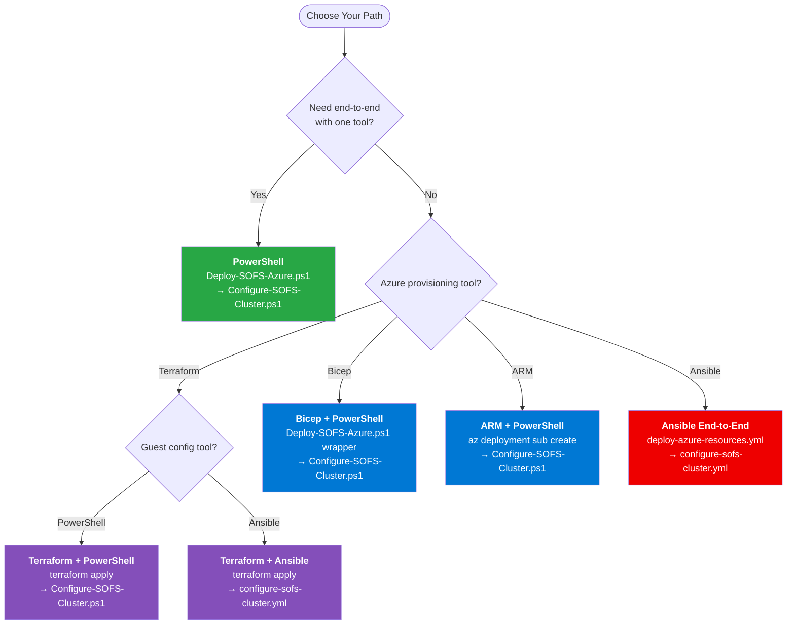

# Deployment Paths

## Overview

The SOFS deployment spans two domains — **Azure-side provisioning** and **guest OS configuration** — each requiring different tools. You choose one tool for each domain, or use PowerShell for end-to-end.

---

## Valid Combinations

| # | Azure Provisioning | Guest Configuration | Notes |
|---|-------------------|-------------------|-------|
| 1 | **PowerShell** | **PowerShell** | Only end-to-end path with a single tool.  |
| 2 | **Terraform** | **PowerShell** | Default `guest_config_engine=powershell`. Run `Configure-SOFS-Cluster.ps1` after `terraform apply`. |
| 3 | **Terraform** | **Ansible** | Set `guest_config_engine=ansible_create` or `ansible_existing`. Auto-generated inventory. |
| 4 | **Bicep** | **PowerShell** | `Deploy-SOFS-Azure.ps1` wrapper deploys Bicep, then run `Configure-SOFS-Cluster.ps1`. |
| 5 | **ARM** | **PowerShell** | `az deployment sub create`, then `Configure-SOFS-Cluster.ps1`. |
| 6 | **Ansible** | **Ansible** | `deploy-azure-resources.yml` → `configure-sofs-cluster.yml`.  |

---

## Decision Tree

---

## What Each Domain Covers

### Azure-Side Provisioning

All five tools can create Azure resources through the control plane:

- Resource group
- Cloud witness storage account
- NICs on Azure Local compute logical network
- Arc VM placeholders + VM instances
- Data disks for the S2D pool
- Domain join via `JsonADDomainExtension` Arc extension

> [!NOTE]
> **Domain join**
> Domain join is an Azure resource deployment, not a guest OS operation. All five tools deploy the `JsonADDomainExtension` extension on `Microsoft.HybridCompute/machines` as part of Phase 4.
>
### Guest OS Configuration

Only PowerShell and Ansible can configure the Windows Server guest VMs (via WinRM):

- Anti-affinity rules on the Azure Local host cluster
- Failover Clustering role installation
- Cluster creation + cloud witness
- Storage Spaces Direct enable + guest tuning
- SOFS role + SMB share creation
- NTFS permissions
- Antivirus exclusions
- Validation

These are multi-node orchestrated operations that require remote access to the VMs from a management workstation or Ansible controller.

---

## Choosing a Path

| If you... | Use |
|-----------|-----|
| Want the simplest, tested path | [PowerShell](powershell.md) end-to-end |
| Prefer IaC with state management | [Terraform](terraform.md) + PowerShell or Ansible |
| Are in an Azure-native shop | [Bicep](bicep.md) + PowerShell |
| Need JSON templates (policy/legacy) | [ARM](arm.md) + PowerShell |
| Run a Linux-based automation platform | [Ansible](ansible.md) end-to-end or Terraform + Ansible |

---

## Next Steps

- [Prerequisites](prerequisites.md) — Ensure all infrastructure is in place
- [Variables](variables.md) — Configure the central variable file
- Choose your tool: [Terraform](terraform.md) | [Bicep](bicep.md) | [ARM](arm.md) | [PowerShell](powershell.md) | [Ansible](ansible.md)
