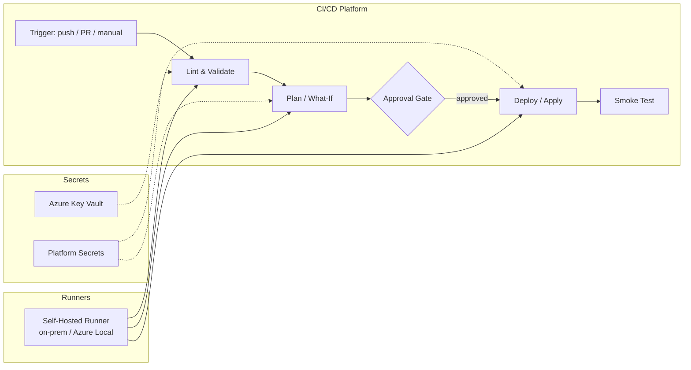

# CI/CD Pipelines

Automate SOFS + FSLogix deployments using GitHub Actions, GitLab CI, or Azure DevOps.

## Architecture



## Pipeline Stages

Every pipeline follows the same four-stage pattern:

| Stage | Purpose | Runs On |
|-------|---------|---------|
| **Validate** | Lint, syntax check, format verification | Any runner |
| **Plan** | `terraform plan`, `bicep build`, `ansible --check` | Self-hosted runner with network access |
| **Deploy** | `terraform apply`, `az deployment`, `ansible-playbook` | Self-hosted runner (production-gated) |
| **Test** | `Test-SOFSDeployment.ps1` smoke tests | Self-hosted runner with cluster access |

## Platform Comparison

| Feature | GitHub Actions | GitLab CI | Azure DevOps |
|---------|---------------|-----------|--------------|
| Self-hosted agent | `runs-on: [self-hosted, azurelocal]` | `tags: [azurelocal]` | `pool: { name: AzureLocal }` |
| Secrets store | Repository / Org Secrets | CI/CD Variables | Variable Groups |
| Key Vault native | `azure/get-keyvault-secrets@v1` | Premium: native integration | `AzureKeyVault@2` task |
| OIDC / Federated | `azure/login@v2` with OIDC | Manual config | Automatic with service connections |
| Manual approval | Environment protection rules | Manual job gate | Environment approvals |
| Artifact passing | `actions/upload-artifact` | Job artifacts | Pipeline artifacts |

## Example Pipelines

All examples are in `examples/pipelines/`:

### GitHub Actions
- [Terraform](https://github.com/AzureLocal/azurelocal-sofs-fslogix/blob/main/examples/pipelines/github-actions/deploy-terraform.yml.example)
- [Bicep](https://github.com/AzureLocal/azurelocal-sofs-fslogix/blob/main/examples/pipelines/github-actions/deploy-bicep.yml.example)
- [Ansible](https://github.com/AzureLocal/azurelocal-sofs-fslogix/blob/main/examples/pipelines/github-actions/deploy-ansible.yml.example)
- [PowerShell](https://github.com/AzureLocal/azurelocal-sofs-fslogix/blob/main/examples/pipelines/github-actions/deploy-powershell.yml.example)

### GitLab CI
- [Terraform](https://github.com/AzureLocal/azurelocal-sofs-fslogix/blob/main/examples/pipelines/gitlab/deploy-terraform.gitlab-ci.yml.example)
- [Bicep](https://github.com/AzureLocal/azurelocal-sofs-fslogix/blob/main/examples/pipelines/gitlab/deploy-bicep.gitlab-ci.yml.example)
- [Ansible](https://github.com/AzureLocal/azurelocal-sofs-fslogix/blob/main/examples/pipelines/gitlab/deploy-ansible.yml.example)
- [PowerShell](https://github.com/AzureLocal/azurelocal-sofs-fslogix/blob/main/examples/pipelines/gitlab/deploy-powershell.gitlab-ci.yml.example)

### Azure DevOps
- [Terraform](https://github.com/AzureLocal/azurelocal-sofs-fslogix/blob/main/examples/pipelines/azure-devops/deploy-terraform.yml.example)
- [Bicep](https://github.com/AzureLocal/azurelocal-sofs-fslogix/blob/main/examples/pipelines/azure-devops/deploy-bicep.yml.example)
- [Ansible](https://github.com/AzureLocal/azurelocal-sofs-fslogix/blob/main/examples/pipelines/azure-devops/deploy-ansible.yml.example)
- [PowerShell](https://github.com/AzureLocal/azurelocal-sofs-fslogix/blob/main/examples/pipelines/azure-devops/deploy-powershell.yml.example)

## Environment Promotion

```
staging → production
```

- **Staging**: Auto-deploys on merge to `main` (or `develop` if using GitFlow)
- **Production**: Requires manual approval via environment protection rules

Use separate `config/variables.yml` per environment, or parameterize per the [example configs](https://github.com/AzureLocal/azurelocal-sofs-fslogix/tree/main/examples/configs/).

## Getting Started

1. Choose your CI/CD platform
2. Copy the relevant `.example` file into your pipeline config directory
3. Set up a [self-hosted runner](runner-setup.md) on your Azure Local network
4. Configure [secrets](secrets-management.md) for Azure authentication
5. Adjust paths and variable names to match your environment
6. Trigger a pipeline run and review the plan output before approving deploy

<!-- TODO: Add per-tool detailed walkthrough -->
