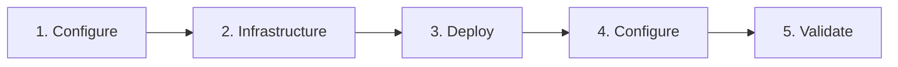

# Azure Local SOFS for FSLogix

!!! warning "Under Active Development"
    This repository is a work in progress. Scripts, templates, and automation are **not guaranteed to work** at this time. Use at your own risk and expect breaking changes.

Automation and Infrastructure-as-Code for deploying a **Scale Out File Server (SOFS)** on **Azure Local** to host **FSLogix** profile containers for **Azure Virtual Desktop (AVD)** session hosts.

**Sister repo:** [AzureLocal/azurelocal-avd](https://github.com/AzureLocal/aurelocal-avd) — AVD session host deployment on Azure Local.

---

## What This Repo Provides

A highly available, SMB-based file share on Azure Local that FSLogix uses to store and serve user profile containers (VHD/VHDX) for AVD session hosts — deployed and configured entirely through code.

## Deployment Workflow



### 1. Configure Variables

Set your environment values in a single file that feeds every phase:

```bash
cp config/variables.example.yml config/variables.yml
```

See the [Variable Reference](reference/variables.md) for every parameter.

### 2. Deploy Azure Infrastructure

Choose one IaC tool to create the Azure resource group and diagnostic storage:

| Tool | Path | Recommended |
|------|------|:-----------:|
| Bicep | `src/bicep/` | :material-check: |
| ARM | `src/arm/` | |
| Terraform | `src/terraform/` | |

### 3. Deploy SOFS

Create the SOFS cluster role and SMB share on the Azure Local failover cluster:

```powershell
.\src\powershell\New-SOFSDeployment.ps1 -ParametersFile .\src\powershell\parameters.example.ps1
```

### 4. Configure Share & FSLogix

Choose PowerShell or Ansible to set share permissions and FSLogix registry settings:

=== "PowerShell"

    ```powershell
    .\src\powershell\Set-FSLogixShare.ps1 `
      -SOFSName "SOFS01" `
      -ShareName "FSLogixProfiles" `
      -SharePath "C:\ClusterStorage\Volume1\FSLogixProfiles" `
      -AVDUsersGroup "AVD-Users" `
      -ClusterName "AZLHCI-CLUSTER"
    ```

=== "Ansible"

    ```bash
    ansible-playbook -i src/ansible/inventory/hosts.yml \
      src/ansible/playbooks/configure-sofs.yml

    ansible-playbook -i src/ansible/inventory/hosts.yml \
      src/ansible/playbooks/configure-fslogix.yml
    ```

### 5. Validate

```powershell
.\tests\Test-SOFSDeployment.ps1 -SOFSName "SOFS01" -ShareName "FSLogixProfiles"
```

---

## Repository Structure

```
├── src/                   # All automation code, organised by tool
│   ├── bicep/             #   Azure Bicep templates
│   ├── arm/               #   ARM JSON templates
│   ├── terraform/         #   Terraform configuration
│   ├── ansible/           #   Ansible playbooks & inventory
│   └── powershell/        #   PowerShell deploy & configure scripts
├── config/                # Central variables — single source of truth
├── docs/                  # This documentation site (MkDocs)
├── tests/                 # Phase 4 — Deployment validation
├── scripts/               # Standalone utilities
└── examples/              # Scenarios & walkthroughs
```

## Prerequisites

- An existing **Azure Local** cluster registered with Azure Arc
- Azure subscription with Contributor RBAC
- PowerShell 5.1+ with RSAT-Clustering tools
- For Bicep/ARM: Azure CLI >= 2.50
- For Terraform: >= 1.5, AzureRM provider >= 3.75
- For Ansible: >= 2.14, `azure.azcollection` collection
