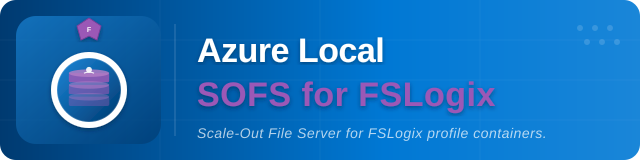

# Azure Local SOFS for FSLogix



!!! warning "Under Active Development"
    This repository is a work in progress. Scripts, templates, and automation are **not guaranteed to work** at this time. Use at your own risk and expect breaking changes.

Automation and Infrastructure-as-Code for deploying a **Scale Out File Server (SOFS)** on **Azure Local** to host **FSLogix** profile containers for **Azure Virtual Desktop (AVD)** session hosts.

**Sister repo:** [AzureLocal/azurelocal-avd](https://github.com/AzureLocal/aurelocal-avd) — AVD session host deployment on Azure Local.

---

## Architecture at a Glance


Three Windows Server VMs form a guest **Storage Spaces Direct** cluster on Azure Local. An anti-affinity rule keeps each VM on a separate physical node for host-level resiliency. The guest S2D cluster presents a **Scale-Out File Server** role with continuously available SMB shares that FSLogix uses to store user profile VHDXs.

| Section | Description |
|---------|-------------|
| **[Architecture](architecture/overview.md)** | Design decisions, storage layout, capacity planning, AVD considerations, and worked scenarios |
| **[Deployment](deployment/prerequisites.md)** | Prerequisites, variables, tool-specific guides (Terraform, Bicep, ARM, PowerShell, Ansible), and validation |
| **[Configuration](configuration/fslogix.md)** | FSLogix registry settings, NTFS/SMB permissions, and antivirus exclusions |
| **[Operations](operations/troubleshooting.md)** | Troubleshooting, CI/CD pipelines, runner setup, and secrets management |

---

## How Deployment Works

Deploying a SOFS on Azure Local spans **two domains** that require different tools:

| Domain | What It Does | Tools |
|--------|-------------|-------|
| **Azure-side provisioning** | Resource group, cloud witness, NICs, Arc VMs, data disks, domain join extension | All five tools |
| **Guest OS configuration** | Anti-affinity, failover clustering, S2D, SOFS role, SMB shares, NTFS permissions | PowerShell or Ansible (via WinRM) |

Domain join is an Azure resource deployment (`JsonADDomainExtension` on `Microsoft.HybridCompute/machines/extensions`) — any tool that deploys Azure resources can do this.

### Tool Capabilities

What each tool **can** do (technology capability):

| Tool | Azure Resources | Domain Join | Guest Config | End-to-End |
|------|:---:|:---:|:---:|:---:|
| PowerShell | ✅ | ✅ | ✅ | ✅ |
| Terraform | ✅ | ✅ | Delegates | — |
| Bicep | ✅ | ✅ | Delegates | — |
| ARM | ✅ | ✅ | Delegates | — |
| Ansible | ✅ | ✅ | ✅ | Partial |

### Current Code Status

What this repo's automation **does** today:

| Tool | Azure | Domain Join | Guest Config | Status |
|------|:---:|:---:|:---:|:---:|
| [PowerShell](deployment/powershell.md) | Full | ✅ | Full |  |
| [Terraform](deployment/terraform.md) | Full | Not yet | Delegates |  |
| [Bicep](deployment/bicep.md) | Full | Not yet | Delegates |  |
| [ARM](deployment/arm.md) | Partial | — | Delegates |  |
| [Ansible](deployment/ansible.md) | Full | Not yet | Phases 5–11 |  |

Domain join gaps are implementation TODOs, not tool limitations. See [Deployment Paths](deployment/paths.md) for valid combinations.

---

## Quick Start

### 1. Configure Variables

```bash
cp config/variables.example.yml config/variables.yml
```

See [Variables Reference](reference/variables.md) for every parameter.

### 2. Deploy Azure Infrastructure

Choose one tool to create resource group, VMs, NICs, data disks, and cloud witness:

| Tool | Path | Status |
|------|------|--------|
| [Terraform](deployment/terraform.md) | `src/terraform/` |  |
| [Bicep](deployment/bicep.md) | `src/bicep/` |  |
| [ARM](deployment/arm.md) | `src/arm/` |  |
| [PowerShell](deployment/powershell.md) | `src/powershell/` |  |
| [Ansible](deployment/ansible.md) | `src/ansible/` |  |

### 3. Configure Guest Cluster (Phases 3–11)

```powershell
.\src\powershell\Configure-SOFS-Cluster.ps1 -ConfigFile .\config\variables.yml
```

See [PowerShell Deployment](deployment/powershell.md) for the full walkthrough.

### 4. Validate

```powershell
.\tests\Test-SOFSDeployment.ps1 `
    -SOFSAccessPoint "FSLogixSOFS" `
    -ShareNames @("FSLogix") `
    -ClusterName "sofs-cluster"
```

See [Validation](deployment/validation.md) for the full checklist.

---

## Repository Structure

```
├── src/                   # Automation code by tool
│   ├── terraform/         #   Terraform (azapi + azurerm)
│   ├── bicep/             #   Bicep (subscription-scope)
│   ├── arm/               #   ARM JSON templates
│   ├── powershell/        #   PowerShell scripts (all phases)
│   └── ansible/           #   Ansible playbooks (WinRM/Kerberos)
├── config/                # Central variables.yml — single source of truth
├── docs/                  # This documentation site (MkDocs)
│   ├── architecture/      #   Design decisions & capacity planning
│   ├── deployment/        #   Prerequisites, tool guides, validation
│   ├── configuration/     #   FSLogix, permissions, antivirus
│   ├── operations/        #   Troubleshooting, CI/CD, secrets
│   └── reference/         #   Deployment guide, variables reference
├── tests/                 # Deployment validation scripts
├── scripts/               # Standalone utilities
└── examples/              # Pipeline examples & sample configs
```

## Prerequisites

- An existing **Azure Local** cluster registered with Azure Arc
- Azure subscription with Contributor RBAC
- Windows Server 2025 Datacenter: Azure Edition Core (Gen2) gallery image
- PowerShell 7+ with RSAT-Clustering tools
- AD domain with permissions to create computer objects
- For full prerequisites, see [Prerequisites](deployment/prerequisites.md)
