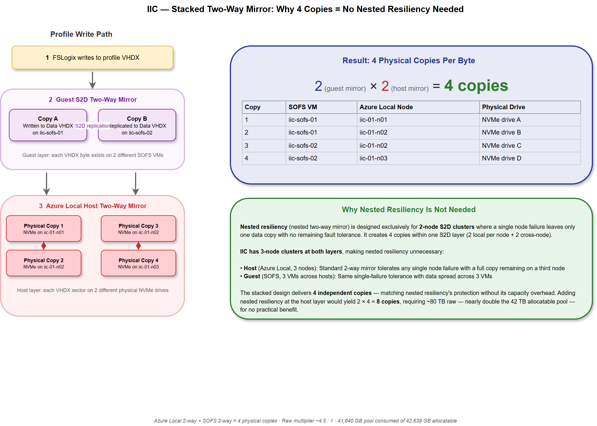
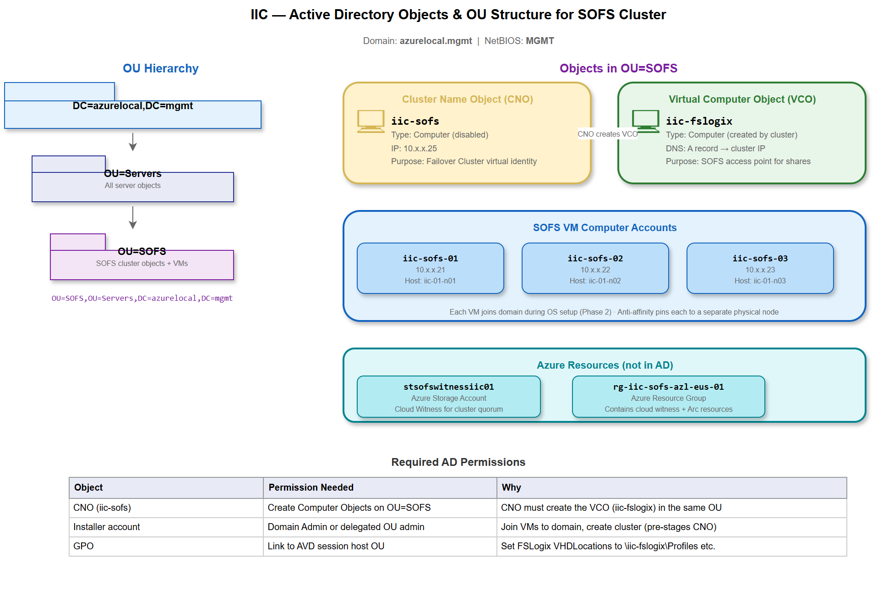
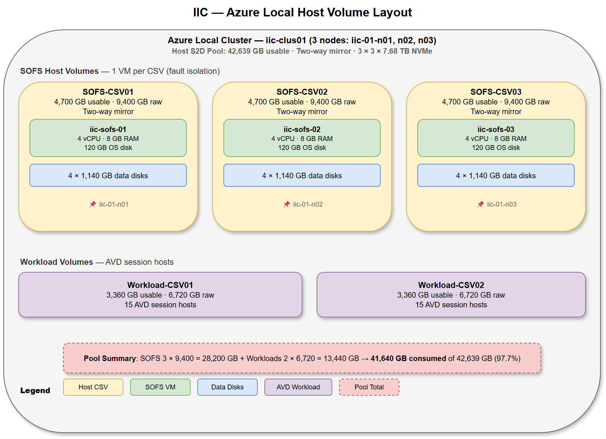
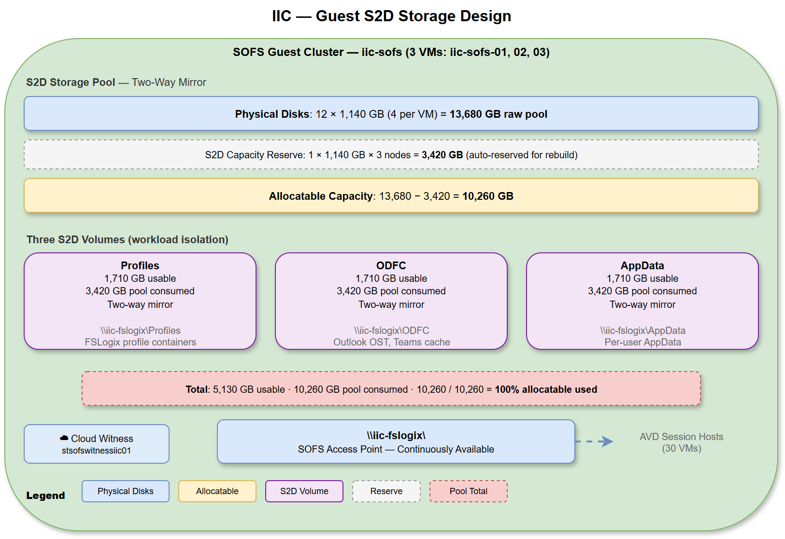
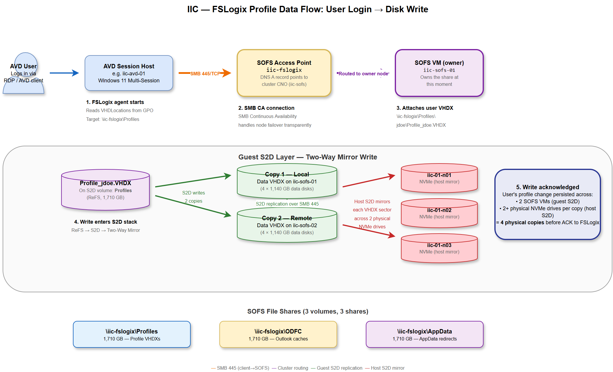
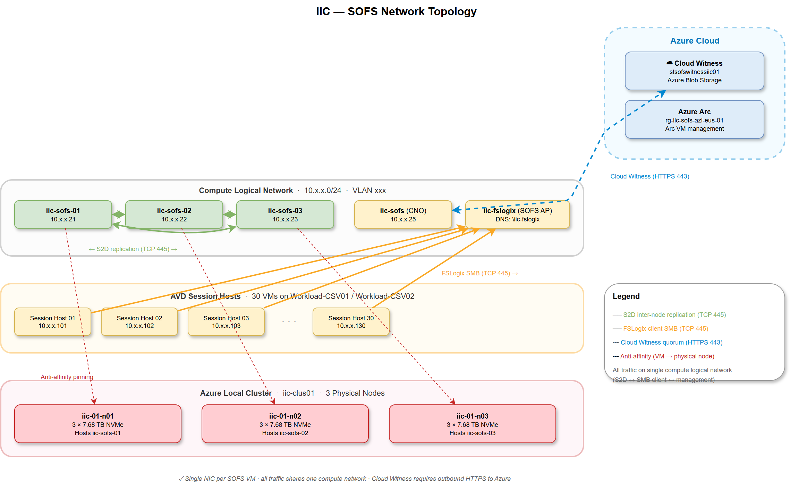
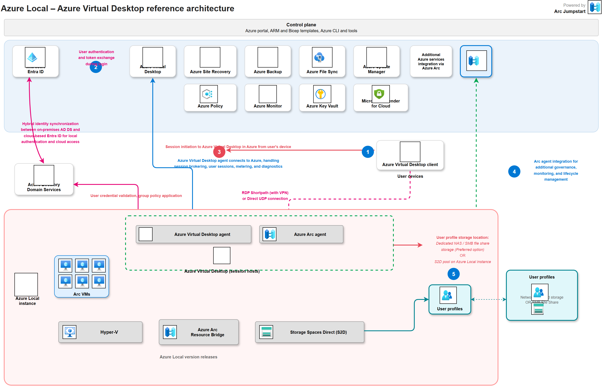
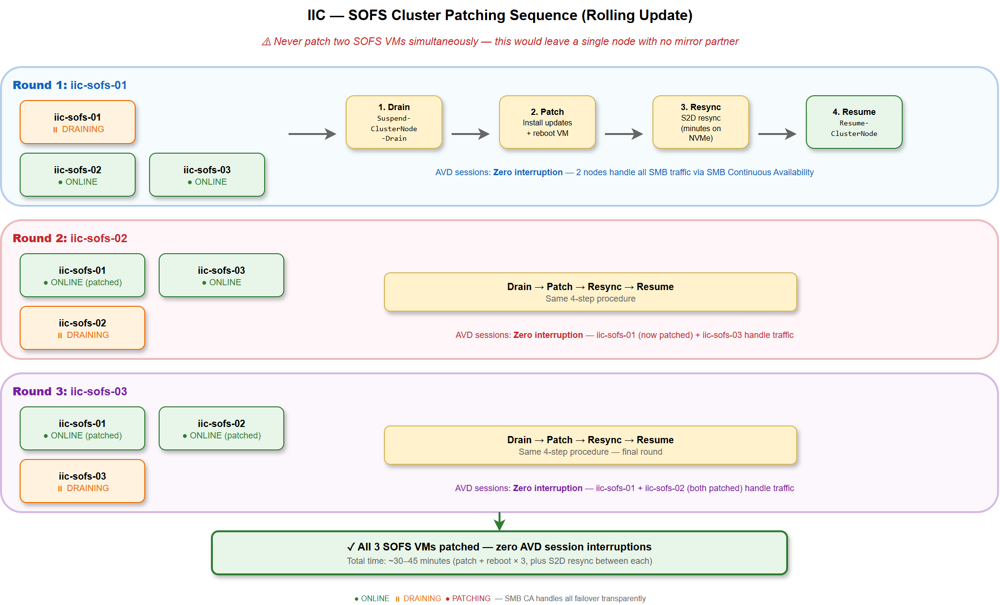
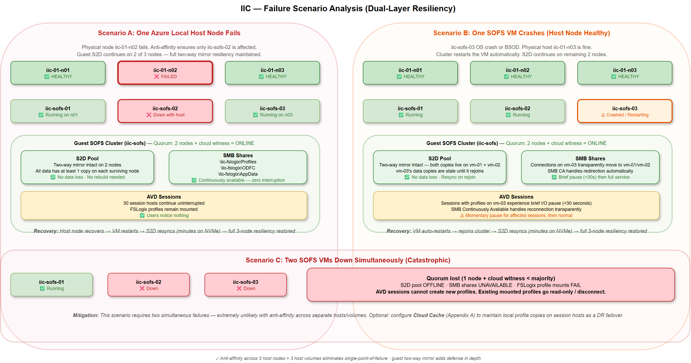

# Scale-Out File Server — Design & Deployment Guide
## Guest SOFS on Azure Local for AVD FSLogix Profiles


<table>
  <thead>
    <tr>
      <th style="padding:8px; text-align:left; background:#0078D4; color:#FFFFFF; font-weight:600; border-bottom:2px solid #005a9e;"></th>
      <th style="padding:8px; text-align:left; background:#0078D4; color:#FFFFFF; font-weight:600; border-bottom:2px solid #005a9e;"></th>
    </tr>
  </thead>
  <tbody>
    <tr style="background:#E6F2FF;">
      <td style="padding:8px; text-align:left;">**Version**</td>
      <td style="padding:8px; text-align:left;">1.0</td>
    </tr>
    <tr style="background:#CCE4FF;">
      <td style="padding:8px; text-align:left;">**Last Updated**</td>
      <td style="padding:8px; text-align:left;">March 2026</td>
    </tr>
    <tr style="background:#E6F2FF;">
      <td style="padding:8px; text-align:left;">**Maintained by**</td>
      <td style="padding:8px; text-align:left;">Hybrid Cloud Solutions LLC</td>
    </tr>
    <tr style="background:#CCE4FF;">
      <td style="padding:8px; text-align:left;">**Customer**</td>
      <td style="padding:8px; text-align:left;">Contoso (IIC)</td>
    </tr>
  </tbody>
</table>


---

### What This Document Covers

This document is the complete design and deployment reference for a **3-node Scale-Out File Server (SOFS) guest cluster** running Storage Spaces Direct (S2D) on Azure Local, purpose-built to host FSLogix profile containers for Azure Virtual Desktop (AVD) session hosts.

The document is organized in four parts:

- **Part I — Design Decisions** explains how two stacked mirror layers multiply raw consumption, introduces the "cattle vs. pets" concept for AVD session hosts, walks through all 13 storage sizing scenarios (10 SOFS + 3 Cloud Cache) with their capacity implications, and commits to the **Maximum HA** scenario: three-way mirror at the Azure Local host layer for profile CSVs, three-way mirror at the guest S2D layer for profile volumes, and two-way mirror at the host layer for AVD workload CSVs. The hardware implication — a **6-node Dell AX-760 cluster with 10 × 7.68 TB NVMe per node** — is derived directly from the capacity math.
- **Part II — Architecture & Design** details the hardware build, naming and identity model, host-layer storage layout, SOFS VM configuration, guest S2D storage design with three FSLogix shares, network configuration, and AVD integration points.
- **Part III — Implementation** provides the full 11-phase deployment from creating Azure Local host volumes through guest cluster creation, S2D configuration, SOFS role setup, SMB share creation, NTFS permissions, antivirus exclusions, and validation. Every phase includes exact PowerShell or Azure CLI commands with IIC-specific resource names following Azure Cloud Adoption Framework (CAF) naming conventions.
- **Part IV — Reference** consolidates the IP/name reference table, operational notes (patching, monitoring, failure scenarios), AVD session host configuration (FSLogix registry keys, identity model), optional Cloud Cache for DR, automation script inventory with links, and Microsoft documentation references.

The companion [`azurelocal-sofs-fslogix`](https://github.com/AzureLocal/azurelocal-sofs-fslogix) repository contains automation that can execute these same steps via Terraform, Bicep, ARM templates, PowerShell scripts, and Ansible playbooks — see [Automation Scripts](#automation-scripts) for a detailed breakdown of what each tool covers and which phases it automates.

---

## Table of Contents

**Part I — Design Decisions**

1. [Understanding Stacked Mirror Resiliency](#1-understanding-stacked-mirror-resiliency)
2. [Why AVD Session Hosts Are Cattle, Not Pets](#2-why-avd-session-hosts-are-cattle-not-pets)
3. [Storage Sizing Scenarios](#3-storage-sizing-scenarios)
4. [Recommended Scenario — Maximum HA](#4-recommended-scenario--maximum-ha)

**Part II — Architecture & Design**

5. [Hardware Build — Dell AX-760 (6-Node Cluster)](#5-hardware-build--dell-ax-760-6-node-cluster)
6. [Naming and Identity](#6-naming-and-identity)
7. [Azure Local Host Storage Design](#7-azure-local-host-storage-design)
8. [SOFS VM Configuration](#8-sofs-vm-configuration)
9. [Guest SOFS Cluster Storage Design](#9-guest-sofs-cluster-storage-design)
10. [Network Design](#10-network-design)
11. [AVD Integration Points](#11-avd-integration-points)

**Part III — Implementation**

12. [Prerequisites](#prerequisites)
13. [Phase 1: Create Azure Local Host Volumes](#phase-1-create-azure-local-host-volumes)
14. [Phase 2: Deploy SOFS VMs](#phase-2-deploy-sofs-vms)
15. [Phase 3: Configure Anti-Affinity Rules](#phase-3-configure-anti-affinity-rules)
16. [Phase 4: Post-Deployment VM Configuration](#phase-4-post-deployment-vm-configuration)
17. [Phase 5: Install Required Roles and Features](#phase-5-install-required-roles-and-features)
18. [Phase 6: Validate and Create the Guest Failover Cluster](#phase-6-validate-and-create-the-guest-failover-cluster)
19. [Phase 7: Enable Storage Spaces Direct (S2D)](#phase-7-enable-storage-spaces-direct-s2d)
20. [Phase 8: Add the Scale-Out File Server Role](#phase-8-add-the-scale-out-file-server-role)
21. [Phase 9: Configure NTFS Permissions for FSLogix](#phase-9-configure-ntfs-permissions-for-fslogix)
22. [Phase 10: Antivirus Exclusions](#phase-10-antivirus-exclusions)
23. [Phase 11: Validation and Testing](#phase-11-validation-and-testing)

**Part IV — Reference**

24. [IP and Name Reference](#ip-and-name-reference)
25. [Operations and Maintenance](#operations-and-maintenance)
26. [Important Notes and Considerations](#important-notes-and-considerations)
27. [Considerations for AVD Deployment](#considerations-for-avd-deployment)
28. [Appendix A — Cloud Cache for DR to Azure (Optional)](#appendix-a--cloud-cache-for-dr-to-azure-optional)
29. [Automation Scripts](#automation-scripts)
30. [Microsoft Documentation Links](#microsoft-documentation-links)
31. [Related Resources](#related-resources)

---

# Part I — Design Decisions

## 1. Understanding Stacked Mirror Resiliency

Mirror resiliency is evaluated at **two independent layers**:

- **Azure Local cluster layer** — The physical S2D pool where Cluster Shared Volumes (CSVs) are created to host SOFS VMs and AVD workload VMs.
- **SOFS cluster layer** — The virtual S2D pool inside the SOFS guest cluster, formed from VHDX data disks passed through from the Azure Local cluster. This is where the FSLogix profile volumes live.

These layers multiply. A **two-way mirror on Azure Local** hosting a **two-way mirror inside the SOFS cluster** means every byte of profile data exists in **2 × 2 = 4 physical copies**. A three-way at both layers means **3 × 3 = 9 copies**.


<table>
  <thead>
    <tr>
      <th style="padding:8px; text-align:left; background:#0078D4; color:#FFFFFF; font-weight:600; border-bottom:2px solid #005a9e;">Combination</th>
      <th style="padding:8px; text-align:left; background:#0078D4; color:#FFFFFF; font-weight:600; border-bottom:2px solid #005a9e;">Copies per Byte</th>
      <th style="padding:8px; text-align:left; background:#0078D4; color:#FFFFFF; font-weight:600; border-bottom:2px solid #005a9e;">Raw Multiplier</th>
    </tr>
  </thead>
  <tbody>
    <tr style="background:#E6F2FF;">
      <td style="padding:8px; text-align:left;">Azure Local 2-way × SOFS 2-way</td>
      <td style="padding:8px; text-align:left;">4</td>
      <td style="padding:8px; text-align:left;">~4.5 : 1</td>
    </tr>
    <tr style="background:#CCE4FF;">
      <td style="padding:8px; text-align:left;">Azure Local 2-way × SOFS 3-way</td>
      <td style="padding:8px; text-align:left;">6</td>
      <td style="padding:8px; text-align:left;">~6.2 : 1</td>
    </tr>
    <tr style="background:#E6F2FF;">
      <td style="padding:8px; text-align:left;">Azure Local 3-way × SOFS 2-way</td>
      <td style="padding:8px; text-align:left;">6</td>
      <td style="padding:8px; text-align:left;">~6.8 : 1</td>
    </tr>
    <tr style="background:#CCE4FF;">
      <td style="padding:8px; text-align:left;">Azure Local 3-way × SOFS 3-way</td>
      <td style="padding:8px; text-align:left;">9</td>
      <td style="padding:8px; text-align:left;">~9.3 : 1</td>
    </tr>
  </tbody>
</table>




> **The capacity tax is real.** Three-way at both layers means 9 physical copies of every byte of user profile data. This is the maximum resiliency configuration — but it consumes substantial raw capacity. The cluster must be sized accordingly from the start, which is why this document presents the full scenario analysis before committing to a design.

---

## 2. Why AVD Session Hosts Are Cattle, Not Pets

In IIC's Azure Virtual Desktop deployment, session hosts are **cattle** — interchangeable, disposable, and replaceable — not **pets** that are individually maintained and irreplaceable. This distinction drives the entire storage design.

### Pooled Host Pools: Non-Persistent by Design

IIC's 24 AVD session hosts run **Windows 11 Enterprise Multi-Session** in a **pooled host pool**. Users are load-balanced across available hosts — no user is permanently assigned to a specific VM. At logoff, the session host returns to its clean baseline state. All user personalization, data, and application state lives somewhere else: **FSLogix profile containers on the SOFS**.

### FSLogix Decouples State from Compute

This is the key insight: **the user's data is not on the VM**. FSLogix's kernel-mode filter driver intercepts the profile load at logon, mounts a per-user VHDX from the SOFS share (`\\iic-fslogix\Profiles`), and transparently redirects `C:\Users\<Username>` into that VHDX. When the user logs off, the VHDX is cleanly unmounted and the VM is stateless again.

### What This Means for Storage Design


<table>
  <thead>
    <tr>
      <th style="padding:8px; text-align:left; background:#0078D4; color:#FFFFFF; font-weight:600; border-bottom:2px solid #005a9e;">Component</th>
      <th style="padding:8px; text-align:left; background:#0078D4; color:#FFFFFF; font-weight:600; border-bottom:2px solid #005a9e;">Nature</th>
      <th style="padding:8px; text-align:left; background:#0078D4; color:#FFFFFF; font-weight:600; border-bottom:2px solid #005a9e;">Storage Implication</th>
    </tr>
  </thead>
  <tbody>
    <tr style="background:#E6F2FF;">
      <td style="padding:8px; text-align:left;">**AVD session host VMs**</td>
      <td style="padding:8px; text-align:left;">Cattle — replaceable, stateless</td>
      <td style="padding:8px; text-align:left;">Host-layer CSVs need **2-way mirror** — sufficient protection for VMs that can be redeployed from a golden image in minutes</td>
    </tr>
    <tr style="background:#CCE4FF;">
      <td style="padding:8px; text-align:left;">**SOFS / FSLogix profile data**</td>
      <td style="padding:8px; text-align:left;">Pets — irreplaceable user state</td>
      <td style="padding:8px; text-align:left;">Host-layer CSVs need **3-way mirror** at host + **3-way mirror** at guest — maximum protection for data that represents every user's work environment</td>
    </tr>
  </tbody>
</table>


Losing a session host VM is a non-event — the user reconnects to another host and their profile remounts seamlessly. Losing profile data would mean users losing their desktop settings, Outlook cache, application configurations, browser bookmarks, and saved documents stored in OneDrive/SharePoint sync. The asymmetry between these two impacts is why IIC invests in 3-way mirrors for profiles but only 2-way for workloads.

### IIC's AVD Environment


<table>
  <thead>
    <tr>
      <th style="padding:8px; text-align:left; background:#0078D4; color:#FFFFFF; font-weight:600; border-bottom:2px solid #005a9e;">Parameter</th>
      <th style="padding:8px; text-align:left; background:#0078D4; color:#FFFFFF; font-weight:600; border-bottom:2px solid #005a9e;">Value</th>
    </tr>
  </thead>
  <tbody>
    <tr style="background:#E6F2FF;">
      <td style="padding:8px; text-align:left;">**Total users**</td>
      <td style="padding:8px; text-align:left;">2,000</td>
    </tr>
    <tr style="background:#CCE4FF;">
      <td style="padding:8px; text-align:left;">**Concurrent users (50%)**</td>
      <td style="padding:8px; text-align:left;">1,000</td>
    </tr>
    <tr style="background:#E6F2FF;">
      <td style="padding:8px; text-align:left;">**Session hosts**</td>
      <td style="padding:8px; text-align:left;">24 × Windows 11 Enterprise Multi-Session</td>
    </tr>
    <tr style="background:#CCE4FF;">
      <td style="padding:8px; text-align:left;">**VM size**</td>
      <td style="padding:8px; text-align:left;">8 vCPU, 32 GB RAM per host</td>
    </tr>
    <tr style="background:#E6F2FF;">
      <td style="padding:8px; text-align:left;">**Users per host**</td>
      <td style="padding:8px; text-align:left;">25 concurrent</td>
    </tr>
    <tr style="background:#CCE4FF;">
      <td style="padding:8px; text-align:left;">**Workload profile**</td>
      <td style="padding:8px; text-align:left;">Heavy — Teams, Outlook, LOB applications</td>
    </tr>
    <tr style="background:#E6F2FF;">
      <td style="padding:8px; text-align:left;">**Host pool type**</td>
      <td style="padding:8px; text-align:left;">Pooled (non-persistent)</td>
    </tr>
    <tr style="background:#CCE4FF;">
      <td style="padding:8px; text-align:left;">**FSLogix per-user quotas**</td>
      <td style="padding:8px; text-align:left;">5 GB profile + 10 GB ODFC + 3 GB AppData = 18 GB/user</td>
    </tr>
  </tbody>
</table>


---

## 3. Storage Sizing Scenarios

Before committing to a mirror configuration, it's essential to understand whether the cluster can physically support it. The following scenarios are based on the **Azure Local Storage Sizing Analysis** that evaluates every practical combination of SOFS node count, host mirror, and guest mirror against a given hardware baseline.

### Baseline: Minimum Viable Cluster (3 nodes × 3 drives × 7.68 TB)

For reference, the minimum viable cluster has:


<table>
  <thead>
    <tr>
      <th style="padding:8px; text-align:left; background:#0078D4; color:#FFFFFF; font-weight:600; border-bottom:2px solid #005a9e;">Item</th>
      <th style="padding:8px; text-align:left; background:#0078D4; color:#FFFFFF; font-weight:600; border-bottom:2px solid #005a9e;">Value</th>
    </tr>
  </thead>
  <tbody>
    <tr style="background:#E6F2FF;">
      <td style="padding:8px; text-align:left;">Nodes</td>
      <td style="padding:8px; text-align:left;">3</td>
    </tr>
    <tr style="background:#CCE4FF;">
      <td style="padding:8px; text-align:left;">NVMe drives per node</td>
      <td style="padding:8px; text-align:left;">3</td>
    </tr>
    <tr style="background:#E6F2FF;">
      <td style="padding:8px; text-align:left;">Raw capacity per drive</td>
      <td style="padding:8px; text-align:left;">7.68 TB</td>
    </tr>
    <tr style="background:#CCE4FF;">
      <td style="padding:8px; text-align:left;">Total raw</td>
      <td style="padding:8px; text-align:left;">69.12 TB</td>
    </tr>
    <tr style="background:#E6F2FF;">
      <td style="padding:8px; text-align:left;">Formatted (~92%)</td>
      <td style="padding:8px; text-align:left;">~63.59 TB</td>
    </tr>
    <tr style="background:#CCE4FF;">
      <td style="padding:8px; text-align:left;">S2D reserve (1 drive/node × 3 nodes)</td>
      <td style="padding:8px; text-align:left;">~21.20 TB</td>
    </tr>
    <tr style="background:#E6F2FF;">
      <td style="padding:8px; text-align:left;">**Allocatable**</td>
      <td style="padding:8px; text-align:left;">**~42,639 GB**</td>
    </tr>
  </tbody>
</table>


### SOFS Scenarios 1–10

Each scenario targets **5,120 GB usable FSLogix space** with 10% growth headroom. The "Fits?" column indicates whether the total pool consumed fits within the 42,639 GB allocatable ceiling of the 3-node/3-drive baseline.


<table>
  <thead>
    <tr>
      <th style="padding:8px; text-align:left; background:#0078D4; color:#FFFFFF; font-weight:600; border-bottom:2px solid #005a9e;">#</th>
      <th style="padding:8px; text-align:left; background:#0078D4; color:#FFFFFF; font-weight:600; border-bottom:2px solid #005a9e;">SOFS Nodes</th>
      <th style="padding:8px; text-align:left; background:#0078D4; color:#FFFFFF; font-weight:600; border-bottom:2px solid #005a9e;">Host Mirror</th>
      <th style="padding:8px; text-align:left; background:#0078D4; color:#FFFFFF; font-weight:600; border-bottom:2px solid #005a9e;">Guest Mirror</th>
      <th style="padding:8px; text-align:left; background:#0078D4; color:#FFFFFF; font-weight:600; border-bottom:2px solid #005a9e;">Copies/Byte</th>
      <th style="padding:8px; text-align:left; background:#0078D4; color:#FFFFFF; font-weight:600; border-bottom:2px solid #005a9e;">Pool Consumed</th>
      <th style="padding:8px; text-align:left; background:#0078D4; color:#FFFFFF; font-weight:600; border-bottom:2px solid #005a9e;">Fits?</th>
    </tr>
  </thead>
  <tbody>
    <tr style="background:#E6F2FF;">
      <td style="padding:8px; text-align:left;">1</td>
      <td style="padding:8px; text-align:left;">3-VM</td>
      <td style="padding:8px; text-align:left;">2-way</td>
      <td style="padding:8px; text-align:left;">2-way</td>
      <td style="padding:8px; text-align:left;">4</td>
      <td style="padding:8px; text-align:left;">~36,000 GB</td>
      <td style="padding:8px; text-align:left;">**Yes**</td>
    </tr>
    <tr style="background:#CCE4FF;">
      <td style="padding:8px; text-align:left;">2</td>
      <td style="padding:8px; text-align:left;">3-VM</td>
      <td style="padding:8px; text-align:left;">2-way</td>
      <td style="padding:8px; text-align:left;">3-way</td>
      <td style="padding:8px; text-align:left;">6</td>
      <td style="padding:8px; text-align:left;">~54,000 GB</td>
      <td style="padding:8px; text-align:left;">No</td>
    </tr>
    <tr style="background:#E6F2FF;">
      <td style="padding:8px; text-align:left;">3</td>
      <td style="padding:8px; text-align:left;">3-VM</td>
      <td style="padding:8px; text-align:left;">3-way</td>
      <td style="padding:8px; text-align:left;">2-way</td>
      <td style="padding:8px; text-align:left;">6</td>
      <td style="padding:8px; text-align:left;">~54,000 GB</td>
      <td style="padding:8px; text-align:left;">No</td>
    </tr>
    <tr style="background:#CCE4FF;">
      <td style="padding:8px; text-align:left;">4</td>
      <td style="padding:8px; text-align:left;">3-VM</td>
      <td style="padding:8px; text-align:left;">3-way</td>
      <td style="padding:8px; text-align:left;">3-way</td>
      <td style="padding:8px; text-align:left;">9</td>
      <td style="padding:8px; text-align:left;">~81,000 GB</td>
      <td style="padding:8px; text-align:left;">No</td>
    </tr>
    <tr style="background:#E6F2FF;">
      <td style="padding:8px; text-align:left;">5</td>
      <td style="padding:8px; text-align:left;">2-VM</td>
      <td style="padding:8px; text-align:left;">2-way</td>
      <td style="padding:8px; text-align:left;">2-way</td>
      <td style="padding:8px; text-align:left;">4</td>
      <td style="padding:8px; text-align:left;">~24,000 GB</td>
      <td style="padding:8px; text-align:left;">**Yes**</td>
    </tr>
    <tr style="background:#CCE4FF;">
      <td style="padding:8px; text-align:left;">6</td>
      <td style="padding:8px; text-align:left;">2-VM</td>
      <td style="padding:8px; text-align:left;">2-way</td>
      <td style="padding:8px; text-align:left;">3-way</td>
      <td style="padding:8px; text-align:left;">6</td>
      <td style="padding:8px; text-align:left;">~50,000 GB</td>
      <td style="padding:8px; text-align:left;">No</td>
    </tr>
    <tr style="background:#E6F2FF;">
      <td style="padding:8px; text-align:left;">7</td>
      <td style="padding:8px; text-align:left;">2-VM</td>
      <td style="padding:8px; text-align:left;">3-way</td>
      <td style="padding:8px; text-align:left;">2-way</td>
      <td style="padding:8px; text-align:left;">6</td>
      <td style="padding:8px; text-align:left;">~48,000 GB</td>
      <td style="padding:8px; text-align:left;">No</td>
    </tr>
    <tr style="background:#CCE4FF;">
      <td style="padding:8px; text-align:left;">8</td>
      <td style="padding:8px; text-align:left;">2-VM</td>
      <td style="padding:8px; text-align:left;">3-way</td>
      <td style="padding:8px; text-align:left;">3-way</td>
      <td style="padding:8px; text-align:left;">9</td>
      <td style="padding:8px; text-align:left;">~72,000 GB</td>
      <td style="padding:8px; text-align:left;">No</td>
    </tr>
    <tr style="background:#E6F2FF;">
      <td style="padding:8px; text-align:left;">9</td>
      <td style="padding:8px; text-align:left;">3-VM</td>
      <td style="padding:8px; text-align:left;">2-way</td>
      <td style="padding:8px; text-align:left;">2-way (workload 2-way)</td>
      <td style="padding:8px; text-align:left;">4</td>
      <td style="padding:8px; text-align:left;">~42,000 GB</td>
      <td style="padding:8px; text-align:left;">Barely</td>
    </tr>
    <tr style="background:#CCE4FF;">
      <td style="padding:8px; text-align:left;">10</td>
      <td style="padding:8px; text-align:left;">3-VM</td>
      <td style="padding:8px; text-align:left;">3-way</td>
      <td style="padding:8px; text-align:left;">2-way (workload 2-way)</td>
      <td style="padding:8px; text-align:left;">6</td>
      <td style="padding:8px; text-align:left;">~54,000 GB</td>
      <td style="padding:8px; text-align:left;">No</td>
    </tr>
  </tbody>
</table>


> **On a 3-node/3-drive baseline, only Scenarios 1 and 5 (both 2×2) fit.** Any three-way mirror at either layer pushes past the pool ceiling.

### Cloud Cache Scenarios 11–13

Cloud Cache replaces the guest S2D layer with a local cache on each session host plus Azure Blob replication. This eliminates the guest mirror multiplier entirely.


<table>
  <thead>
    <tr>
      <th style="padding:8px; text-align:left; background:#0078D4; color:#FFFFFF; font-weight:600; border-bottom:2px solid #005a9e;">#</th>
      <th style="padding:8px; text-align:left; background:#0078D4; color:#FFFFFF; font-weight:600; border-bottom:2px solid #005a9e;">Approach</th>
      <th style="padding:8px; text-align:left; background:#0078D4; color:#FFFFFF; font-weight:600; border-bottom:2px solid #005a9e;">Host Mirror</th>
      <th style="padding:8px; text-align:left; background:#0078D4; color:#FFFFFF; font-weight:600; border-bottom:2px solid #005a9e;">Guest Mirror</th>
      <th style="padding:8px; text-align:left; background:#0078D4; color:#FFFFFF; font-weight:600; border-bottom:2px solid #005a9e;">Pool Consumed</th>
      <th style="padding:8px; text-align:left; background:#0078D4; color:#FFFFFF; font-weight:600; border-bottom:2px solid #005a9e;">Notes</th>
    </tr>
  </thead>
  <tbody>
    <tr style="background:#E6F2FF;">
      <td style="padding:8px; text-align:left;">11</td>
      <td style="padding:8px; text-align:left;">Cloud Cache (3-VM SOFS)</td>
      <td style="padding:8px; text-align:left;">2-way</td>
      <td style="padding:8px; text-align:left;">None (CC)</td>
      <td style="padding:8px; text-align:left;">~24,000 GB</td>
      <td style="padding:8px; text-align:left;">SOFS provides primary storage; Azure Blob for DR</td>
    </tr>
    <tr style="background:#CCE4FF;">
      <td style="padding:8px; text-align:left;">12</td>
      <td style="padding:8px; text-align:left;">Cloud Cache (no SOFS)</td>
      <td style="padding:8px; text-align:left;">2-way</td>
      <td style="padding:8px; text-align:left;">None</td>
      <td style="padding:8px; text-align:left;">~10,000 GB</td>
      <td style="padding:8px; text-align:left;">Azure Files or Blob only — no on-prem SOFS</td>
    </tr>
    <tr style="background:#E6F2FF;">
      <td style="padding:8px; text-align:left;">13</td>
      <td style="padding:8px; text-align:left;">Cloud Cache hybrid</td>
      <td style="padding:8px; text-align:left;">3-way</td>
      <td style="padding:8px; text-align:left;">None (CC)</td>
      <td style="padding:8px; text-align:left;">~36,000 GB</td>
      <td style="padding:8px; text-align:left;">3-way host for SOFS; CC handles profile resiliency</td>
    </tr>
  </tbody>
</table>


> **Cloud Cache eliminates the guest mirror tax** but introduces session-host local disk requirements, write amplification, and Azure egress costs. It's the right choice for multi-site DR or when the cluster physically cannot support 3-way mirrors. For IIC's single-site deployment with sufficient hardware, SOFS with stacked mirrors is simpler and more predictable.

### More Drives Per Node or More Nodes

The scenarios above are constrained by the 3-node/3-drive baseline. Adding more **drives per node** (4, 5, 6+) or more **nodes** (4+) changes the math dramatically:

- **4 nodes × 4 drives × 7.68 TB:** ~86,016 GB allocatable — Scenarios 1–5 all fit
- **6 nodes × 5 drives × 7.68 TB:** ~180,000+ GB allocatable — all SOFS scenarios fit
- **6 nodes × 10 drives × 7.68 TB:** ~377,856 GB allocatable — all scenarios fit with headroom

> **The decision gate is simple:** if you want three-way mirrors at either layer, you need more capacity than a 3-node/3-drive cluster provides. Size the cluster to fit the resiliency you need — don't compromise resiliency to fit the cluster.

### Decision: Commit to One Scenario

This document commits to **Scenario 4 on scaled-up hardware** — three-way host mirror for SOFS CSVs, three-way guest mirror for profile volumes, and two-way host mirror for AVD workload CSVs. The next section details the hardware required and the full capacity math.

> **Reference:** Use the [S2D Capacity Calculator](https://github.com/AzureLocal/azurelocal-toolkit/tree/main/tools/planning) from the `azurelocal-toolkit` repository to model your own hardware configuration against any of these 13 scenarios.

---

## 4. Recommended Scenario — Maximum HA

### Configuration Summary


<table>
  <thead>
    <tr>
      <th style="padding:8px; text-align:left; background:#0078D4; color:#FFFFFF; font-weight:600; border-bottom:2px solid #005a9e;">Layer</th>
      <th style="padding:8px; text-align:left; background:#0078D4; color:#FFFFFF; font-weight:600; border-bottom:2px solid #005a9e;">Mirror</th>
      <th style="padding:8px; text-align:left; background:#0078D4; color:#FFFFFF; font-weight:600; border-bottom:2px solid #005a9e;">Rationale</th>
    </tr>
  </thead>
  <tbody>
    <tr style="background:#E6F2FF;">
      <td style="padding:8px; text-align:left;">**Host S2D — SOFS CSVs**</td>
      <td style="padding:8px; text-align:left;">3-way</td>
      <td style="padding:8px; text-align:left;">Profile data is irreplaceable; survives 2 simultaneous drive/node failures</td>
    </tr>
    <tr style="background:#CCE4FF;">
      <td style="padding:8px; text-align:left;">**Guest S2D — Profile volumes**</td>
      <td style="padding:8px; text-align:left;">3-way</td>
      <td style="padding:8px; text-align:left;">Defense in depth; 9 physical copies total</td>
    </tr>
    <tr style="background:#E6F2FF;">
      <td style="padding:8px; text-align:left;">**Host S2D — AVD workload CSVs**</td>
      <td style="padding:8px; text-align:left;">2-way</td>
      <td style="padding:8px; text-align:left;">Session hosts are cattle; redeployable in minutes</td>
    </tr>
  </tbody>
</table>


### Hardware Implication: 6-Node Dell AX-760 Cluster

To support 1,200 users at 3×3 mirrors with comfortable headroom, IIC's cluster consists of:

- **6 physical nodes** (`iic-01-n01` through `iic-01-n06`)
- **10 × 7.68 TB NVMe U.2 per node** (60 drives total)
- Full hardware details in [Section 5](#5-hardware-build--dell-ax-760-6-node-cluster)

### Host S2D Pool Capacity


<table>
  <thead>
    <tr>
      <th style="padding:8px; text-align:left; background:#0078D4; color:#FFFFFF; font-weight:600; border-bottom:2px solid #005a9e;">Item</th>
      <th style="padding:8px; text-align:left; background:#0078D4; color:#FFFFFF; font-weight:600; border-bottom:2px solid #005a9e;">Value</th>
    </tr>
  </thead>
  <tbody>
    <tr style="background:#E6F2FF;">
      <td style="padding:8px; text-align:left;">Raw capacity</td>
      <td style="padding:8px; text-align:left;">60 × 7,680 GB = **460,800 GB**</td>
    </tr>
    <tr style="background:#CCE4FF;">
      <td style="padding:8px; text-align:left;">Formatted (~92%)</td>
      <td style="padding:8px; text-align:left;">~423,936 GB</td>
    </tr>
    <tr style="background:#E6F2FF;">
      <td style="padding:8px; text-align:left;">S2D reserve (1 drive/node × 6 nodes)</td>
      <td style="padding:8px; text-align:left;">6 × 7,680 GB = 46,080 GB</td>
    </tr>
    <tr style="background:#CCE4FF;">
      <td style="padding:8px; text-align:left;">**Allocatable**</td>
      <td style="padding:8px; text-align:left;">**377,856 GB**</td>
    </tr>
  </tbody>
</table>


### Host Volume Layout


<table>
  <thead>
    <tr>
      <th style="padding:8px; text-align:left; background:#0078D4; color:#FFFFFF; font-weight:600; border-bottom:2px solid #005a9e;">Volume</th>
      <th style="padding:8px; text-align:left; background:#0078D4; color:#FFFFFF; font-weight:600; border-bottom:2px solid #005a9e;">Usable Size</th>
      <th style="padding:8px; text-align:left; background:#0078D4; color:#FFFFFF; font-weight:600; border-bottom:2px solid #005a9e;">Mirror</th>
      <th style="padding:8px; text-align:left; background:#0078D4; color:#FFFFFF; font-weight:600; border-bottom:2px solid #005a9e;">Pool Consumed</th>
      <th style="padding:8px; text-align:left; background:#0078D4; color:#FFFFFF; font-weight:600; border-bottom:2px solid #005a9e;">Purpose</th>
    </tr>
  </thead>
  <tbody>
    <tr style="background:#E6F2FF;">
      <td style="padding:8px; text-align:left;">`csv-iic-clus01-m3-sofs-01`</td>
      <td style="padding:8px; text-align:left;">31,627 GB</td>
      <td style="padding:8px; text-align:left;">3-way</td>
      <td style="padding:8px; text-align:left;">94,881 GB</td>
      <td style="padding:8px; text-align:left;">SOFS VM 1 (iic-sofs-01)</td>
    </tr>
    <tr style="background:#CCE4FF;">
      <td style="padding:8px; text-align:left;">`csv-iic-clus01-m3-sofs-02`</td>
      <td style="padding:8px; text-align:left;">31,627 GB</td>
      <td style="padding:8px; text-align:left;">3-way</td>
      <td style="padding:8px; text-align:left;">94,881 GB</td>
      <td style="padding:8px; text-align:left;">SOFS VM 2 (iic-sofs-02)</td>
    </tr>
    <tr style="background:#E6F2FF;">
      <td style="padding:8px; text-align:left;">`csv-iic-clus01-m3-sofs-03`</td>
      <td style="padding:8px; text-align:left;">31,627 GB</td>
      <td style="padding:8px; text-align:left;">3-way</td>
      <td style="padding:8px; text-align:left;">94,881 GB</td>
      <td style="padding:8px; text-align:left;">SOFS VM 3 (iic-sofs-03)</td>
    </tr>
    <tr style="background:#CCE4FF;">
      <td style="padding:8px; text-align:left;">`csv-iic-clus01-m2-avd-01`</td>
      <td style="padding:8px; text-align:left;">2,000 GB</td>
      <td style="padding:8px; text-align:left;">2-way</td>
      <td style="padding:8px; text-align:left;">4,000 GB</td>
      <td style="padding:8px; text-align:left;">AVD session hosts (12 VMs)</td>
    </tr>
    <tr style="background:#E6F2FF;">
      <td style="padding:8px; text-align:left;">`csv-iic-clus01-m2-avd-02`</td>
      <td style="padding:8px; text-align:left;">2,000 GB</td>
      <td style="padding:8px; text-align:left;">2-way</td>
      <td style="padding:8px; text-align:left;">4,000 GB</td>
      <td style="padding:8px; text-align:left;">AVD session hosts (12 VMs)</td>
    </tr>
    <tr style="background:#CCE4FF;">
      <td style="padding:8px; text-align:left;">**Total**</td>
      <td style="padding:8px; text-align:left;"></td>
      <td style="padding:8px; text-align:left;"></td>
      <td style="padding:8px; text-align:left;">**292,643 GB**</td>
      <td style="padding:8px; text-align:left;">**Headroom: 85,213 GB (22.6%)**</td>
    </tr>
  </tbody>
</table>


> **Why three separate SOFS host volumes?** If all three SOFS VMs sit on a single Azure Local volume, that volume is a shared-fate dependency — a volume-level issue takes out the entire guest cluster. With three volumes, a single volume failure only affects one SOFS node. The guest S2D three-way mirror continues operating on the remaining two nodes with full resiliency.

> **Do not thin-provision the host volumes.** `New-Volume` uses fixed provisioning by default — leave it that way. Thin provisioning lets you over-commit the Azure Local storage pool by allocating more logical capacity than physical space exists, but for SOFS host volumes this creates more problems than it solves:
>
> - **Pool full = all volumes die.** If total writes exceed the physical pool capacity, S2D puts the pool into a degraded/read-only state. That's not one volume full — it's every SOFS VM going read-only simultaneously.
> - **Defeats fault isolation.** Three volumes on a shared thin pool are back to a shared-fate dependency on pool free space — exactly what separate volumes are designed to eliminate.
> - **Write-time allocation overhead.** Every write must find and allocate slabs from the pool. During a logon storm, that's an extra metadata operation per write. Fixed provisioning has pre-allocated extents — writes go straight to reserved space.
> - **Misleading capacity reporting.** Volumes report large free space while the underlying pool may be nearly full. Admin tools, PerfMon, and FSRM all show the logical number, not the physical reality.

### SOFS VM Configuration


<table>
  <thead>
    <tr>
      <th style="padding:8px; text-align:left; background:#0078D4; color:#FFFFFF; font-weight:600; border-bottom:2px solid #005a9e;">Item</th>
      <th style="padding:8px; text-align:left; background:#0078D4; color:#FFFFFF; font-weight:600; border-bottom:2px solid #005a9e;">Value</th>
    </tr>
  </thead>
  <tbody>
    <tr style="background:#E6F2FF;">
      <td style="padding:8px; text-align:left;">VM count</td>
      <td style="padding:8px; text-align:left;">3</td>
    </tr>
    <tr style="background:#CCE4FF;">
      <td style="padding:8px; text-align:left;">Names</td>
      <td style="padding:8px; text-align:left;">`iic-sofs-01`, `iic-sofs-02`, `iic-sofs-03`</td>
    </tr>
    <tr style="background:#E6F2FF;">
      <td style="padding:8px; text-align:left;">vCPU</td>
      <td style="padding:8px; text-align:left;">4 per VM</td>
    </tr>
    <tr style="background:#CCE4FF;">
      <td style="padding:8px; text-align:left;">RAM</td>
      <td style="padding:8px; text-align:left;">16 GB per VM</td>
    </tr>
    <tr style="background:#E6F2FF;">
      <td style="padding:8px; text-align:left;">Generation</td>
      <td style="padding:8px; text-align:left;">Gen2</td>
    </tr>
    <tr style="background:#CCE4FF;">
      <td style="padding:8px; text-align:left;">OS disk</td>
      <td style="padding:8px; text-align:left;">127 GB (dynamic VHDX)</td>
    </tr>
    <tr style="background:#E6F2FF;">
      <td style="padding:8px; text-align:left;">Data disks</td>
      <td style="padding:8px; text-align:left;">7 × 4,500 GB per VM (dynamic VHDX)</td>
    </tr>
    <tr style="background:#CCE4FF;">
      <td style="padding:8px; text-align:left;">Total disk per VM</td>
      <td style="padding:8px; text-align:left;">~31,627 GB (fits within CSV)</td>
    </tr>
    <tr style="background:#E6F2FF;">
      <td style="padding:8px; text-align:left;">OS</td>
      <td style="padding:8px; text-align:left;">Windows Server 2025 Datacenter: Azure Edition Core</td>
    </tr>
  </tbody>
</table>


### Guest S2D Pool Capacity


<table>
  <thead>
    <tr>
      <th style="padding:8px; text-align:left; background:#0078D4; color:#FFFFFF; font-weight:600; border-bottom:2px solid #005a9e;">Item</th>
      <th style="padding:8px; text-align:left; background:#0078D4; color:#FFFFFF; font-weight:600; border-bottom:2px solid #005a9e;">Value</th>
    </tr>
  </thead>
  <tbody>
    <tr style="background:#E6F2FF;">
      <td style="padding:8px; text-align:left;">Total S2D pool</td>
      <td style="padding:8px; text-align:left;">21 disks × 4,500 GB = 94,500 GB</td>
    </tr>
    <tr style="background:#CCE4FF;">
      <td style="padding:8px; text-align:left;">S2D reserve (1 × 4,500 GB × 3 nodes)</td>
      <td style="padding:8px; text-align:left;">13,500 GB</td>
    </tr>
    <tr style="background:#E6F2FF;">
      <td style="padding:8px; text-align:left;">**Allocatable**</td>
      <td style="padding:8px; text-align:left;">**81,000 GB**</td>
    </tr>
    <tr style="background:#CCE4FF;">
      <td style="padding:8px; text-align:left;">At 3-way mirror</td>
      <td style="padding:8px; text-align:left;">**27,000 GB usable**</td>
    </tr>
  </tbody>
</table>


### Guest Volume Layout


<table>
  <thead>
    <tr>
      <th style="padding:8px; text-align:left; background:#0078D4; color:#FFFFFF; font-weight:600; border-bottom:2px solid #005a9e;">Volume</th>
      <th style="padding:8px; text-align:left; background:#0078D4; color:#FFFFFF; font-weight:600; border-bottom:2px solid #005a9e;">Usable Size</th>
      <th style="padding:8px; text-align:left; background:#0078D4; color:#FFFFFF; font-weight:600; border-bottom:2px solid #005a9e;">Pool Consumed</th>
      <th style="padding:8px; text-align:left; background:#0078D4; color:#FFFFFF; font-weight:600; border-bottom:2px solid #005a9e;">Per-User Quota</th>
      <th style="padding:8px; text-align:left; background:#0078D4; color:#FFFFFF; font-weight:600; border-bottom:2px solid #005a9e;">Headroom</th>
    </tr>
  </thead>
  <tbody>
    <tr style="background:#E6F2FF;">
      <td style="padding:8px; text-align:left;">`Profiles`</td>
      <td style="padding:8px; text-align:left;">7,500 GB</td>
      <td style="padding:8px; text-align:left;">22,500 GB</td>
      <td style="padding:8px; text-align:left;">5 GB × 1,200 = 6,000 GB</td>
      <td style="padding:8px; text-align:left;">25%</td>
    </tr>
    <tr style="background:#CCE4FF;">
      <td style="padding:8px; text-align:left;">`ODFC`</td>
      <td style="padding:8px; text-align:left;">13,500 GB</td>
      <td style="padding:8px; text-align:left;">40,500 GB</td>
      <td style="padding:8px; text-align:left;">10 GB × 1,200 = 12,000 GB</td>
      <td style="padding:8px; text-align:left;">12.5%</td>
    </tr>
    <tr style="background:#E6F2FF;">
      <td style="padding:8px; text-align:left;">`AppData`</td>
      <td style="padding:8px; text-align:left;">6,000 GB</td>
      <td style="padding:8px; text-align:left;">18,000 GB</td>
      <td style="padding:8px; text-align:left;">3 GB × 1,200 = 3,600 GB</td>
      <td style="padding:8px; text-align:left;">67%</td>
    </tr>
    <tr style="background:#CCE4FF;">
      <td style="padding:8px; text-align:left;">**Total**</td>
      <td style="padding:8px; text-align:left;">**27,000 GB**</td>
      <td style="padding:8px; text-align:left;">**81,000 GB**</td>
      <td style="padding:8px; text-align:left;">**18 GB/user**</td>
      <td style="padding:8px; text-align:left;">**25% avg**</td>
    </tr>
  </tbody>
</table>


> **ODFC headroom is modest at 12.5%.** In practice, 10 GB per user is generous for Outlook OST + Teams cache. Most users will consume 3–6 GB for ODFC. The quotas represent ceiling allocations, not expected utilization. Monitor actual usage after deployment and expand data disks if needed — they are dynamically provisioned.

### AVD Session Host Callout (Informational)


<table>
  <thead>
    <tr>
      <th style="padding:8px; text-align:left; background:#0078D4; color:#FFFFFF; font-weight:600; border-bottom:2px solid #005a9e;">Parameter</th>
      <th style="padding:8px; text-align:left; background:#0078D4; color:#FFFFFF; font-weight:600; border-bottom:2px solid #005a9e;">Value</th>
    </tr>
  </thead>
  <tbody>
    <tr style="background:#E6F2FF;">
      <td style="padding:8px; text-align:left;">VMs</td>
      <td style="padding:8px; text-align:left;">24 × Windows 11 Enterprise Multi-Session</td>
    </tr>
    <tr style="background:#CCE4FF;">
      <td style="padding:8px; text-align:left;">Size</td>
      <td style="padding:8px; text-align:left;">8 vCPU, 32 GB RAM, 127 GB OS disk</td>
    </tr>
    <tr style="background:#E6F2FF;">
      <td style="padding:8px; text-align:left;">Users per VM</td>
      <td style="padding:8px; text-align:left;">25 concurrent</td>
    </tr>
    <tr style="background:#CCE4FF;">
      <td style="padding:8px; text-align:left;">Capacity</td>
      <td style="padding:8px; text-align:left;">25 × 40 = 600 concurrent users</td>
    </tr>
    <tr style="background:#E6F2FF;">
      <td style="padding:8px; text-align:left;">Placement</td>
      <td style="padding:8px; text-align:left;">12 VMs on `csv-iic-clus01-m2-avd-01`, 12 on `csv-iic-clus01-m2-avd-02`</td>
    </tr>
  </tbody>
</table>


> AVD session host deployment is covered in the [`azurelocal-avd`](https://github.com/AzureLocal/azurelocal-avd) repository. The split across two workload CSVs is noted here for completeness — it is an AVD deployment concern, not a SOFS concern.

### Compute N-1 Validation

With 6 nodes, the cluster must support all workloads with one node down (N-1):


<table>
  <thead>
    <tr>
      <th style="padding:8px; text-align:left; background:#0078D4; color:#FFFFFF; font-weight:600; border-bottom:2px solid #005a9e;">Workload</th>
      <th style="padding:8px; text-align:left; background:#0078D4; color:#FFFFFF; font-weight:600; border-bottom:2px solid #005a9e;">vCPU</th>
      <th style="padding:8px; text-align:left; background:#0078D4; color:#FFFFFF; font-weight:600; border-bottom:2px solid #005a9e;">RAM</th>
    </tr>
  </thead>
  <tbody>
    <tr style="background:#E6F2FF;">
      <td style="padding:8px; text-align:left;">SOFS (3 VMs)</td>
      <td style="padding:8px; text-align:left;">12</td>
      <td style="padding:8px; text-align:left;">48 GB</td>
    </tr>
    <tr style="background:#CCE4FF;">
      <td style="padding:8px; text-align:left;">AVD (24 VMs)</td>
      <td style="padding:8px; text-align:left;">192</td>
      <td style="padding:8px; text-align:left;">768 GB</td>
    </tr>
    <tr style="background:#E6F2FF;">
      <td style="padding:8px; text-align:left;">**Total**</td>
      <td style="padding:8px; text-align:left;">**204**</td>
      <td style="padding:8px; text-align:left;">**816 GB**</td>
    </tr>
  </tbody>
</table>


<table>
  <thead>
    <tr>
      <th style="padding:8px; text-align:left; background:#0078D4; color:#FFFFFF; font-weight:600; border-bottom:2px solid #005a9e;">Metric</th>
      <th style="padding:8px; text-align:left; background:#0078D4; color:#FFFFFF; font-weight:600; border-bottom:2px solid #005a9e;">Per Node at N-1 (5 nodes)</th>
      <th style="padding:8px; text-align:left; background:#0078D4; color:#FFFFFF; font-weight:600; border-bottom:2px solid #005a9e;">Available per Node</th>
      <th style="padding:8px; text-align:left; background:#0078D4; color:#FFFFFF; font-weight:600; border-bottom:2px solid #005a9e;">Utilization</th>
    </tr>
  </thead>
  <tbody>
    <tr style="background:#E6F2FF;">
      <td style="padding:8px; text-align:left;">vCPU</td>
      <td style="padding:8px; text-align:left;">40.8</td>
      <td style="padding:8px; text-align:left;">128 cores</td>
      <td style="padding:8px; text-align:left;">**32%**</td>
    </tr>
    <tr style="background:#CCE4FF;">
      <td style="padding:8px; text-align:left;">RAM</td>
      <td style="padding:8px; text-align:left;">163.2 GB</td>
      <td style="padding:8px; text-align:left;">512 GB</td>
      <td style="padding:8px; text-align:left;">**32%**</td>
    </tr>
  </tbody>
</table>


Comfortable headroom at N-1 for both compute and memory.

---

# Part II — Architecture & Design

## 5. Hardware Build — Dell AX-760 (6-Node Cluster)

IIC's Azure Local cluster is built on the **Dell Integrated System for Microsoft Azure Local AX-760** platform.

### Per-Node Specification


<table>
  <thead>
    <tr>
      <th style="padding:8px; text-align:left; background:#0078D4; color:#FFFFFF; font-weight:600; border-bottom:2px solid #005a9e;">Component</th>
      <th style="padding:8px; text-align:left; background:#0078D4; color:#FFFFFF; font-weight:600; border-bottom:2px solid #005a9e;">Specification</th>
    </tr>
  </thead>
  <tbody>
    <tr style="background:#E6F2FF;">
      <td style="padding:8px; text-align:left;">**Platform**</td>
      <td style="padding:8px; text-align:left;">Dell AX-760</td>
    </tr>
    <tr style="background:#CCE4FF;">
      <td style="padding:8px; text-align:left;">**Processors**</td>
      <td style="padding:8px; text-align:left;">2 × Intel Xeon Gold 6548N (32 cores / 64 threads each = 128 threads/node)</td>
    </tr>
    <tr style="background:#E6F2FF;">
      <td style="padding:8px; text-align:left;">**Memory**</td>
      <td style="padding:8px; text-align:left;">512 GB DDR5-5600 (16 × 32 GB DIMMs)</td>
    </tr>
    <tr style="background:#CCE4FF;">
      <td style="padding:8px; text-align:left;">**Storage**</td>
      <td style="padding:8px; text-align:left;">10 × 7.68 TB NVMe U.2 (all-flash, single tier)</td>
    </tr>
    <tr style="background:#E6F2FF;">
      <td style="padding:8px; text-align:left;">**Boot**</td>
      <td style="padding:8px; text-align:left;">Dell BOSS-N1 (M.2 RAID-1 internal boot)</td>
    </tr>
    <tr style="background:#CCE4FF;">
      <td style="padding:8px; text-align:left;">**Network**</td>
      <td style="padding:8px; text-align:left;">4 × 25 GbE SFP28 (2 for management, 2 for compute/storage)</td>
    </tr>
    <tr style="background:#E6F2FF;">
      <td style="padding:8px; text-align:left;">**Form factor**</td>
      <td style="padding:8px; text-align:left;">2U rack-mount</td>
    </tr>
  </tbody>
</table>


### Cluster Totals


<table>
  <thead>
    <tr>
      <th style="padding:8px; text-align:left; background:#0078D4; color:#FFFFFF; font-weight:600; border-bottom:2px solid #005a9e;">Resource</th>
      <th style="padding:8px; text-align:left; background:#0078D4; color:#FFFFFF; font-weight:600; border-bottom:2px solid #005a9e;">Per Node</th>
      <th style="padding:8px; text-align:left; background:#0078D4; color:#FFFFFF; font-weight:600; border-bottom:2px solid #005a9e;">6-Node Total</th>
    </tr>
  </thead>
  <tbody>
    <tr style="background:#E6F2FF;">
      <td style="padding:8px; text-align:left;">CPU cores</td>
      <td style="padding:8px; text-align:left;">64 (128 threads)</td>
      <td style="padding:8px; text-align:left;">384 cores (768 threads)</td>
    </tr>
    <tr style="background:#CCE4FF;">
      <td style="padding:8px; text-align:left;">RAM</td>
      <td style="padding:8px; text-align:left;">512 GB</td>
      <td style="padding:8px; text-align:left;">3,072 GB (3 TB)</td>
    </tr>
    <tr style="background:#E6F2FF;">
      <td style="padding:8px; text-align:left;">NVMe drives</td>
      <td style="padding:8px; text-align:left;">10</td>
      <td style="padding:8px; text-align:left;">60</td>
    </tr>
    <tr style="background:#CCE4FF;">
      <td style="padding:8px; text-align:left;">Raw storage</td>
      <td style="padding:8px; text-align:left;">76.8 TB</td>
      <td style="padding:8px; text-align:left;">460.8 TB</td>
    </tr>
    <tr style="background:#E6F2FF;">
      <td style="padding:8px; text-align:left;">Network ports (25 GbE)</td>
      <td style="padding:8px; text-align:left;">4</td>
      <td style="padding:8px; text-align:left;">24</td>
    </tr>
  </tbody>
</table>


### Networking


<table>
  <thead>
    <tr>
      <th style="padding:8px; text-align:left; background:#0078D4; color:#FFFFFF; font-weight:600; border-bottom:2px solid #005a9e;">Component</th>
      <th style="padding:8px; text-align:left; background:#0078D4; color:#FFFFFF; font-weight:600; border-bottom:2px solid #005a9e;">Specification</th>
    </tr>
  </thead>
  <tbody>
    <tr style="background:#E6F2FF;">
      <td style="padding:8px; text-align:left;">**TOR switches**</td>
      <td style="padding:8px; text-align:left;">2 × Dell S5248F-ON (VLT pair)</td>
    </tr>
    <tr style="background:#CCE4FF;">
      <td style="padding:8px; text-align:left;">**Uplinks**</td>
      <td style="padding:8px; text-align:left;">4 × 100 GbE to spine (per switch)</td>
    </tr>
    <tr style="background:#E6F2FF;">
      <td style="padding:8px; text-align:left;">**Host connections**</td>
      <td style="padding:8px; text-align:left;">25 GbE SFP28 to each TOR switch</td>
    </tr>
    <tr style="background:#CCE4FF;">
      <td style="padding:8px; text-align:left;">**VLANs**</td>
      <td style="padding:8px; text-align:left;">Management, Compute, Storage, Migration</td>
    </tr>
  </tbody>
</table>


### Physical Rack Layout


<table>
  <thead>
    <tr>
      <th style="padding:8px; text-align:left; background:#0078D4; color:#FFFFFF; font-weight:600; border-bottom:2px solid #005a9e;">Position</th>
      <th style="padding:8px; text-align:left; background:#0078D4; color:#FFFFFF; font-weight:600; border-bottom:2px solid #005a9e;">Equipment</th>
    </tr>
  </thead>
  <tbody>
    <tr style="background:#E6F2FF;">
      <td style="padding:8px; text-align:left;">U1–U2</td>
      <td style="padding:8px; text-align:left;">Dell S5248F-ON TOR Switch #1</td>
    </tr>
    <tr style="background:#CCE4FF;">
      <td style="padding:8px; text-align:left;">U3–U4</td>
      <td style="padding:8px; text-align:left;">Dell S5248F-ON TOR Switch #2</td>
    </tr>
    <tr style="background:#E6F2FF;">
      <td style="padding:8px; text-align:left;">U5–U6</td>
      <td style="padding:8px; text-align:left;">Patch panels</td>
    </tr>
    <tr style="background:#CCE4FF;">
      <td style="padding:8px; text-align:left;">U7–U18</td>
      <td style="padding:8px; text-align:left;">6 × Dell AX-760 nodes (2U each)</td>
    </tr>
  </tbody>
</table>


---

## 6. Naming and Identity

### IIC Naming Convention

All resources follow Azure Cloud Adoption Framework (CAF) and IIC standards.


<table>
  <thead>
    <tr>
      <th style="padding:8px; text-align:left; background:#0078D4; color:#FFFFFF; font-weight:600; border-bottom:2px solid #005a9e;">Item</th>
      <th style="padding:8px; text-align:left; background:#0078D4; color:#FFFFFF; font-weight:600; border-bottom:2px solid #005a9e;">Value</th>
    </tr>
  </thead>
  <tbody>
    <tr style="background:#E6F2FF;">
      <td style="padding:8px; text-align:left;">**Company**</td>
      <td style="padding:8px; text-align:left;">Contoso</td>
    </tr>
    <tr style="background:#CCE4FF;">
      <td style="padding:8px; text-align:left;">**Domain**</td>
      <td style="padding:8px; text-align:left;">`contoso.cloud`</td>
    </tr>
    <tr style="background:#E6F2FF;">
      <td style="padding:8px; text-align:left;">**NetBIOS**</td>
      <td style="padding:8px; text-align:left;">`IMPROBABLE`</td>
    </tr>
    <tr style="background:#CCE4FF;">
      <td style="padding:8px; text-align:left;">**Prefix**</td>
      <td style="padding:8px; text-align:left;">`iic`</td>
    </tr>
    <tr style="background:#E6F2FF;">
      <td style="padding:8px; text-align:left;">**Entra tenant**</td>
      <td style="padding:8px; text-align:left;">`improbability.onmicrosoft.com`</td>
    </tr>
    <tr style="background:#CCE4FF;">
      <td style="padding:8px; text-align:left;">**Azure Local cluster**</td>
      <td style="padding:8px; text-align:left;">`iic-clus01`</td>
    </tr>
    <tr style="background:#E6F2FF;">
      <td style="padding:8px; text-align:left;">**Physical nodes**</td>
      <td style="padding:8px; text-align:left;">`iic-01-n01` through `iic-01-n06`</td>
    </tr>
    <tr style="background:#CCE4FF;">
      <td style="padding:8px; text-align:left;">**Resource group**</td>
      <td style="padding:8px; text-align:left;">`rg-iic-sofs-azl-eus-01`</td>
    </tr>
    <tr style="background:#E6F2FF;">
      <td style="padding:8px; text-align:left;">**Location**</td>
      <td style="padding:8px; text-align:left;">East US</td>
    </tr>
  </tbody>
</table>


### Single AD Domain Model

IIC uses a **single Active Directory domain** for everything — Azure Local host nodes, SOFS VMs, and AVD session hosts are all joined to `contoso.cloud`. There is no separate management domain.

Since the SOFS cluster and AVD users are in the same domain, **Kerberos authentication to the SMB shares is native** — no cross-domain trust is needed.


<table>
  <thead>
    <tr>
      <th style="padding:8px; text-align:left; background:#0078D4; color:#FFFFFF; font-weight:600; border-bottom:2px solid #005a9e;">Component</th>
      <th style="padding:8px; text-align:left; background:#0078D4; color:#FFFFFF; font-weight:600; border-bottom:2px solid #005a9e;">Identity</th>
      <th style="padding:8px; text-align:left; background:#0078D4; color:#FFFFFF; font-weight:600; border-bottom:2px solid #005a9e;">Auth to SOFS</th>
    </tr>
  </thead>
  <tbody>
    <tr style="background:#E6F2FF;">
      <td style="padding:8px; text-align:left;">Azure Local host nodes</td>
      <td style="padding:8px; text-align:left;">`contoso.cloud` domain member</td>
      <td style="padding:8px; text-align:left;">N/A (infrastructure)</td>
    </tr>
    <tr style="background:#CCE4FF;">
      <td style="padding:8px; text-align:left;">SOFS VMs</td>
      <td style="padding:8px; text-align:left;">`contoso.cloud` domain member</td>
      <td style="padding:8px; text-align:left;">N/A (they are the server)</td>
    </tr>
    <tr style="background:#E6F2FF;">
      <td style="padding:8px; text-align:left;">AVD session hosts</td>
      <td style="padding:8px; text-align:left;">`contoso.cloud` domain member</td>
      <td style="padding:8px; text-align:left;">Kerberos — native (same domain)</td>
    </tr>
    <tr style="background:#CCE4FF;">
      <td style="padding:8px; text-align:left;">User at logon</td>
      <td style="padding:8px; text-align:left;">`contoso.cloud` domain user</td>
      <td style="padding:8px; text-align:left;">Kerberos TGS for `\\iic-fslogix`</td>
    </tr>
  </tbody>
</table>


### OU Structure

```
DC=improbability,DC=cloud
└── OU=Azure Local
    ├── OU=Host Nodes      ← iic-01-n01 through iic-01-n06
    ├── OU=SOFS
    │   ├── iic-sofs-01, iic-sofs-02, iic-sofs-03
    │   ├── iic-sofs (cluster CNO)
    │   └── iic-fslogix (SOFS access point)
    └── OU=AVD
        └── AVD session hosts
```

### Service Accounts


<table>
  <thead>
    <tr>
      <th style="padding:8px; text-align:left; background:#0078D4; color:#FFFFFF; font-weight:600; border-bottom:2px solid #005a9e;">Account</th>
      <th style="padding:8px; text-align:left; background:#0078D4; color:#FFFFFF; font-weight:600; border-bottom:2px solid #005a9e;">Type</th>
      <th style="padding:8px; text-align:left; background:#0078D4; color:#FFFFFF; font-weight:600; border-bottom:2px solid #005a9e;">Purpose</th>
    </tr>
  </thead>
  <tbody>
    <tr style="background:#E6F2FF;">
      <td style="padding:8px; text-align:left;">`svc-sofs-admin`</td>
      <td style="padding:8px; text-align:left;">Domain user (managed service account)</td>
      <td style="padding:8px; text-align:left;">SOFS cluster administration</td>
    </tr>
    <tr style="background:#CCE4FF;">
      <td style="padding:8px; text-align:left;">`gmsa-sofs$`</td>
      <td style="padding:8px; text-align:left;">Group Managed Service Account (gMSA)</td>
      <td style="padding:8px; text-align:left;">S2D and cluster operations</td>
    </tr>
  </tbody>
</table>




---

## 7. Azure Local Host Storage Design

S2D manages all 60 NVMe drives across 6 nodes as a single distributed pool. All drives are NVMe-only (no cache/capacity tier split) — S2D runs in **flat (all-capacity)** mode.

### Host Volume Layout

Reproduced from [Section 4](#4-recommended-scenario--maximum-ha) for reference:


<table>
  <thead>
    <tr>
      <th style="padding:8px; text-align:left; background:#0078D4; color:#FFFFFF; font-weight:600; border-bottom:2px solid #005a9e;">Volume</th>
      <th style="padding:8px; text-align:left; background:#0078D4; color:#FFFFFF; font-weight:600; border-bottom:2px solid #005a9e;">Usable Size</th>
      <th style="padding:8px; text-align:left; background:#0078D4; color:#FFFFFF; font-weight:600; border-bottom:2px solid #005a9e;">Mirror</th>
      <th style="padding:8px; text-align:left; background:#0078D4; color:#FFFFFF; font-weight:600; border-bottom:2px solid #005a9e;">Pool Consumed</th>
      <th style="padding:8px; text-align:left; background:#0078D4; color:#FFFFFF; font-weight:600; border-bottom:2px solid #005a9e;">Purpose</th>
    </tr>
  </thead>
  <tbody>
    <tr style="background:#E6F2FF;">
      <td style="padding:8px; text-align:left;">`csv-iic-clus01-m3-sofs-01`</td>
      <td style="padding:8px; text-align:left;">31,627 GB</td>
      <td style="padding:8px; text-align:left;">3-way</td>
      <td style="padding:8px; text-align:left;">94,881 GB</td>
      <td style="padding:8px; text-align:left;">SOFS VM 1</td>
    </tr>
    <tr style="background:#CCE4FF;">
      <td style="padding:8px; text-align:left;">`csv-iic-clus01-m3-sofs-02`</td>
      <td style="padding:8px; text-align:left;">31,627 GB</td>
      <td style="padding:8px; text-align:left;">3-way</td>
      <td style="padding:8px; text-align:left;">94,881 GB</td>
      <td style="padding:8px; text-align:left;">SOFS VM 2</td>
    </tr>
    <tr style="background:#E6F2FF;">
      <td style="padding:8px; text-align:left;">`csv-iic-clus01-m3-sofs-03`</td>
      <td style="padding:8px; text-align:left;">31,627 GB</td>
      <td style="padding:8px; text-align:left;">3-way</td>
      <td style="padding:8px; text-align:left;">94,881 GB</td>
      <td style="padding:8px; text-align:left;">SOFS VM 3</td>
    </tr>
    <tr style="background:#CCE4FF;">
      <td style="padding:8px; text-align:left;">`csv-iic-clus01-m2-avd-01`</td>
      <td style="padding:8px; text-align:left;">2,000 GB</td>
      <td style="padding:8px; text-align:left;">2-way</td>
      <td style="padding:8px; text-align:left;">4,000 GB</td>
      <td style="padding:8px; text-align:left;">AVD session hosts (12 VMs)</td>
    </tr>
    <tr style="background:#E6F2FF;">
      <td style="padding:8px; text-align:left;">`csv-iic-clus01-m2-avd-02`</td>
      <td style="padding:8px; text-align:left;">2,000 GB</td>
      <td style="padding:8px; text-align:left;">2-way</td>
      <td style="padding:8px; text-align:left;">4,000 GB</td>
      <td style="padding:8px; text-align:left;">AVD session hosts (12 VMs)</td>
    </tr>
    <tr style="background:#CCE4FF;">
      <td style="padding:8px; text-align:left;">**Total**</td>
      <td style="padding:8px; text-align:left;"></td>
      <td style="padding:8px; text-align:left;"></td>
      <td style="padding:8px; text-align:left;">**292,643 GB**</td>
      <td style="padding:8px; text-align:left;">**Headroom: 85,213 GB (22.6%)**</td>
    </tr>
  </tbody>
</table>




---

## 8. SOFS VM Configuration

Each SOFS VM is deployed from the **Windows Server 2025 Datacenter: Azure Edition Core (Gen2)** gallery image (marketplace SKU: `2025-datacenter-azure-edition-core`).


<table>
  <thead>
    <tr>
      <th style="padding:8px; text-align:left; background:#0078D4; color:#FFFFFF; font-weight:600; border-bottom:2px solid #005a9e;">Specification</th>
      <th style="padding:8px; text-align:left; background:#0078D4; color:#FFFFFF; font-weight:600; border-bottom:2px solid #005a9e;">Value</th>
    </tr>
  </thead>
  <tbody>
    <tr style="background:#E6F2FF;">
      <td style="padding:8px; text-align:left;">**VM count**</td>
      <td style="padding:8px; text-align:left;">3</td>
    </tr>
    <tr style="background:#CCE4FF;">
      <td style="padding:8px; text-align:left;">**VM names**</td>
      <td style="padding:8px; text-align:left;">`iic-sofs-01`, `iic-sofs-02`, `iic-sofs-03`</td>
    </tr>
    <tr style="background:#E6F2FF;">
      <td style="padding:8px; text-align:left;">**vCPU**</td>
      <td style="padding:8px; text-align:left;">4 per VM</td>
    </tr>
    <tr style="background:#CCE4FF;">
      <td style="padding:8px; text-align:left;">**RAM**</td>
      <td style="padding:8px; text-align:left;">16 GB per VM</td>
    </tr>
    <tr style="background:#E6F2FF;">
      <td style="padding:8px; text-align:left;">**OS disk**</td>
      <td style="padding:8px; text-align:left;">127 GB (dynamic VHDX)</td>
    </tr>
    <tr style="background:#CCE4FF;">
      <td style="padding:8px; text-align:left;">**Data disks**</td>
      <td style="padding:8px; text-align:left;">7 × 4,500 GB per VM (dynamic VHDX)</td>
    </tr>
    <tr style="background:#E6F2FF;">
      <td style="padding:8px; text-align:left;">**Total disk per VM**</td>
      <td style="padding:8px; text-align:left;">~31,627 GB</td>
    </tr>
    <tr style="background:#CCE4FF;">
      <td style="padding:8px; text-align:left;">**OS**</td>
      <td style="padding:8px; text-align:left;">Windows Server 2025 Datacenter: Azure Edition Core</td>
    </tr>
    <tr style="background:#E6F2FF;">
      <td style="padding:8px; text-align:left;">**Domain**</td>
      <td style="padding:8px; text-align:left;">`contoso.cloud`</td>
    </tr>
    <tr style="background:#CCE4FF;">
      <td style="padding:8px; text-align:left;">**Placement**</td>
      <td style="padding:8px; text-align:left;">Anti-affinity — one VM per physical node (pinned to `iic-01-n01`, `iic-01-n02`, `iic-01-n03`)</td>
    </tr>
  </tbody>
</table>


> **Datacenter licensing is required** for Storage Spaces Direct. Standard edition does not support S2D.

> **Why 16 GB RAM (not 8 GB)?** With 1,200 users and 7 × 4,500 GB data disks per VM, the S2D metadata footprint and SMB session count are significantly larger than a small deployment. 16 GB provides comfortable headroom for the S2D health service, ReFS metadata cache, and concurrent SMB handles during logon storms.


---

## 9. Guest SOFS Cluster Storage Design

Inside the 3-VM SOFS guest cluster, all 21 data disks (7 × 4,500 GB × 3 VMs) form a single S2D storage pool. Three separate S2D volumes are created — one per FSLogix workload — using **three-way mirror** for maximum resiliency.

### Pool Summary


<table>
  <thead>
    <tr>
      <th style="padding:8px; text-align:left; background:#0078D4; color:#FFFFFF; font-weight:600; border-bottom:2px solid #005a9e;">Item</th>
      <th style="padding:8px; text-align:left; background:#0078D4; color:#FFFFFF; font-weight:600; border-bottom:2px solid #005a9e;">Value</th>
    </tr>
  </thead>
  <tbody>
    <tr style="background:#E6F2FF;">
      <td style="padding:8px; text-align:left;">Total S2D pool</td>
      <td style="padding:8px; text-align:left;">30 × 4,500 GB = 94,500 GB</td>
    </tr>
    <tr style="background:#CCE4FF;">
      <td style="padding:8px; text-align:left;">S2D reserve (1 × 4,500 GB × 3 nodes)</td>
      <td style="padding:8px; text-align:left;">13,500 GB</td>
    </tr>
    <tr style="background:#E6F2FF;">
      <td style="padding:8px; text-align:left;">**Allocatable**</td>
      <td style="padding:8px; text-align:left;">**81,000 GB**</td>
    </tr>
  </tbody>
</table>


### Guest Volume Layout


<table>
  <thead>
    <tr>
      <th style="padding:8px; text-align:left; background:#0078D4; color:#FFFFFF; font-weight:600; border-bottom:2px solid #005a9e;">Volume</th>
      <th style="padding:8px; text-align:left; background:#0078D4; color:#FFFFFF; font-weight:600; border-bottom:2px solid #005a9e;">Usable Size</th>
      <th style="padding:8px; text-align:left; background:#0078D4; color:#FFFFFF; font-weight:600; border-bottom:2px solid #005a9e;">Mirror</th>
      <th style="padding:8px; text-align:left; background:#0078D4; color:#FFFFFF; font-weight:600; border-bottom:2px solid #005a9e;">Pool Consumed</th>
      <th style="padding:8px; text-align:left; background:#0078D4; color:#FFFFFF; font-weight:600; border-bottom:2px solid #005a9e;">SMB Share</th>
      <th style="padding:8px; text-align:left; background:#0078D4; color:#FFFFFF; font-weight:600; border-bottom:2px solid #005a9e;">Contents</th>
    </tr>
  </thead>
  <tbody>
    <tr style="background:#E6F2FF;">
      <td style="padding:8px; text-align:left;">`Profiles`</td>
      <td style="padding:8px; text-align:left;">7,500 GB</td>
      <td style="padding:8px; text-align:left;">3-way</td>
      <td style="padding:8px; text-align:left;">22,500 GB</td>
      <td style="padding:8px; text-align:left;">`\\iic-fslogix\Profiles`</td>
      <td style="padding:8px; text-align:left;">FSLogix profile containers</td>
    </tr>
    <tr style="background:#CCE4FF;">
      <td style="padding:8px; text-align:left;">`ODFC`</td>
      <td style="padding:8px; text-align:left;">13,500 GB</td>
      <td style="padding:8px; text-align:left;">3-way</td>
      <td style="padding:8px; text-align:left;">40,500 GB</td>
      <td style="padding:8px; text-align:left;">`\\iic-fslogix\ODFC`</td>
      <td style="padding:8px; text-align:left;">Office Data File Containers (Outlook OST, Teams cache)</td>
    </tr>
    <tr style="background:#E6F2FF;">
      <td style="padding:8px; text-align:left;">`AppData`</td>
      <td style="padding:8px; text-align:left;">6,000 GB</td>
      <td style="padding:8px; text-align:left;">3-way</td>
      <td style="padding:8px; text-align:left;">18,000 GB</td>
      <td style="padding:8px; text-align:left;">`\\iic-fslogix\AppData`</td>
      <td style="padding:8px; text-align:left;">Per-user AppData redirections</td>
    </tr>
    <tr style="background:#CCE4FF;">
      <td style="padding:8px; text-align:left;">**Total**</td>
      <td style="padding:8px; text-align:left;">**27,000 GB**</td>
      <td style="padding:8px; text-align:left;"></td>
      <td style="padding:8px; text-align:left;">**81,000 GB**</td>
      <td style="padding:8px; text-align:left;"></td>
      <td style="padding:8px; text-align:left;"></td>
    </tr>
  </tbody>
</table>


### FSRM Quotas

File Server Resource Manager quotas prevent individual users from consuming disproportionate share space:


<table>
  <thead>
    <tr>
      <th style="padding:8px; text-align:left; background:#0078D4; color:#FFFFFF; font-weight:600; border-bottom:2px solid #005a9e;">Volume</th>
      <th style="padding:8px; text-align:left; background:#0078D4; color:#FFFFFF; font-weight:600; border-bottom:2px solid #005a9e;">Soft Warning (80%)</th>
      <th style="padding:8px; text-align:left; background:#0078D4; color:#FFFFFF; font-weight:600; border-bottom:2px solid #005a9e;">Hard Limit</th>
      <th style="padding:8px; text-align:left; background:#0078D4; color:#FFFFFF; font-weight:600; border-bottom:2px solid #005a9e;">Per-User Allocation</th>
    </tr>
  </thead>
  <tbody>
    <tr style="background:#E6F2FF;">
      <td style="padding:8px; text-align:left;">Profiles</td>
      <td style="padding:8px; text-align:left;">4 GB</td>
      <td style="padding:8px; text-align:left;">5 GB</td>
      <td style="padding:8px; text-align:left;">5 GB</td>
    </tr>
    <tr style="background:#CCE4FF;">
      <td style="padding:8px; text-align:left;">ODFC</td>
      <td style="padding:8px; text-align:left;">8 GB</td>
      <td style="padding:8px; text-align:left;">10 GB</td>
      <td style="padding:8px; text-align:left;">10 GB</td>
    </tr>
    <tr style="background:#E6F2FF;">
      <td style="padding:8px; text-align:left;">AppData</td>
      <td style="padding:8px; text-align:left;">2.4 GB</td>
      <td style="padding:8px; text-align:left;">3 GB</td>
      <td style="padding:8px; text-align:left;">3 GB</td>
    </tr>
  </tbody>
</table>


### Why Three Shares?

IIC's deployment targets 1,200 users across 24 AVD session hosts. Three separate volumes provide significant operational advantages at this scale:

- **NTFS metadata isolation** — Each volume has its own MFT and change journal. Outlook OST writes hammering the ODFC change journal don't compete with profile writes for NTFS lock time on the Profiles volume.
- **Logon storm resilience** — Heavy AppData syncs (Chrome profiles, specialized apps) only slow the AppData volume. The Profiles volume stays responsive — Start Menu and Desktop load fast for everyone else.
- **FSRM quotas** — Per-volume File Server Resource Manager quotas let you hard-cap ODFC so one user's 50 GB Outlook cache can't eat into profile space. Impossible with a single volume.
- **Monitoring granularity** — Separate PerfMon counters per volume. "ODFC at 85%" is actionable. "FSLogixData at 60%" tells you nothing about what's growing.
- **Future migration path** — If IIC moves to Azure NetApp Files or tiered storage later, pre-separated data maps cleanly to different tiers (fast tier for Profiles, cheaper tier for ODFC/AppData).





---

## 10. Network Design

All SOFS VMs connect to the compute network via a single NIC. The AVD session hosts are on the same network/VLAN for optimal SMB latency.

### IP Allocation


<table>
  <thead>
    <tr>
      <th style="padding:8px; text-align:left; background:#0078D4; color:#FFFFFF; font-weight:600; border-bottom:2px solid #005a9e;">Component</th>
      <th style="padding:8px; text-align:left; background:#0078D4; color:#FFFFFF; font-weight:600; border-bottom:2px solid #005a9e;">IP Address</th>
      <th style="padding:8px; text-align:left; background:#0078D4; color:#FFFFFF; font-weight:600; border-bottom:2px solid #005a9e;">Notes</th>
    </tr>
  </thead>
  <tbody>
    <tr style="background:#E6F2FF;">
      <td style="padding:8px; text-align:left;">`iic-sofs-01`</td>
      <td style="padding:8px; text-align:left;">10.42.10.21</td>
      <td style="padding:8px; text-align:left;">S2D node</td>
    </tr>
    <tr style="background:#CCE4FF;">
      <td style="padding:8px; text-align:left;">`iic-sofs-02`</td>
      <td style="padding:8px; text-align:left;">10.42.10.22</td>
      <td style="padding:8px; text-align:left;">S2D node</td>
    </tr>
    <tr style="background:#E6F2FF;">
      <td style="padding:8px; text-align:left;">`iic-sofs-03`</td>
      <td style="padding:8px; text-align:left;">10.42.10.23</td>
      <td style="padding:8px; text-align:left;">S2D node</td>
    </tr>
    <tr style="background:#CCE4FF;">
      <td style="padding:8px; text-align:left;">`iic-sofs` (cluster CNO)</td>
      <td style="padding:8px; text-align:left;">10.42.10.25</td>
      <td style="padding:8px; text-align:left;">Failover cluster IP</td>
    </tr>
    <tr style="background:#E6F2FF;">
      <td style="padding:8px; text-align:left;">`iic-fslogix` (SOFS access point)</td>
      <td style="padding:8px; text-align:left;">—</td>
      <td style="padding:8px; text-align:left;">Uses cluster IP; DNS A record</td>
    </tr>
  </tbody>
</table>


> **Assign static IPs or DHCP reservations** before creating the guest cluster. All SOFS nodes must have stable, predictable IP addresses.

### Firewall Ports

**Between SOFS VMs (east-west):**


<table>
  <thead>
    <tr>
      <th style="padding:8px; text-align:left; background:#0078D4; color:#FFFFFF; font-weight:600; border-bottom:2px solid #005a9e;">Port</th>
      <th style="padding:8px; text-align:left; background:#0078D4; color:#FFFFFF; font-weight:600; border-bottom:2px solid #005a9e;">Protocol</th>
      <th style="padding:8px; text-align:left; background:#0078D4; color:#FFFFFF; font-weight:600; border-bottom:2px solid #005a9e;">Purpose</th>
    </tr>
  </thead>
  <tbody>
    <tr style="background:#E6F2FF;">
      <td style="padding:8px; text-align:left;">445</td>
      <td style="padding:8px; text-align:left;">TCP</td>
      <td style="padding:8px; text-align:left;">SMB (S2D replication, CSV redirected I/O, client access)</td>
    </tr>
    <tr style="background:#CCE4FF;">
      <td style="padding:8px; text-align:left;">5445</td>
      <td style="padding:8px; text-align:left;">TCP</td>
      <td style="padding:8px; text-align:left;">SMB over QUIC (if used)</td>
    </tr>
    <tr style="background:#E6F2FF;">
      <td style="padding:8px; text-align:left;">5985–5986</td>
      <td style="padding:8px; text-align:left;">TCP</td>
      <td style="padding:8px; text-align:left;">WinRM / PowerShell Remoting</td>
    </tr>
    <tr style="background:#CCE4FF;">
      <td style="padding:8px; text-align:left;">135</td>
      <td style="padding:8px; text-align:left;">TCP</td>
      <td style="padding:8px; text-align:left;">RPC Endpoint Mapper (cluster communication)</td>
    </tr>
    <tr style="background:#E6F2FF;">
      <td style="padding:8px; text-align:left;">49152–65535</td>
      <td style="padding:8px; text-align:left;">TCP</td>
      <td style="padding:8px; text-align:left;">RPC dynamic ports (cluster, S2D)</td>
    </tr>
    <tr style="background:#CCE4FF;">
      <td style="padding:8px; text-align:left;">3343</td>
      <td style="padding:8px; text-align:left;">UDP</td>
      <td style="padding:8px; text-align:left;">Cluster network driver</td>
    </tr>
  </tbody>
</table>


**Between SOFS VMs and AVD session hosts:**


<table>
  <thead>
    <tr>
      <th style="padding:8px; text-align:left; background:#0078D4; color:#FFFFFF; font-weight:600; border-bottom:2px solid #005a9e;">Port</th>
      <th style="padding:8px; text-align:left; background:#0078D4; color:#FFFFFF; font-weight:600; border-bottom:2px solid #005a9e;">Protocol</th>
      <th style="padding:8px; text-align:left; background:#0078D4; color:#FFFFFF; font-weight:600; border-bottom:2px solid #005a9e;">Purpose</th>
    </tr>
  </thead>
  <tbody>
    <tr style="background:#E6F2FF;">
      <td style="padding:8px; text-align:left;">445</td>
      <td style="padding:8px; text-align:left;">TCP</td>
      <td style="padding:8px; text-align:left;">SMB (FSLogix profile access via `\\iic-fslogix\<share>`)</td>
    </tr>
  </tbody>
</table>




---

## 11. AVD Integration Points

### FSLogix Profile Mapping

Users never see a mapped drive or UNC path — the **FSLogix agent** (`frxsvc.exe`) on each session host handles everything automatically via a kernel-mode filter driver:

1. `VHDLocations` is configured (via GPO) pointing to `\\iic-fslogix\Profiles`.
2. At user logon, the FSLogix filter driver intercepts the profile load, connects to the share using the user's **AD Kerberos identity**, and creates (or mounts) a per-user VHDX inside a folder named `<SID>_<Username>`.
3. The driver redirects `C:\Users\<Username>` into the mounted VHDX — completely transparent to the user and all applications.

### Identity Model

On Azure Local, AVD session hosts **must be AD domain-joined**. Pure Entra ID join is not supported for Azure Local Arc VMs. Since all components are in the `contoso.cloud` domain, Kerberos authentication is automatic.

**Hybrid Entra ID Join** (domain-joined + registered in Entra ID) is also supported and recommended for SSO to the AVD gateway. It does not change the SOFS authentication path.

### FSLogix Registry Configuration (Three Shares)

**Profile Containers** point to the `Profiles` share:

```
HKLM\SOFTWARE\FSLogix\Profiles
    Enabled                          REG_DWORD    1
    VHDLocations                     REG_MULTI_SZ \\iic-fslogix\Profiles
    SizeInMBs                        REG_DWORD    30000
    VolumeType                       REG_SZ       VHDX
    FlipFlopProfileDirectoryName     REG_DWORD    1
```

**Office Data File Containers (ODFC)** point to the `ODFC` share:

```
HKLM\SOFTWARE\Policies\FSLogix\ODFC
    Enabled                          REG_DWORD    1
    VHDLocations                     REG_MULTI_SZ \\iic-fslogix\ODFC
    VolumeType                       REG_SZ       VHDX
    FlipFlopProfileDirectoryName     REG_DWORD    1
    IncludeOutlookPersonalization    REG_DWORD    1
```

**AppData redirection** can use folder redirection GPO to `\\iic-fslogix\AppData\%USERNAME%` or a separate FSLogix container — choose based on user persona requirements.

**GPO Path:** `Computer Configuration → Administrative Templates → FSLogix → Profile Containers`

> AVD session host deployment, including host pool configuration and session host provisioning, is documented in the [`azurelocal-avd`](https://github.com/AzureLocal/azurelocal-avd) repository.



---

# Part III — Implementation

## Prerequisites

### Infrastructure

- Azure Local cluster (`iic-clus01`) with **6 physical nodes** (`iic-01-n01` through `iic-01-n06`)
- **377,856 GB allocatable pool capacity** available on the Azure Local cluster (60 × 7.68 TB NVMe, minus reserves)
- **Windows Server 2025 Datacenter: Azure Edition Core (Gen2)** gallery image registered on the Azure Local cluster (marketplace SKU: `2025-datacenter-azure-edition-core`)

### Licensing

- **Windows Server 2025 Datacenter: Azure Edition Core (Gen2)** is required for Storage Spaces Direct (S2D). Each of the 3 SOFS VMs must be licensed for Datacenter.
- If your Azure Local hosts are licensed with **Windows Server Datacenter with Software Assurance** or you have an active **Azure Local subscription** that includes Windows Server guest licensing, your guest VM rights may already cover the SOFS VMs. Check with your Microsoft licensing contact — this is **not always included** and depends on how the Azure Local cluster was purchased and licensed.
- Without existing guest rights, you will need 3 additional Windows Server 2025 Datacenter licenses (or a volume licensing agreement that covers them).

### Active Directory and DNS

- Active Directory domain environment (`contoso.cloud`)
- DNS configured for the domain
- A **domain account with permissions to:**
  - Create Computer Objects in the target OU (required for the failover cluster CNO and the SOFS access point)
  - Join computers to the domain
  - Register DNS records (or pre-stage the DNS entries manually)
  - Create and manage SMB shares on the cluster
- Pre-stage the cluster CNO (`iic-sofs`) and SOFS access point (`iic-fslogix`) Computer Objects in AD if your environment restricts dynamic Computer Object creation — otherwise the account above must have `Create Computer Objects` permission on the target OU


### Tooling

- **Host volume creation** (Phase 1): PowerShell run directly on an **Azure Local cluster node** (or via remote PowerShell to the cluster). The `New-Volume` cmdlet is a Storage Spaces Direct operation — it does not go through Azure.
- **Azure resource provisioning** (Phases 1–2): Azure CLI (`az`) run from a **PowerShell** session. Install the Azure CLI and the `stack-hci-vm` extension. All commands in this guide use PowerShell variable syntax (`$variable`) and PowerShell line continuation (backtick `` ` ``), not bash.
- **Guest OS configuration** (Phases 4–11): Standard PowerShell remoting (`Enter-PSSession` / `Invoke-Command`) against the SOFS VMs from a management workstation with RSAT installed.

**Install from a management workstation (winget):**

```powershell
# Azure CLI
winget install --id Microsoft.AzureCLI --source winget

# Azure PowerShell (Az module)
winget install --id Microsoft.AzurePowerShell --source winget
```

After installing the Azure CLI, add the `stack-hci-vm` extension:

```powershell
az extension add --name stack-hci-vm --upgrade
```

> **RSAT** (Remote Server Administration Tools) is required for `Enter-PSSession`, `Invoke-Command`, and failover cluster management. Install it via Settings → Apps → Optional Features → Add a feature → search "RSAT", or:
>
> ```powershell
> Get-WindowsCapability -Name RSAT* -Online |
>     Where-Object { $_.State -ne 'Installed' } |
>     Add-WindowsCapability -Online
> ```

---

## Phase 1: Create Azure Local Host Volumes

### 1.1 — Create the Three-Way Mirror SOFS Volumes

 

Run this on an **Azure Local cluster node** (any node in the host cluster).

Create three separate **three-way mirror** CSV volumes — one per SOFS VM. Each volume provides 31,627 GB usable to hold one VM's OS and 7 data disks at full provisioned capacity.

```powershell
# ── Create three dedicated SOFS storage volumes ──
# One per SOFS VM for fault isolation
# Three-way mirror: ~31,627 GB usable each = ~94,881 GB pool each
$sofsVolumes = @(
    "csv-iic-clus01-m3-sofs-01",
    "csv-iic-clus01-m3-sofs-02",
    "csv-iic-clus01-m3-sofs-03"
)

foreach ($volName in $sofsVolumes) {
    New-Volume -FriendlyName $volName `
               -StoragePoolFriendlyName "S2D on iic-clus01" `
               -FileSystem CSVFS_ReFS `
               -ResiliencySettingName Mirror `
               -NumberOfDataCopies 3 `
               -Size 31627GB
}
```

### 1.2 — Create the Two-Way Mirror Workload Volumes

 

Run this on an **Azure Local cluster node**.

Create two **two-way mirror** CSV volumes for AVD session hosts:

```powershell
# ── Create two workload volumes for AVD session hosts ──
# Two-way mirror: 2,000 GB usable each = 4,000 GB pool each
$workloadVolumes = @(
    "csv-iic-clus01-m2-avd-01",
    "csv-iic-clus01-m2-avd-02"
)

foreach ($volName in $workloadVolumes) {
    New-Volume -FriendlyName $volName `
               -StoragePoolFriendlyName "S2D on iic-clus01" `
               -FileSystem CSVFS_ReFS `
               -ResiliencySettingName Mirror `
               -NumberOfDataCopies 2 `
               -Size 2000GB
}
```

### 1.3 — Verify Volumes

 

```powershell
Get-VirtualDisk -CimSession "iic-clus01" |
    Where-Object { $_.FriendlyName -like "csv-iic-clus01-*" } |
    Select-Object FriendlyName, ResiliencySettingName, NumberOfDataCopies, Size, HealthStatus

Get-ClusterSharedVolume -Cluster "iic-clus01" |
    Select-Object Name, State
```

### 1.4 — Create Storage Paths in Azure

 

Run this from a **management workstation** with Azure CLI and the `stack-hci-vm` extension installed.

```powershell
# ── Create storage paths — one per SOFS CSV volume ──
$subscription     = "<Your Subscription ID>"
$resourceGroup    = "rg-iic-sofs-azl-eus-01"
$location         = "eastus"
$customLocationID = "<Your Custom Location Resource ID>"

$storagePathDefs = @(
    @{ Name = "sp-iic-sofs-vol-01"; Path = "C:\ClusterStorage\csv-iic-clus01-m3-sofs-01" },
    @{ Name = "sp-iic-sofs-vol-02"; Path = "C:\ClusterStorage\csv-iic-clus01-m3-sofs-02" },
    @{ Name = "sp-iic-sofs-vol-03"; Path = "C:\ClusterStorage\csv-iic-clus01-m3-sofs-03" }
)

foreach ($sp in $storagePathDefs) {
    az stack-hci-vm storagepath create `
        --resource-group $resourceGroup `
        --custom-location $customLocationID `
        --location $location `
        --name $sp.Name `
        --path $sp.Path
}
```

After creation, capture the resource IDs:

```powershell
$storagePathIds = @{}
foreach ($sp in $storagePathDefs) {
    $nodeId = $sp.Name.Substring($sp.Name.Length - 2)
    $storagePathIds[$nodeId] = az stack-hci-vm storagepath show `
        --resource-group $resourceGroup `
        --name $sp.Name `
        --query id -o tsv
}

$storagePathIds | Format-Table -AutoSize
```

### 1.5 — Verify Logical Network and Prerequisites

 

```powershell
az extension add --name stack-hci-vm --upgrade

$subscription     = "<Your Subscription ID>"
$resourceGroup    = "rg-iic-sofs-azl-eus-01"
$location         = "eastus"
$customLocationID = "<Your Custom Location Resource ID>"
$imageName        = "img-iic-ws2025-dc-aze-core-g2-v1"
$logicalNetworkId = "<Your Compute Logical Network Resource ID>"
```

---

## Phase 2: Deploy SOFS VMs

### 2.1 — Create Network Interfaces

 

```powershell
$nodeIds = @("01", "02", "03")

foreach ($nodeId in $nodeIds) {
    az stack-hci-vm network nic create `
        --resource-group $resourceGroup `
        --custom-location $customLocationID `
        --location $location `
        --name "iic-sofs-$nodeId-nic" `
        --subnet-id $logicalNetworkId
}
```

### 2.2 — Create the VMs

 

Each VM is created on its dedicated storage volume:

```powershell
$nodeIds = @("01", "02", "03")

foreach ($nodeId in $nodeIds) {
    az stack-hci-vm create `
        --name "iic-sofs-$nodeId" `
        --resource-group $resourceGroup `
        --custom-location $customLocationID `
        --location $location `
        --image $imageName `
        --admin-username "sofs_admin" `
        --admin-password "<YourSecurePassword>" `
        --computer-name "iic-sofs-$nodeId" `
        --hardware-profile memory-mb="16384" processors="4" `
        --nics "iic-sofs-$nodeId-nic" `
        --storage-path-id $storagePathIds[$nodeId] `
        --authentication-type all `
        --enable-agent true
}
```

### 2.3 — Create and Attach Data Disks

 

Each VM needs **7 × 4,500 GB** data disks for the S2D storage pool:

```powershell
$nodeIds     = @("01", "02", "03")
$diskNumbers = 1..7

foreach ($nodeId in $nodeIds) {
    foreach ($diskNumber in $diskNumbers) {
        $diskName = "iic-sofs-$nodeId-data$('{0:D2}' -f $diskNumber)"
        az stack-hci-vm disk create `
            --resource-group $resourceGroup `
            --custom-location $customLocationID `
            --location $location `
            --name $diskName `
            --size-gb 4500 `
            --dynamic true `
            --storage-path-id $storagePathIds[$nodeId]
    }
}

# Attach the data disks to each VM
foreach ($nodeId in $nodeIds) {
    $diskNames = 1..7 | ForEach-Object { "iic-sofs-$nodeId-data$('{0:D2}' -f $_)" }
    az stack-hci-vm disk attach `
        --resource-group $resourceGroup `
        --vm-name "iic-sofs-$nodeId" `
        --disks @diskNames `
        --yes
}
```

### 2.4 — Verify VMs and Disks

 

```powershell
az stack-hci-vm list --resource-group $resourceGroup -o table

$nodeIds = @("01", "02", "03")
foreach ($nodeId in $nodeIds) {
    Write-Host "=== iic-sofs-$nodeId ==="
    az stack-hci-vm show `
        --resource-group $resourceGroup `
        --name "iic-sofs-$nodeId" `
        --query "{name:name, dataDisks:properties.storageProfile.dataDisks}"
}
```

### 2.5 — Verify VM Placement

 

Run this on an **Azure Local cluster node**.

```powershell
Get-ClusterGroup -Cluster "iic-clus01" |
    Where-Object { $_.Name -like "iic-sofs*" } |
    Select-Object Name, OwnerNode, State
```

If any VMs share a node, live migrate them:

```powershell
Move-ClusterVirtualMachineRole -Name "iic-sofs-01" -Node "iic-01-n01" -Cluster "iic-clus01"
Move-ClusterVirtualMachineRole -Name "iic-sofs-02" -Node "iic-01-n02" -Cluster "iic-clus01"
Move-ClusterVirtualMachineRole -Name "iic-sofs-03" -Node "iic-01-n03" -Cluster "iic-clus01"
```

---

## Phase 3: Configure Anti-Affinity Rules

Anti-affinity rules ensure the three SOFS VMs always run on different Azure Local physical nodes so a single host failure only takes out one S2D node.

### 3.1 — Create the Anti-Affinity Rule (Azure Local / Windows Server 2025)

 

Run this on an **Azure Local cluster node** (or a management machine with RSAT Failover Clustering tools installed).

```powershell
New-ClusterAffinityRule -Name "SOFS-AntiAffinity" `
                        -RuleType DifferentNode `
                        -Cluster "iic-clus01"

Add-ClusterGroupToAffinityRule -Groups "iic-sofs-01","iic-sofs-02","iic-sofs-03" `
                               -Name "SOFS-AntiAffinity" `
                               -Cluster "iic-clus01"

Set-ClusterAffinityRule -Name "SOFS-AntiAffinity" `
                        -Enabled 1 `
                        -Cluster "iic-clus01"

# Verify
Get-ClusterAffinityRule -Name "SOFS-AntiAffinity" -Cluster "iic-clus01"
```

Expected output:

```
Name                RuleType       Groups                                    Enabled
----                -----------    -------                                   -------
SOFS-AntiAffinity   DifferentNode  {iic-sofs-01, iic-sofs-02, iic-sofs-03}  1
```

### 3.2 — Alternative: Legacy AntiAffinityClassNames Method

 

If the `New-ClusterAffinityRule` cmdlet is not available (older builds):

```powershell
$AntiAffinity = New-Object System.Collections.Specialized.StringCollection
$AntiAffinity.Add("SOFSCluster")

(Get-ClusterGroup -Name "iic-sofs-01" -Cluster "iic-clus01").AntiAffinityClassNames = $AntiAffinity
(Get-ClusterGroup -Name "iic-sofs-02" -Cluster "iic-clus01").AntiAffinityClassNames = $AntiAffinity
(Get-ClusterGroup -Name "iic-sofs-03" -Cluster "iic-clus01").AntiAffinityClassNames = $AntiAffinity

# Verify
Get-ClusterGroup -Cluster "iic-clus01" |
    Where-Object { $_.Name -like "iic-sofs*" } |
    Format-List Name, AntiAffinityClassNames
```

> **Note:** `AntiAffinityClassNames` is a *soft* rule — the cluster will *try* to keep VMs apart but will allow co-location if no other option exists. The `New-ClusterAffinityRule` with `DifferentNode` is the preferred approach on Azure Local 23H2+ / Windows Server 2025.

---

## Phase 4: Post-Deployment VM Configuration

### 4.1 — Domain Join the SOFS VMs

 

Run this on **each SOFS VM** (via RDP, Azure Arc remote access, or `Invoke-Command`):

```powershell
$domain = "contoso.cloud"
$ouPath = "OU=SOFS,OU=Azure Local,DC=improbability,DC=cloud"
$credential = Get-Credential -Message "Enter domain join credentials"

Add-Computer -DomainName $domain `
             -OUPath $ouPath `
             -Credential $credential `
             -Restart -Force
```

> **Tip:** Script this across all three VMs from a management workstation:
>
> ```powershell
> $cred = Get-Credential -Message "Domain join credentials"
> $nodes = "iic-sofs-01","iic-sofs-02","iic-sofs-03"
> foreach ($node in $nodes) {
>     Invoke-Command -ComputerName $node -ScriptBlock {
>         Add-Computer -DomainName "contoso.cloud" `
>                      -OUPath "OU=SOFS,OU=Azure Local,DC=improbability,DC=cloud" `
>                      -Credential $using:cred `
>                      -Restart -Force
>     }
> }
> ```

### 4.2 — Verify Domain Join and Network Configuration

 

After reboot, on each SOFS VM:

```powershell
(Get-WmiObject Win32_ComputerSystem).Domain
hostname
Get-NetIPAddress -AddressFamily IPv4 | Where-Object { $_.IPAddress -notlike "169.*" }
Resolve-DnsName contoso.cloud
```

### 4.3 — IP Address Reference


<table>
  <thead>
    <tr>
      <th style="padding:8px; text-align:left; background:#0078D4; color:#FFFFFF; font-weight:600; border-bottom:2px solid #005a9e;">VM Name</th>
      <th style="padding:8px; text-align:left; background:#0078D4; color:#FFFFFF; font-weight:600; border-bottom:2px solid #005a9e;">IP Address</th>
      <th style="padding:8px; text-align:left; background:#0078D4; color:#FFFFFF; font-weight:600; border-bottom:2px solid #005a9e;">Role</th>
    </tr>
  </thead>
  <tbody>
    <tr style="background:#E6F2FF;">
      <td style="padding:8px; text-align:left;">iic-sofs-01</td>
      <td style="padding:8px; text-align:left;">10.42.10.21</td>
      <td style="padding:8px; text-align:left;">S2D Node</td>
    </tr>
    <tr style="background:#CCE4FF;">
      <td style="padding:8px; text-align:left;">iic-sofs-02</td>
      <td style="padding:8px; text-align:left;">10.42.10.22</td>
      <td style="padding:8px; text-align:left;">S2D Node</td>
    </tr>
    <tr style="background:#E6F2FF;">
      <td style="padding:8px; text-align:left;">iic-sofs-03</td>
      <td style="padding:8px; text-align:left;">10.42.10.23</td>
      <td style="padding:8px; text-align:left;">S2D Node</td>
    </tr>
  </tbody>
</table>


---

## Phase 5: Install Required Roles and Features

 

Run this on **all three SOFS VMs**:

```powershell
Install-WindowsFeature -Name Failover-Clustering,
                              FS-FileServer,
                              FS-Resource-Manager,
                              RSAT-Clustering-PowerShell,
                              RSAT-Clustering-Mgmt `
                       -IncludeManagementTools -Restart
```

> **`FS-Resource-Manager`** is included for FSRM quota management on the profile volumes.

### 5.1 — Firewall Considerations

 

Windows Firewall rules for Failover Clustering, S2D, and SMB are automatically created when the features are installed. Verify:

```powershell
Get-NetFirewallRule -Group "Failover Clusters" | Select-Object DisplayName, Enabled, Direction
Get-NetFirewallRule -Group "File and Printer Sharing" |
    Where-Object { $_.DisplayName -like "*SMB*" } |
    Select-Object DisplayName, Enabled, Direction
```

If your environment uses a hardened base image, refer to the port table in [Section 10 — Network Design](#10-network-design) for required ports.

---

## Phase 6: Validate and Create the Guest Failover Cluster

### 6.1 — Validate the Cluster

 

Run from **any one of the SOFS VMs**:

```powershell
Test-Cluster -Node "iic-sofs-01","iic-sofs-02","iic-sofs-03" `
             -Include "Inventory","Network","System Configuration"
```

> Skip the "Storage" tests — we're using S2D inside VMs, not shared SAS/FC storage.

### 6.2 — Create the Failover Cluster

 

```powershell
New-Cluster -Name "iic-sofs" `
            -Node "iic-sofs-01","iic-sofs-02","iic-sofs-03" `
            -StaticAddress "10.42.10.25" `
            -NoStorage
```

### 6.3 — Create the Cloud Witness Storage Account

 

```powershell
az storage account create `
    --name "stsofswitnessiic01" `
    --resource-group $resourceGroup `
    --location $location `
    --sku Standard_LRS `
    --kind StorageV2 `
    --min-tls-version TLS1_2 `
    --allow-blob-public-access false

$witnessKey = (az storage account keys list `
    --account-name "stsofswitnessiic01" `
    --resource-group $resourceGroup `
    --query "[0].value" -o tsv)
```

### 6.4 — Configure the Cloud Witness

 

```powershell
Set-ClusterQuorum -Cluster "iic-sofs" `
                  -CloudWitness `
                  -AccountName "stsofswitnessiic01" `
                  -AccessKey $witnessKey `
                  -Endpoint "core.windows.net"
```

---

## Phase 7: Enable Storage Spaces Direct (S2D)

### 7.1 — Clean the Data Disks

 

On **each SOFS VM**, ensure the data disks are raw/uninitialized:

```powershell
Get-Disk | Where-Object { $_.Number -ne 0 -and $_.IsBoot -eq $false } |
    Clear-Disk -RemoveData -RemoveOEM -Confirm:$false
```

### 7.2 — Enable S2D

 

Run from **any one of the SOFS VMs**:

```powershell
Enable-ClusterStorageSpacesDirect -Cluster "iic-sofs" -Confirm:$false
```

> **Important for nested/guest S2D:** Since these are VMs, S2D treats all disks as capacity (flat — no caching tier). This is expected and correct.

### 7.3 — Apply Guest S2D Tuning (Registry)

 

On **each SOFS VM**, increase the S2D I/O timeout for VM latency:

```powershell
Set-ItemProperty -Path "HKLM:\SYSTEM\CurrentControlSet\Services\spaceport\Parameters" `
                 -Name "HwTimeout" `
                 -Value 0x0000003C `
                 -Type DWord

Get-StorageSubSystem Clus* |
    Set-StorageHealthSetting -Name "System.Storage.PhysicalDisk.AutoReplace.Enabled" -Value "False"
```

### 7.4 — Create the S2D Volumes

 

Run from **any one of the SOFS VMs**. Create three volumes with **three-way mirror**:

```powershell
# Profiles — 7,500 GB
New-Volume -FriendlyName "Profiles" `
           -StoragePoolFriendlyName "S2D on iic-sofs" `
           -FileSystem CSVFS_ReFS `
           -ResiliencySettingName Mirror `
           -NumberOfDataCopies 3 `
           -Size 7500GB

# ODFC (Office Data File Containers) — 13,500 GB
New-Volume -FriendlyName "ODFC" `
           -StoragePoolFriendlyName "S2D on iic-sofs" `
           -FileSystem CSVFS_ReFS `
           -ResiliencySettingName Mirror `
           -NumberOfDataCopies 3 `
           -Size 13500GB

# AppData — 6,000 GB
New-Volume -FriendlyName "AppData" `
           -StoragePoolFriendlyName "S2D on iic-sofs" `
           -FileSystem CSVFS_ReFS `
           -ResiliencySettingName Mirror `
           -NumberOfDataCopies 3 `
           -Size 6000GB
```

> **`-NumberOfDataCopies 3` creates a three-way mirror.** On a 3-node S2D cluster this is the default, but specifying it explicitly makes the design intent clear. Total pool consumed: 81,000 GB (100% of allocatable pool).

Verify:

```powershell
Get-Volume -CimSession "iic-sofs" |
    Where-Object { $_.FileSystemLabel -match "Profiles|ODFC|AppData" }

Get-VirtualDisk -CimSession "iic-sofs"
```

---

## Phase 8: Add the Scale-Out File Server Role

### 8.1 — Add the SOFS Cluster Role

 

Run from **any one of the SOFS VMs**:

```powershell
Add-ClusterScaleOutFileServerRole -Name "iic-fslogix" -Cluster "iic-sofs"
```

> **AD and DNS permissions required:** The cluster CNO (`iic-sofs$`) must have permission to create a Computer Object for the SOFS access point (`iic-fslogix`) in the target OU. If your AD environment restricts this, pre-stage the `iic-fslogix` Computer Object and grant the `iic-sofs$` CNO full control over it.

Verify:

```powershell
Get-ClusterGroup -Cluster "iic-sofs" | Where-Object { $_.GroupType -eq "ScaleOutFileServer" }
```

### 8.2 — Create the FSLogix SMB Shares

 

```powershell
function New-SOFSShare {
    param([string]$VolumeName, [string]$ShareName)
    $csv = (Get-ClusterSharedVolume -Cluster "iic-sofs" |
        Where-Object { $_.SharedVolumeInfo.FriendlyVolumeName -match $VolumeName }
    ).SharedVolumeInfo.FriendlyVolumeName
    $path = "$csv\$ShareName"
    New-Item -Path $path -ItemType Directory -Force | Out-Null
    New-SmbShare -Name $ShareName `
                 -Path $path `
                 -ScopeName "iic-fslogix" `
                 -ContinuouslyAvailable $true `
                 -CachingMode None `
                 -FullAccess "IMPROBABLE\Domain Admins" `
                 -ChangeAccess "IMPROBABLE\Domain Users" `
                 -FolderEnumerationMode AccessBased
}

New-SOFSShare -VolumeName "Profiles" -ShareName "Profiles"
New-SOFSShare -VolumeName "ODFC"     -ShareName "ODFC"
New-SOFSShare -VolumeName "AppData"  -ShareName "AppData"
```

> **Critical settings:**
> - **`-ContinuouslyAvailable $true`** — Required for SOFS. Enables transparent failover via SMB3 persistent handles.
> - **`-CachingMode None`** — Disables offline file caching (FSLogix manages its own caching).
> - **`-ScopeName "iic-fslogix"`** — Associates the share with the SOFS cluster role, not a single node.

---

## Phase 9: Configure NTFS Permissions for FSLogix

 

Run from **any one of the SOFS VMs**:

```powershell
function Set-FSLogixNTFS {
    param([string]$SharePath, [string]$Domain = "IMPROBABLE")

    $acl = Get-Acl $SharePath
    $acl.SetAccessRuleProtection($true, $false)

    # CREATOR OWNER — Modify (subfolders and files only)
    $acl.AddAccessRule((New-Object System.Security.AccessControl.FileSystemAccessRule(
        "CREATOR OWNER", "Modify", "ContainerInherit,ObjectInherit", "InheritOnly", "Allow")))

    # Domain Users — Modify (this folder only) — allows creating their profile folder
    $acl.AddAccessRule((New-Object System.Security.AccessControl.FileSystemAccessRule(
        "$Domain\Domain Users", "Modify", "None", "None", "Allow")))

    # Domain Admins — Full Control (this folder, subfolders, and files)
    $acl.AddAccessRule((New-Object System.Security.AccessControl.FileSystemAccessRule(
        "$Domain\Domain Admins", "FullControl", "ContainerInherit,ObjectInherit", "None", "Allow")))

    # SYSTEM — Full Control
    $acl.AddAccessRule((New-Object System.Security.AccessControl.FileSystemAccessRule(
        "NT AUTHORITY\SYSTEM", "FullControl", "ContainerInherit,ObjectInherit", "None", "Allow")))

    Set-Acl -Path $SharePath -AclObject $acl
}

Set-FSLogixNTFS -SharePath "C:\ClusterStorage\Profiles\Profiles"
Set-FSLogixNTFS -SharePath "C:\ClusterStorage\ODFC\ODFC"
Set-FSLogixNTFS -SharePath "C:\ClusterStorage\AppData\AppData"
```

> **Why this structure:** Each user's FSLogix agent creates a subfolder (by SID) and a VHDX inside it. CREATOR OWNER ensures users can only modify their own profile folder. The "Modify, this folder only" entry for Domain Users lets the agent create the initial folder.

### 9.1 — Configure FSRM Quotas

 

Apply per-user quotas on each share directory using auto-apply templates:

```powershell
# Create quota templates
New-FsrmQuotaTemplate -Name "FSLogix-Profiles-5GB" `
    -Size 5GB `
    -SoftLimit `
    -Threshold (New-FsrmQuotaThreshold -Percentage 80 -Action (
        New-FsrmAction -Type Event -EventType Warning -Body "User [Source Io Owner] has reached 80% of their 5 GB profile quota on [Quota Path]."
    ))

New-FsrmQuotaTemplate -Name "FSLogix-ODFC-10GB" `
    -Size 10GB `
    -SoftLimit `
    -Threshold (New-FsrmQuotaThreshold -Percentage 80 -Action (
        New-FsrmAction -Type Event -EventType Warning -Body "User [Source Io Owner] has reached 80% of their 10 GB ODFC quota on [Quota Path]."
    ))

New-FsrmQuotaTemplate -Name "FSLogix-AppData-3GB" `
    -Size 3GB `
    -SoftLimit `
    -Threshold (New-FsrmQuotaThreshold -Percentage 80 -Action (
        New-FsrmAction -Type Event -EventType Warning -Body "User [Source Io Owner] has reached 80% of their 3 GB AppData quota on [Quota Path]."
    ))

# Apply auto-apply quotas (applies to each new user subfolder)
New-FsrmAutoQuota -Path "C:\ClusterStorage\Profiles\Profiles" -Template "FSLogix-Profiles-5GB"
New-FsrmAutoQuota -Path "C:\ClusterStorage\ODFC\ODFC" -Template "FSLogix-ODFC-10GB"
New-FsrmAutoQuota -Path "C:\ClusterStorage\AppData\AppData" -Template "FSLogix-AppData-3GB"
```

---

## Phase 10: Antivirus Exclusions

### 10.1 — Antivirus Exclusions on SOFS Nodes

 

Run on **each SOFS VM**:

```powershell
Add-MpPreference -ExclusionPath "C:\ClusterStorage"
Add-MpPreference -ExclusionExtension ".VHD"
Add-MpPreference -ExclusionExtension ".VHDX"
Add-MpPreference -ExclusionProcess "clussvc.exe"
Add-MpPreference -ExclusionProcess "csvfs.sys"

Get-MpPreference | Select-Object ExclusionPath, ExclusionExtension, ExclusionProcess
```

### 10.2 — Antivirus Exclusions on AVD Session Hosts (When Deployed)

 

When deploying AVD session hosts, configure FSLogix exclusions to prevent profile corruption:

```powershell
Add-MpPreference -ExclusionProcess "frxsvc.exe"
Add-MpPreference -ExclusionProcess "frxdrv.sys"
Add-MpPreference -ExclusionProcess "frxccd.sys"
Add-MpPreference -ExclusionPath "$env:ProgramFiles\FSLogix\Apps"
Add-MpPreference -ExclusionPath "$env:TEMP\intlMountPoints"
Add-MpPreference -ExclusionExtension ".VHD"
Add-MpPreference -ExclusionExtension ".VHDX"
```

---

## Phase 11: Validation and Testing

### 11.1 — Verify SOFS Access

 

From any machine on the compute network:

```powershell
"Profiles","ODFC","AppData" | ForEach-Object {
    [PSCustomObject]@{ Share = $_; Accessible = (Test-Path "\\iic-fslogix\$_") }
}

Get-SmbShare -CimSession "iic-sofs-01" -Name "Profiles","ODFC","AppData" |
    Select-Object Name, ScopeName, ContinuouslyAvailable, CachingMode
```

### 11.2 — Test Failover

 

1. Log into an AVD session so a FSLogix profile is mounted.
2. Identify which SOFS node currently owns the connection:

```powershell
Get-SmbOpenFile -CimSession "iic-sofs-01","iic-sofs-02","iic-sofs-03" |
    Where-Object { $_.Path -like "*Profiles*" -or $_.Path -like "*ODFC*" -or $_.Path -like "*AppData*" }
```

3. Drain the owning SOFS VM's host node to simulate failure:

```powershell
Suspend-ClusterNode -Name "iic-01-n01" -Cluster "iic-clus01" -Drain
```

4. Verify the user's session remains connected (SMB3 transparent failover handles the reconnection).

### 11.3 — Verify Anti-Affinity

 

```powershell
Get-ClusterGroup -Cluster "iic-clus01" |
    Where-Object { $_.Name -like "iic-sofs*" } |
    Select-Object Name, OwnerNode

Get-ClusterAffinityRule -Name "SOFS-AntiAffinity" -Cluster "iic-clus01"
```

### 11.4 — Verify S2D Health

 

```powershell
Get-StorageSubSystem -CimSession "iic-sofs" |
    Get-StorageHealthReport

Get-VirtualDisk -CimSession "iic-sofs" |
    Select-Object FriendlyName, HealthStatus, OperationalStatus, ResiliencySettingName, NumberOfDataCopies
```


---

# Part IV — Reference

## IP and Name Reference


<table>
  <thead>
    <tr>
      <th style="padding:8px; text-align:left; background:#0078D4; color:#FFFFFF; font-weight:600; border-bottom:2px solid #005a9e;">Component</th>
      <th style="padding:8px; text-align:left; background:#0078D4; color:#FFFFFF; font-weight:600; border-bottom:2px solid #005a9e;">Name / Value</th>
      <th style="padding:8px; text-align:left; background:#0078D4; color:#FFFFFF; font-weight:600; border-bottom:2px solid #005a9e;">Purpose</th>
    </tr>
  </thead>
  <tbody>
    <tr style="background:#E6F2FF;">
      <td style="padding:8px; text-align:left;">**Azure Local cluster**</td>
      <td style="padding:8px; text-align:left;">`iic-clus01`</td>
      <td style="padding:8px; text-align:left;">Physical cluster</td>
    </tr>
    <tr style="background:#CCE4FF;">
      <td style="padding:8px; text-align:left;">**Physical nodes**</td>
      <td style="padding:8px; text-align:left;">`iic-01-n01` through `iic-01-n06`</td>
      <td style="padding:8px; text-align:left;">Azure Local hosts</td>
    </tr>
    <tr style="background:#E6F2FF;">
      <td style="padding:8px; text-align:left;">**SOFS CSV 1**</td>
      <td style="padding:8px; text-align:left;">`csv-iic-clus01-m3-sofs-01` (31,627 GB, 3-way)</td>
      <td style="padding:8px; text-align:left;">Hosts iic-sofs-01 (94,881 GB pool)</td>
    </tr>
    <tr style="background:#CCE4FF;">
      <td style="padding:8px; text-align:left;">**SOFS CSV 2**</td>
      <td style="padding:8px; text-align:left;">`csv-iic-clus01-m3-sofs-02` (31,627 GB, 3-way)</td>
      <td style="padding:8px; text-align:left;">Hosts iic-sofs-02 (94,881 GB pool)</td>
    </tr>
    <tr style="background:#E6F2FF;">
      <td style="padding:8px; text-align:left;">**SOFS CSV 3**</td>
      <td style="padding:8px; text-align:left;">`csv-iic-clus01-m3-sofs-03` (31,627 GB, 3-way)</td>
      <td style="padding:8px; text-align:left;">Hosts iic-sofs-03 (94,881 GB pool)</td>
    </tr>
    <tr style="background:#CCE4FF;">
      <td style="padding:8px; text-align:left;">**Workload CSV 1**</td>
      <td style="padding:8px; text-align:left;">`csv-iic-clus01-m2-avd-01` (2,000 GB, 2-way)</td>
      <td style="padding:8px; text-align:left;">AVD session hosts (4,000 GB pool)</td>
    </tr>
    <tr style="background:#E6F2FF;">
      <td style="padding:8px; text-align:left;">**Workload CSV 2**</td>
      <td style="padding:8px; text-align:left;">`csv-iic-clus01-m2-avd-02` (2,000 GB, 2-way)</td>
      <td style="padding:8px; text-align:left;">AVD session hosts (4,000 GB pool)</td>
    </tr>
    <tr style="background:#CCE4FF;">
      <td style="padding:8px; text-align:left;">**SOFS VM 1**</td>
      <td style="padding:8px; text-align:left;">`iic-sofs-01` / 10.42.10.21</td>
      <td style="padding:8px; text-align:left;">S2D node (127 GB OS + 7 × 4,500 GB data)</td>
    </tr>
    <tr style="background:#E6F2FF;">
      <td style="padding:8px; text-align:left;">**SOFS VM 2**</td>
      <td style="padding:8px; text-align:left;">`iic-sofs-02` / 10.42.10.22</td>
      <td style="padding:8px; text-align:left;">S2D node (127 GB OS + 7 × 4,500 GB data)</td>
    </tr>
    <tr style="background:#CCE4FF;">
      <td style="padding:8px; text-align:left;">**SOFS VM 3**</td>
      <td style="padding:8px; text-align:left;">`iic-sofs-03` / 10.42.10.23</td>
      <td style="padding:8px; text-align:left;">S2D node (127 GB OS + 7 × 4,500 GB data)</td>
    </tr>
    <tr style="background:#E6F2FF;">
      <td style="padding:8px; text-align:left;">**Guest cluster CNO**</td>
      <td style="padding:8px; text-align:left;">`iic-sofs` / 10.42.10.25</td>
      <td style="padding:8px; text-align:left;">Failover cluster name</td>
    </tr>
    <tr style="background:#CCE4FF;">
      <td style="padding:8px; text-align:left;">**SOFS access point**</td>
      <td style="padding:8px; text-align:left;">`iic-fslogix`</td>
      <td style="padding:8px; text-align:left;">Client access (`\\iic-fslogix\<share>`)</td>
    </tr>
    <tr style="background:#E6F2FF;">
      <td style="padding:8px; text-align:left;">**Profiles volume**</td>
      <td style="padding:8px; text-align:left;">`Profiles` (7,500 GB, 3-way)</td>
      <td style="padding:8px; text-align:left;">`\\iic-fslogix\Profiles`</td>
    </tr>
    <tr style="background:#CCE4FF;">
      <td style="padding:8px; text-align:left;">**ODFC volume**</td>
      <td style="padding:8px; text-align:left;">`ODFC` (13,500 GB, 3-way)</td>
      <td style="padding:8px; text-align:left;">`\\iic-fslogix\ODFC`</td>
    </tr>
    <tr style="background:#E6F2FF;">
      <td style="padding:8px; text-align:left;">**AppData volume**</td>
      <td style="padding:8px; text-align:left;">`AppData` (6,000 GB, 3-way)</td>
      <td style="padding:8px; text-align:left;">`\\iic-fslogix\AppData`</td>
    </tr>
    <tr style="background:#CCE4FF;">
      <td style="padding:8px; text-align:left;">**Cloud witness**</td>
      <td style="padding:8px; text-align:left;">`stsofswitnessiic01`</td>
      <td style="padding:8px; text-align:left;">Azure Storage Account quorum witness</td>
    </tr>
    <tr style="background:#E6F2FF;">
      <td style="padding:8px; text-align:left;">**Anti-affinity rule**</td>
      <td style="padding:8px; text-align:left;">`SOFS-AntiAffinity`</td>
      <td style="padding:8px; text-align:left;">Keeps VMs on separate nodes</td>
    </tr>
    <tr style="background:#CCE4FF;">
      <td style="padding:8px; text-align:left;">**Resource group**</td>
      <td style="padding:8px; text-align:left;">`rg-iic-sofs-azl-eus-01`</td>
      <td style="padding:8px; text-align:left;">Azure resource group</td>
    </tr>
    <tr style="background:#E6F2FF;">
      <td style="padding:8px; text-align:left;">**AD domain**</td>
      <td style="padding:8px; text-align:left;">`contoso.cloud` / `IMPROBABLE`</td>
      <td style="padding:8px; text-align:left;">Single domain for all components</td>
    </tr>
    <tr style="background:#CCE4FF;">
      <td style="padding:8px; text-align:left;">**AD OU**</td>
      <td style="padding:8px; text-align:left;">`OU=SOFS,OU=Azure Local,DC=improbability,DC=cloud`</td>
      <td style="padding:8px; text-align:left;">SOFS computer objects</td>
    </tr>
  </tbody>
</table>


---

## Operations and Maintenance

### Patching Procedure

1. **Drain** one SOFS VM at a time using `Suspend-ClusterNode -Drain`
2. **Patch and reboot** the drained VM
3. **Wait** for S2D resync to complete (minutes on all-NVMe)
4. **Repeat** for the next VM

Never patch two SOFS VMs simultaneously — this would leave a single node with no mirror partner (with 3-way mirror, the remaining 2 nodes still maintain full resiliency, but you lose the ability to tolerate another failure during the update window).



### Monitoring


<table>
  <thead>
    <tr>
      <th style="padding:8px; text-align:left; background:#0078D4; color:#FFFFFF; font-weight:600; border-bottom:2px solid #005a9e;">What to Monitor</th>
      <th style="padding:8px; text-align:left; background:#0078D4; color:#FFFFFF; font-weight:600; border-bottom:2px solid #005a9e;">Where</th>
      <th style="padding:8px; text-align:left; background:#0078D4; color:#FFFFFF; font-weight:600; border-bottom:2px solid #005a9e;">Alert Threshold</th>
    </tr>
  </thead>
  <tbody>
    <tr style="background:#E6F2FF;">
      <td style="padding:8px; text-align:left;">S2D pool health</td>
      <td style="padding:8px; text-align:left;">`Get-StoragePool` on SOFS cluster</td>
      <td style="padding:8px; text-align:left;">Any status other than Healthy</td>
    </tr>
    <tr style="background:#CCE4FF;">
      <td style="padding:8px; text-align:left;">Volume capacity</td>
      <td style="padding:8px; text-align:left;">PerfMon per CSV volume</td>
      <td style="padding:8px; text-align:left;">80% consumed</td>
    </tr>
    <tr style="background:#E6F2FF;">
      <td style="padding:8px; text-align:left;">FSRM quota events</td>
      <td style="padding:8px; text-align:left;">Event Log on SOFS nodes</td>
      <td style="padding:8px; text-align:left;">Warning (80%) or hard limit hit</td>
    </tr>
    <tr style="background:#CCE4FF;">
      <td style="padding:8px; text-align:left;">SMB session count</td>
      <td style="padding:8px; text-align:left;">`Get-SmbSession`</td>
      <td style="padding:8px; text-align:left;">Unusual spike or drop</td>
    </tr>
    <tr style="background:#E6F2FF;">
      <td style="padding:8px; text-align:left;">FSLogix mount failures</td>
      <td style="padding:8px; text-align:left;">FSLogix event log on session hosts</td>
      <td style="padding:8px; text-align:left;">Event ID 25 (mount failure)</td>
    </tr>
    <tr style="background:#CCE4FF;">
      <td style="padding:8px; text-align:left;">S2D rebuild progress</td>
      <td style="padding:8px; text-align:left;">`Get-StorageJob`</td>
      <td style="padding:8px; text-align:left;">Active rebuild jobs</td>
    </tr>
  </tbody>
</table>


### Failure Scenarios


<table>
  <thead>
    <tr>
      <th style="padding:8px; text-align:left; background:#0078D4; color:#FFFFFF; font-weight:600; border-bottom:2px solid #005a9e;">Failure</th>
      <th style="padding:8px; text-align:left; background:#0078D4; color:#FFFFFF; font-weight:600; border-bottom:2px solid #005a9e;">Impact</th>
      <th style="padding:8px; text-align:left; background:#0078D4; color:#FFFFFF; font-weight:600; border-bottom:2px solid #005a9e;">Recovery</th>
    </tr>
  </thead>
  <tbody>
    <tr style="background:#E6F2FF;">
      <td style="padding:8px; text-align:left;">1 SOFS VM down</td>
      <td style="padding:8px; text-align:left;">S2D continues on 2 nodes, full 3-way resiliency, zero interruption to AVD</td>
      <td style="padding:8px; text-align:left;">VM restarts or is live-migrated</td>
    </tr>
    <tr style="background:#CCE4FF;">
      <td style="padding:8px; text-align:left;">1 Azure Local node down</td>
      <td style="padding:8px; text-align:left;">Anti-affinity ensures only 1 SOFS VM affected — same as above</td>
      <td style="padding:8px; text-align:left;">Node recovers, S2D resyncs</td>
    </tr>
    <tr style="background:#E6F2FF;">
      <td style="padding:8px; text-align:left;">1 Azure Local CSV volume offline</td>
      <td style="padding:8px; text-align:left;">Only SOFS VM on that volume affected — same as above</td>
      <td style="padding:8px; text-align:left;">Volume recovers, VM restarts</td>
    </tr>
    <tr style="background:#CCE4FF;">
      <td style="padding:8px; text-align:left;">2 SOFS VMs down simultaneously</td>
      <td style="padding:8px; text-align:left;">**Profile storage offline** — FSLogix fails to mount</td>
      <td style="padding:8px; text-align:left;">Restore VMs; Cloud Cache provides continuity if configured</td>
    </tr>
    <tr style="background:#E6F2FF;">
      <td style="padding:8px; text-align:left;">1 SOFS VM + 1 data disk on another VM</td>
      <td style="padding:8px; text-align:left;">3-way mirror degrades to single copy on affected volume segment</td>
      <td style="padding:8px; text-align:left;">Replace disk, wait for rebuild</td>
    </tr>
  </tbody>
</table>




---

## Important Notes and Considerations

**Licensing:** Windows Server 2025 Datacenter: Azure Edition Core (Gen2) is required for S2D, and guest VM licensing is not always included with Azure Local. See [Prerequisites — Licensing](#licensing).

**Supportability:** Microsoft's official guidance is that S2D in guest VMs is supported on Windows Server (not Azure Local OS as the guest). Since IIC is running Windows Server 2025 Datacenter: Azure Edition Core (Gen2) *inside* the VMs on an Azure Local host, this is a supported configuration. Do not mix the Azure Local cluster's own S2D storage volumes with SOFS shares on the same cluster — the guest cluster approach keeps these cleanly separated.

**Network:** All SOFS VMs should be on the same compute network/VLAN as the AVD session hosts for optimal latency. If IIC has a dedicated storage VLAN, a second NIC could be added to each SOFS VM for intra-cluster (S2D replication) traffic, but for most deployments a single compute network NIC is sufficient.

**Capacity planning:** This design provisions 40,500 GB usable for FSLogix profiles across three volumes at 3-way mirror, consuming the entire 81,000 GB allocatable guest pool. Data disks are dynamically provisioned, so day-one consumption will be much lower than the ceiling — it grows as profiles are written. Monitor utilization and expand Azure Local host volumes and VM data disks if growth exceeds projections.

**Backup and DR:** SOFS with continuously available shares requires special backup considerations. Standard VSS-based backup tools may not work directly against the SOFS share. Consider FSLogix Cloud Cache (see [Appendix A](#appendix-a--cloud-cache-for-dr-to-azure-optional)) or a backup agent inside the guest cluster that can back up the FSLogix VHDX files on a schedule during off-hours when profiles are not mounted.

---

## Considerations for AVD Deployment

> **This section is not part of the SOFS deployment itself.** These are items to plan for when deploying AVD session hosts that will consume the SOFS shares.

### Network Placement

AVD session hosts should be on the same compute network/VLAN as the SOFS VMs. Same-subnet placement eliminates routing hops and provides the best login/logoff performance.

### Profile Sizing

Plan FSLogix max profile size (`SizeInMBs`) based on user workload. The default 30 GB is generous for most office workers. If users have heavy Outlook OST files or OneDrive cache, you may need more. Monitor actual usage after deployment and adjust.

### GPO Path

`Computer Configuration → Administrative Templates → FSLogix → Profile Containers`

> **Plan your session host identity model before deploying.** The NTFS permissions (Phase 9) and SMB share permissions (Phase 8) reference AD domain groups (`IMPROBABLE\Domain Users`, `IMPROBABLE\Domain Admins`). If your AVD users are in a different OU or security group, adjust those references accordingly.

---

## Appendix A — Cloud Cache for DR to Azure (Optional)

FSLogix Cloud Cache provides near-real-time replication of profile data to a secondary storage provider — typically Azure Blob Storage or Azure Files — without requiring separate backup infrastructure.

### How It Works

Cloud Cache replaces `VHDLocations` with `CCDLocations`. Instead of writing directly to the SOFS share, the FSLogix agent writes to a **local cache on the session host** first, then asynchronously flushes to all configured providers:

1. **Primary provider:** SOFS (`\\iic-fslogix\Profiles`) — same SMB share as the non-Cloud Cache configuration
2. **Secondary provider:** Azure Blob Storage — provides DR copy in Azure

If the SOFS becomes temporarily unavailable, Cloud Cache serves from the local cache. The user continues working with no interruption. At sign-out, Cloud Cache ensures all providers are synchronized before completing.

### CCDLocations Registry Configuration

Configure on each AVD session host (or via GPO):

```
HKLM\SOFTWARE\FSLogix\Profiles
    Enabled                       REG_DWORD    1
    CCDLocations                  REG_SZ       type=smb,name="SOFS",connectionString=\\iic-fslogix\Profiles;type=azure,name="AzureBlob",connectionString="|fslogix/<KEY-NAME>|"
    ClearCacheOnLogoff            REG_DWORD    1
    FlipFlopProfileDirectoryName  REG_DWORD    1
```

For the three-share layout, configure `CCDLocations` separately for each:

- **Profiles:** `type=smb,name="SOFS-Profiles",connectionString=\\iic-fslogix\Profiles;type=azure,...`
- **ODFC:** Configure under `HKLM\SOFTWARE\Policies\FSLogix\ODFC` with the ODFC share and a separate Azure container
- **AppData:** Configure AppData redirection separately if using Cloud Cache

### When to Use Cloud Cache


<table>
  <thead>
    <tr>
      <th style="padding:8px; text-align:left; background:#0078D4; color:#FFFFFF; font-weight:600; border-bottom:2px solid #005a9e;">Scenario</th>
      <th style="padding:8px; text-align:left; background:#0078D4; color:#FFFFFF; font-weight:600; border-bottom:2px solid #005a9e;">Recommendation</th>
    </tr>
  </thead>
  <tbody>
    <tr style="background:#E6F2FF;">
      <td style="padding:8px; text-align:left;">DR requirement for profile data</td>
      <td style="padding:8px; text-align:left;">**Use Cloud Cache** — provides automatic Azure replication</td>
    </tr>
    <tr style="background:#CCE4FF;">
      <td style="padding:8px; text-align:left;">Single-site, no DR requirement</td>
      <td style="padding:8px; text-align:left;">**SOFS alone is sufficient** — simpler, fewer moving parts</td>
    </tr>
    <tr style="background:#E6F2FF;">
      <td style="padding:8px; text-align:left;">Multi-site AVD with shared profiles</td>
      <td style="padding:8px; text-align:left;">**Use Cloud Cache** — enables cross-site profile access</td>
    </tr>
    <tr style="background:#CCE4FF;">
      <td style="padding:8px; text-align:left;">Regulatory requirement for off-site backup</td>
      <td style="padding:8px; text-align:left;">**Use Cloud Cache** — Azure Blob is the off-site copy</td>
    </tr>
  </tbody>
</table>


### Considerations

- Cloud Cache adds write amplification — every profile write goes to the local cache and all providers
- Session host local disk must have sufficient free space for the cache (plan for at least 50% of average profile size per concurrent user)
- Azure Blob Storage costs accrue based on data stored and write transactions
- Cloud Cache supports up to 4 providers in any combination of SMB and Azure Blob

---

## Automation Scripts

The [`azurelocal-sofs-fslogix`](https://github.com/AzureLocal/azurelocal-sofs-fslogix) repository includes automation tooling for every phase of the SOFS deployment.

### Central Configuration


<table>
  <thead>
    <tr>
      <th style="padding:8px; text-align:left; background:#0078D4; color:#FFFFFF; font-weight:600; border-bottom:2px solid #005a9e;">File</th>
      <th style="padding:8px; text-align:left; background:#0078D4; color:#FFFFFF; font-weight:600; border-bottom:2px solid #005a9e;">Description</th>
    </tr>
  </thead>
  <tbody>
    <tr style="background:#E6F2FF;">
      <td style="padding:8px; text-align:left;">[`config/variables.example.yml`](https://github.com/AzureLocal/azurelocal-sofs-fslogix/blob/main/config/variables.example.yml)</td>
      <td style="padding:8px; text-align:left;">Example configuration — copy to `config/variables.yml` and fill in your values. Key Vault URI references are used for secrets.</td>
    </tr>
  </tbody>
</table>


### Phase 1 — Azure Resource Provisioning


<table>
  <thead>
    <tr>
      <th style="padding:8px; text-align:left; background:#0078D4; color:#FFFFFF; font-weight:600; border-bottom:2px solid #005a9e;">Tool</th>
      <th style="padding:8px; text-align:left; background:#0078D4; color:#FFFFFF; font-weight:600; border-bottom:2px solid #005a9e;">Path</th>
      <th style="padding:8px; text-align:left; background:#0078D4; color:#FFFFFF; font-weight:600; border-bottom:2px solid #005a9e;">Description</th>
    </tr>
  </thead>
  <tbody>
    <tr style="background:#E6F2FF;">
      <td style="padding:8px; text-align:left;">**Terraform**</td>
      <td style="padding:8px; text-align:left;">[`src/terraform/`](https://github.com/AzureLocal/azurelocal-sofs-fslogix/tree/main/src/terraform)</td>
      <td style="padding:8px; text-align:left;">Full IaC using `azapi` + `azurerm` providers. Creates resource group, Key Vault, cloud witness storage, NICs, Arc VMs, and data disks. Auto-generates Ansible inventory.</td>
    </tr>
    <tr style="background:#CCE4FF;">
      <td style="padding:8px; text-align:left;">**Bicep**</td>
      <td style="padding:8px; text-align:left;">[`src/bicep/`](https://github.com/AzureLocal/azurelocal-sofs-fslogix/tree/main/src/bicep)</td>
      <td style="padding:8px; text-align:left;">Subscription-scope Bicep deployment with modules for VMs, NICs, disks, and cloud witness.</td>
    </tr>
    <tr style="background:#E6F2FF;">
      <td style="padding:8px; text-align:left;">**ARM**</td>
      <td style="padding:8px; text-align:left;">[`src/arm/`](https://github.com/AzureLocal/azurelocal-sofs-fslogix/tree/main/src/arm)</td>
      <td style="padding:8px; text-align:left;">Legacy ARM JSON templates — maintained for environments that require JSON. **Bicep is recommended.**</td>
    </tr>
    <tr style="background:#CCE4FF;">
      <td style="padding:8px; text-align:left;">**PowerShell**</td>
      <td style="padding:8px; text-align:left;">[`src/powershell/Deploy-SOFS-Azure.ps1`](https://github.com/AzureLocal/azurelocal-sofs-fslogix/blob/main/src/powershell/Deploy-SOFS-Azure.ps1)</td>
      <td style="padding:8px; text-align:left;">Azure CLI wrapper script. Use when IaC is not required.</td>
    </tr>
    <tr style="background:#E6F2FF;">
      <td style="padding:8px; text-align:left;">**Ansible**</td>
      <td style="padding:8px; text-align:left;">[`src/ansible/playbooks/deploy-azure-resources.yml`](https://github.com/AzureLocal/azurelocal-sofs-fslogix/blob/main/src/ansible/playbooks/deploy-azure-resources.yml)</td>
      <td style="padding:8px; text-align:left;">Runs on `localhost` using Azure CLI. Creates the same Azure resources.</td>
    </tr>
  </tbody>
</table>


### Phases 3–11 — Guest Cluster Configuration


<table>
  <thead>
    <tr>
      <th style="padding:8px; text-align:left; background:#0078D4; color:#FFFFFF; font-weight:600; border-bottom:2px solid #005a9e;">Tool</th>
      <th style="padding:8px; text-align:left; background:#0078D4; color:#FFFFFF; font-weight:600; border-bottom:2px solid #005a9e;">Path</th>
      <th style="padding:8px; text-align:left; background:#0078D4; color:#FFFFFF; font-weight:600; border-bottom:2px solid #005a9e;">Phases</th>
      <th style="padding:8px; text-align:left; background:#0078D4; color:#FFFFFF; font-weight:600; border-bottom:2px solid #005a9e;">Description</th>
    </tr>
  </thead>
  <tbody>
    <tr style="background:#E6F2FF;">
      <td style="padding:8px; text-align:left;">**PowerShell**</td>
      <td style="padding:8px; text-align:left;">[`src/powershell/Configure-SOFS-Cluster.ps1`](https://github.com/AzureLocal/azurelocal-sofs-fslogix/blob/main/src/powershell/Configure-SOFS-Cluster.ps1)</td>
      <td style="padding:8px; text-align:left;">3–11</td>
      <td style="padding:8px; text-align:left;">Comprehensive WinRM/PSRemoting-based script. Idempotent — safe to re-run.</td>
    </tr>
    <tr style="background:#CCE4FF;">
      <td style="padding:8px; text-align:left;">**Ansible**</td>
      <td style="padding:8px; text-align:left;">[`src/ansible/playbooks/configure-sofs-cluster.yml`](https://github.com/AzureLocal/azurelocal-sofs-fslogix/blob/main/src/ansible/playbooks/configure-sofs-cluster.yml)</td>
      <td style="padding:8px; text-align:left;">5–11</td>
      <td style="padding:8px; text-align:left;">WinRM+Kerberos playbook. Does **not** handle anti-affinity (Phases 3–4).</td>
    </tr>
  </tbody>
</table>


### Supplemental Scripts


<table>
  <thead>
    <tr>
      <th style="padding:8px; text-align:left; background:#0078D4; color:#FFFFFF; font-weight:600; border-bottom:2px solid #005a9e;">Script</th>
      <th style="padding:8px; text-align:left; background:#0078D4; color:#FFFFFF; font-weight:600; border-bottom:2px solid #005a9e;">Path</th>
      <th style="padding:8px; text-align:left; background:#0078D4; color:#FFFFFF; font-weight:600; border-bottom:2px solid #005a9e;">Description</th>
    </tr>
  </thead>
  <tbody>
    <tr style="background:#E6F2FF;">
      <td style="padding:8px; text-align:left;">`New-SOFSDeployment.ps1`</td>
      <td style="padding:8px; text-align:left;">[`src/powershell/`](https://github.com/AzureLocal/azurelocal-sofs-fslogix/blob/main/src/powershell/New-SOFSDeployment.ps1)</td>
      <td style="padding:8px; text-align:left;">SOFS role + SMB share creation (Phases 8–9)</td>
    </tr>
    <tr style="background:#CCE4FF;">
      <td style="padding:8px; text-align:left;">`Set-FSLogixShare.ps1`</td>
      <td style="padding:8px; text-align:left;">[`src/powershell/`](https://github.com/AzureLocal/azurelocal-sofs-fslogix/blob/main/src/powershell/Set-FSLogixShare.ps1)</td>
      <td style="padding:8px; text-align:left;">NTFS/SMB permissions + FSLogix registry keys (Phases 9–10)</td>
    </tr>
    <tr style="background:#E6F2FF;">
      <td style="padding:8px; text-align:left;">`configure-fslogix.yml`</td>
      <td style="padding:8px; text-align:left;">[`src/ansible/playbooks/`](https://github.com/AzureLocal/azurelocal-sofs-fslogix/blob/main/src/ansible/playbooks/configure-fslogix.yml)</td>
      <td style="padding:8px; text-align:left;">FSLogix registry settings on AVD session hosts</td>
    </tr>
    <tr style="background:#CCE4FF;">
      <td style="padding:8px; text-align:left;">`Test-SOFSDeployment.ps1`</td>
      <td style="padding:8px; text-align:left;">[`tests/`](https://github.com/AzureLocal/azurelocal-sofs-fslogix/blob/main/tests/Test-SOFSDeployment.ps1)</td>
      <td style="padding:8px; text-align:left;">Full post-deployment validation</td>
    </tr>
  </tbody>
</table>


### CI/CD Pipeline Examples


<table>
  <thead>
    <tr>
      <th style="padding:8px; text-align:left; background:#0078D4; color:#FFFFFF; font-weight:600; border-bottom:2px solid #005a9e;">Directory</th>
      <th style="padding:8px; text-align:left; background:#0078D4; color:#FFFFFF; font-weight:600; border-bottom:2px solid #005a9e;">Description</th>
    </tr>
  </thead>
  <tbody>
    <tr style="background:#E6F2FF;">
      <td style="padding:8px; text-align:left;">[`examples/pipelines/azure-devops/`](https://github.com/AzureLocal/azurelocal-sofs-fslogix/tree/main/examples/pipelines/azure-devops)</td>
      <td style="padding:8px; text-align:left;">Azure DevOps YAML pipeline definitions</td>
    </tr>
    <tr style="background:#CCE4FF;">
      <td style="padding:8px; text-align:left;">[`examples/pipelines/github-actions/`](https://github.com/AzureLocal/azurelocal-sofs-fslogix/tree/main/examples/pipelines/github-actions)</td>
      <td style="padding:8px; text-align:left;">GitHub Actions workflow files</td>
    </tr>
    <tr style="background:#E6F2FF;">
      <td style="padding:8px; text-align:left;">[`examples/pipelines/gitlab/`](https://github.com/AzureLocal/azurelocal-sofs-fslogix/tree/main/examples/pipelines/gitlab)</td>
      <td style="padding:8px; text-align:left;">GitLab CI/CD pipeline definitions</td>
    </tr>
  </tbody>
</table>


> **Terraform and Bicep handle only Phase 1** (Azure resource provisioning). Guest OS cluster configuration (Phases 3–11) requires the PowerShell script or Ansible playbook — infrastructure-as-code tools cannot configure Windows Failover Clustering or S2D inside the guest OS.

---

## Microsoft Documentation Links

### Azure Local

- [Azure Local overview](https://learn.microsoft.com/azure/azure-local/overview)
- [Azure Local deployment overview](https://learn.microsoft.com/azure/azure-local/deploy/deployment-overview)
- [Plan volumes in Azure Local](https://learn.microsoft.com/azure/azure-local/concepts/plan-volumes)
- [Create volumes on Azure Local](https://learn.microsoft.com/azure/azure-local/manage/create-volumes)
- [Create storage path for Azure Local](https://learn.microsoft.com/azure/azure-local/manage/create-storage-path)
- [Create Arc VMs on Azure Local](https://learn.microsoft.com/azure/azure-local/manage/create-arc-virtual-machines)

### Storage Spaces Direct

- [Storage Spaces Direct overview](https://learn.microsoft.com/windows-server/storage/storage-spaces/storage-spaces-direct-overview)
- [Plan volumes in Storage Spaces Direct](https://learn.microsoft.com/windows-server/storage/storage-spaces/plan-volumes)
- [Understand the storage pool cache](https://learn.microsoft.com/windows-server/storage/storage-spaces/understand-the-cache)
- [Fault tolerance and storage efficiency](https://learn.microsoft.com/windows-server/storage/storage-spaces/storage-spaces-fault-tolerance)
- [Nested resiliency for Storage Spaces Direct](https://learn.microsoft.com/windows-server/storage/storage-spaces/nested-resiliency)

### Scale-Out File Server

- [Scale-Out File Server for application data overview](https://learn.microsoft.com/windows-server/failover-clustering/sofs-overview)
- [Use Scale-Out File Server for Hyper-V or SQL Server](https://learn.microsoft.com/windows-server/failover-clustering/deploy-a-scale-out-file-server)
- [SMB Multichannel](https://learn.microsoft.com/windows-server/storage/file-server/smb-multichannel)
- [SMB Direct (SMB over RDMA)](https://learn.microsoft.com/windows-server/storage/file-server/smb-direct)

### Windows Server Failover Clustering

- [Failover Clustering overview](https://learn.microsoft.com/windows-server/failover-clustering/failover-clustering-overview)
- [Configure a cloud witness](https://learn.microsoft.com/windows-server/failover-clustering/deploy-cloud-witness)
- [Cluster-Aware Updating (CAU)](https://learn.microsoft.com/windows-server/failover-clustering/cluster-aware-updating)

### FSLogix

- [FSLogix overview](https://learn.microsoft.com/fslogix/overview-what-is-fslogix)
- [FSLogix profile containers](https://learn.microsoft.com/fslogix/concepts-fslogix-profile-containers)
- [ODFC containers](https://learn.microsoft.com/fslogix/concepts-fslogix-office-containers)
- [Configure profile container](https://learn.microsoft.com/fslogix/tutorial-configure-profile-containers)
- [FSLogix Cloud Cache](https://learn.microsoft.com/fslogix/concepts-fslogix-cloud-cache)
- [FSLogix storage options](https://learn.microsoft.com/fslogix/concepts-container-storage-options)
- [FSLogix exclusions for antivirus](https://learn.microsoft.com/fslogix/overview-prerequisites#configure-antivirus-file-and-folder-exclusions)

### Azure Virtual Desktop

- [Azure Virtual Desktop overview](https://learn.microsoft.com/azure/virtual-desktop/overview)
- [FSLogix for Azure Virtual Desktop](https://learn.microsoft.com/azure/virtual-desktop/fslogix-containers-azure-files)
- [Session host VM sizing](https://learn.microsoft.com/azure/virtual-desktop/session-host-vm-sizing-guidelines)

### Azure Cloud Adoption Framework

- [Define your naming convention](https://learn.microsoft.com/azure/cloud-adoption-framework/ready/azure-best-practices/resource-naming)
- [Resource abbreviations](https://learn.microsoft.com/azure/cloud-adoption-framework/ready/azure-best-practices/resource-abbreviations)
- [Azure Well-Architected Framework](https://learn.microsoft.com/azure/well-architected/)

---

## Related Resources


<table>
  <thead>
    <tr>
      <th style="padding:8px; text-align:left; background:#0078D4; color:#FFFFFF; font-weight:600; border-bottom:2px solid #005a9e;"></th>
      <th style="padding:8px; text-align:left; background:#0078D4; color:#FFFFFF; font-weight:600; border-bottom:2px solid #005a9e;"></th>
    </tr>
  </thead>
  <tbody>
    <tr style="background:#E6F2FF;">
      <td style="padding:8px; text-align:left;">**SOFS Repository**</td>
      <td style="padding:8px; text-align:left;">[AzureLocal/azurelocal-sofs-fslogix](https://github.com/AzureLocal/azurelocal-sofs-fslogix)</td>
    </tr>
    <tr style="background:#CCE4FF;">
      <td style="padding:8px; text-align:left;">**AVD Repository**</td>
      <td style="padding:8px; text-align:left;">[AzureLocal/azurelocal-avd](https://github.com/AzureLocal/azurelocal-avd)</td>
    </tr>
    <tr style="background:#E6F2FF;">
      <td style="padding:8px; text-align:left;">**Toolkit Repository**</td>
      <td style="padding:8px; text-align:left;">[AzureLocal/azurelocal-toolkit](https://github.com/AzureLocal/azurelocal-toolkit)</td>
    </tr>
    <tr style="background:#CCE4FF;">
      <td style="padding:8px; text-align:left;">**Website**</td>
      <td style="padding:8px; text-align:left;">[azurelocal.cloud](https://azurelocal.cloud)</td>
    </tr>
    <tr style="background:#E6F2FF;">
      <td style="padding:8px; text-align:left;">**Path**</td>
      <td style="padding:8px; text-align:left;">`docs/reference/sofs-design-and-deployment-guide.md`</td>
    </tr>
    <tr style="background:#CCE4FF;">
      <td style="padding:8px; text-align:left;">**Maintained by**</td>
      <td style="padding:8px; text-align:left;">Hybrid Cloud Solutions LLC</td>
    </tr>
  </tbody>
</table>
