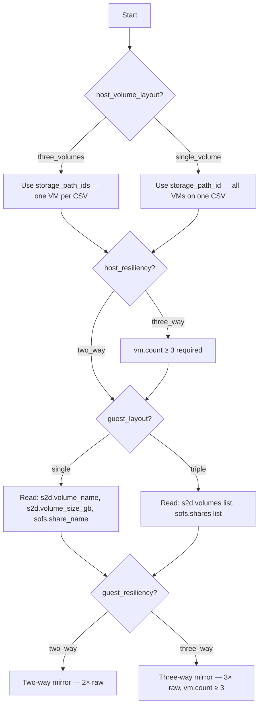

# Variable Reference

All deployment tools read from a single central configuration file: `config/variables.yml`. This file is the **single source of truth** — your architecture decisions, sizing calculations, identity settings, and infrastructure IDs are all declared here and consumed by every automation tool.

> [!TIP]
> **Getting started**
> Copy the example and fill in your values:
> ```powershell
> cp config/variables.example.yml config/variables.yml
> ```
> **Never commit** `variables.yml` — it is excluded by `.gitignore` because it contains environment-specific values and Key Vault references.
>
---

## Deployment Architecture Choices

```yaml
deployment:
  host_volume_layout: "three_volumes"
  host_resiliency: "two_way"
  guest_layout: "single"
  guest_resiliency: "two_way"
```

| Variable | Type | Required | Description | Default | Valid Values | Phases |
|----------|------|:--------:|-------------|---------|-------------|--------|
| `deployment.host_volume_layout` | string | **Yes** | Host CSV layout — three volumes for fault isolation or one shared volume | `three_volumes` | `three_volumes`, `single_volume` | 1 |
| `deployment.host_resiliency` | string | **Yes** | Host mirror level — three-way requires 3+ nodes | `two_way` | `two_way`, `three_way` | 1 |
| `deployment.guest_layout` | string | **Yes** | Guest S2D + share model — Single layout (single) or Triple layout (three) | `single` | `single`, `triple` | 7–8 |
| `deployment.guest_resiliency` | string | **Yes** | Guest S2D mirror level — three-way requires 3+ nodes | `two_way` | `two_way`, `three_way` | 7 |

### Deployment Path Decision Tree



**Variable activation by path:**

| Variable | `single` | `triple` |
|----------|:----------:|:----------:|
| `s2d.volume_name` | ✅ Active | — Ignored |
| `s2d.volume_size_gb` | ✅ Active | — Ignored |
| `s2d.data_copies` | ✅ Active | — Ignored |
| `s2d.volumes[]` | — Ignored | ✅ Active |
| `sofs.share_name` | ✅ Active | — Ignored |
| `sofs.shares[]` | — Ignored | ✅ Active |

---

## Naming Rules

| Scope | Convention | Example |
|-------|-----------|---------|
| Top-level sections | `snake_case` | `azure_local`, `data_disks` |
| Keys within sections | `snake_case` | `subscription_id`, `volume_size_gb` |
| Per-VM maps | Zero-padded string keys | `"01"`, `"02"`, `"03"` |
| Booleans | Descriptive name | `role_enabled: true` |
| Secrets | `keyvault://` URI | `keyvault://kv-name/secret-name` |
| Example values | IIC fictional identity | `contoso.local`, `rg-iic-sofs-01`, `kv-iic-platform` |

---

## Compatibility

The PowerShell scripts include a **compatibility shim** that maps the new sectioned config into the legacy `compute_wsfc` / `wsfc_sofs_*` flat key format. This means:

- New `config/variables.yml` → works with all scripts
- Legacy `solution-sofs.yml` → also works (auto-detected)

The shim is transparent — downstream script logic is unchanged.

---

## Azure

```yaml
azure:
  tenant_id: "00000000-0000-0000-0000-000000000000"
  subscription_id: "00000000-0000-0000-0000-000000000000"
  resource_group: "rg-sofs-azl-eus-01"
  location: "eastus"
```

| Variable | Type | Required | Description | Default | Phases |
|----------|------|:--------:|-------------|---------|--------|
| `azure.tenant_id` | string | **Yes** | Entra ID tenant for provider authentication | — | 1 |
| `azure.subscription_id` | string | **Yes** | Azure subscription for all SOFS resources | — | 1 |
| `azure.resource_group` | string | **Yes** | Resource group name — created by the deployment tool if it doesn't exist | `rg-sofs-azl-eus-01` | 1 |
| `azure.location` | string | **Yes** | Azure region matching your Azure Local cluster registration | `eastus` | 1 |

---

## Key Vault

```yaml
keyvault:
  name: "kv-platform-prod"
  tenant_id: "00000000-0000-0000-0000-000000000000"
  subscription_id: "00000000-0000-0000-0000-000000000000"
  resource_group: "rg-platform"
```

| Variable | Type | Required | Description | Default | Phases |
|----------|------|:--------:|-------------|---------|--------|
| `keyvault.name` | string | **Yes** | Key Vault name for secret resolution — all `keyvault://` URIs reference this | — | 1–2 |
| `keyvault.tenant_id` | string | **Yes** | Entra ID tenant hosting the Key Vault (may differ from `azure.tenant_id`) | — | 1–2 |
| `keyvault.subscription_id` | string | **Yes** | Subscription hosting the Key Vault (may differ from `azure.subscription_id`) | — | 1–2 |
| `keyvault.resource_group` | string | **Yes** | Resource group hosting the Key Vault | — | 1–2 |

---

## Azure Local

```yaml
azure_local:
  cluster_name: "azl-cluster-01"
  custom_location_id: "<resource ID>"
  logical_network_id: "<resource ID>"
  gallery_image_name: "<resource ID>"
  storage_path_id: "<resource ID>"          # Single-volume deployments
  storage_path_ids:                          # Three-volume deployments
    "01": "<resource ID>"
    "02": "<resource ID>"
    "03": "<resource ID>"
```

| Variable | Type | Required | Description | Default | Phases |
|----------|------|:--------:|-------------|---------|--------|
| `azure_local.cluster_name` | string | **Yes** | Azure Local cluster name | — | 1–2 |
| `azure_local.custom_location_id` | string | **Yes** | Custom location resource ID for Arc VM placement | — | 2 |
| `azure_local.logical_network_id` | string | **Yes** | Compute logical network resource ID for NIC creation | — | 2 |
| `azure_local.gallery_image_name` | string | **Yes** | Gallery image resource ID (Windows Server 2025 DC Azure Edition Core Gen2) | — | 2 |
| `azure_local.storage_path_id` | string | Single layout | Storage path for single-volume deployments (all VMs on one volume) | — | 2 |
| `azure_local.storage_path_ids` | map | Triple layout | Per-VM storage paths keyed by node number for three-volume deployments (fault isolation) | — | 2 |

> [!TIP]
> **storage_path_id vs. storage_path_ids**
> Use `storage_path_id` (singular) when all VMs share one host volume. Use `storage_path_ids` (plural, keyed by node number) when each VM has its own host volume for fault isolation. The deployment tools check which one is populated and behave accordingly.
>
---

## Virtual Machines

```yaml
vm:
  prefix: "sofs"
  count: 3
  processors: 4
  memory_mb: 8192
  admin_username: "sofs_admin"
  admin_password: "keyvault://kv-platform-prod/sofs-vm-admin-password"
  ips:
    "01": "192.168.1.201"
    "02": "192.168.1.202"
    "03": "192.168.1.203"
```

| Variable | Type | Required | Description | Default | Phases |
|----------|------|:--------:|-------------|---------|--------|
| `vm.prefix` | string | **Yes** | VM name prefix — VMs are named `<prefix>-01`, `<prefix>-02`, etc. | `sofs` | 2 |
| `vm.count` | integer | **Yes** | Number of SOFS VMs (always 3 for production) | `3` | 2 |
| `vm.processors` | integer | **Yes** | vCPUs per VM (increase for high-density deployments) | `4` | 2 |
| `vm.memory_mb` | integer | **Yes** | RAM per VM in MB (8192 = 8 GB; increase for large S2D pools) | `8192` | 2 |
| `vm.os_disk_size_gb` | integer | No | OS disk size in GB | `127` | 2 |
| `vm.admin_username` | string | **Yes** | Local admin username for the VMs | `sofs_admin` | 2 |
| `vm.admin_password` | string | **Yes** | Key Vault URI — resolved at runtime, never stored in plaintext | — | 2 |
| `vm.ips` | map | **Yes** | Static IP assignments per VM, keyed by node number | — | 2 |

---

## Data Disks

```yaml
data_disks:
  count: 4
  size_gb: 500
```

| Variable | Type | Required | Description | Default | Phases |
|----------|------|:--------:|-------------|---------|--------|
| `data_disks.count` | integer | **Yes** | Data disks per VM (feeds the S2D pool) | `4` | 2 |
| `data_disks.size_gb` | integer | **Yes** | Size of each data disk in GB — derived from [Capacity Planning](../architecture/capacity-planning.md) | `500` | 2 |
| `data_disks.dynamic` | boolean | No | Reserved for future dynamic disk provisioning | `false` | — |

> [!IMPORTANT]
> **Size drives everything**
> `data_disks.size_gb` × `data_disks.count` × `vm.count` = total S2D pool. For the 5.5 TB usable example with two-way mirror: 4 × 1024 GB × 3 VMs = 12,288 GB total pool.
>
---

## Domain

```yaml
domain:
  fqdn: "contoso.local"
  netbios: "IIC"
  join_username: "svc.domainjoin"
  join_password: "keyvault://kv-platform-prod/domain-join-password"
  cluster_ou_path: "OU=SOFS-Cluster,OU=Clusters,OU=Servers,DC=iic,DC=local"
  nodes_ou_path: "OU=SOFS-Cluster,OU=Clusters,OU=Servers,DC=iic,DC=local"
```

| Variable | Type | Required | Description | Default | Phases |
|----------|------|:--------:|-------------|---------|--------|
| `domain.fqdn` | string | **Yes** | Active Directory domain FQDN | `contoso.local` | 3–4 |
| `domain.netbios` | string | **Yes** | NetBIOS domain name (used in share permissions: `NETBIOS\Domain Users`) | `IIC` | 8, 10 |
| `domain.join_username` | string | **Yes** | Service account for domain join operations | — | 4 |
| `domain.join_password` | string | **Yes** | Key Vault URI for the domain join password | — | 4 |
| `domain.cluster_ou_path` | string | **Yes** | AD OU for the cluster CNO (Computer Name Object) | — | 4–5 |
| `domain.nodes_ou_path` | string | **Yes** | AD OU for the SOFS VM computer objects | — | 4 |

---

## DNS Servers

```yaml
dns_servers:
  - "10.0.1.10"
  - "10.0.1.11"
```

| Variable | Type | Required | Description | Default | Phases |
|----------|------|:--------:|-------------|---------|--------|
| `dns_servers` | list | **Yes** | DNS servers for the SOFS VMs — typically your AD domain controllers | — | 3 |

---

## SOFS Configuration

=== "Single layout — Single Share"

    ```yaml
    sofs:
      role_name: "FSLogixSOFS"
      cluster_name: "sofs-cluster"
      cluster_ip: "192.168.1.204"
      access_point_ip: "192.168.1.205"
      share_name: "Profiles"
      role_enabled: true
      anti_affinity_rule_name: "SOFS-AntiAffinity"
      smb_encryption: true
      caching_mode: "None"
      continuous_availability: true
      folder_enumeration_mode: "AccessBased"
    ```

=== "Triple layout — Three Shares"

    ```yaml
    sofs:
      role_name: "FSLogixSOFS"
      cluster_name: "sofs-cluster"
      cluster_ip: "192.168.1.204"
      access_point_ip: "192.168.1.205"
      role_enabled: true
      anti_affinity_rule_name: "SOFS-AntiAffinity"
      smb_encryption: true
      caching_mode: "None"
      continuous_availability: true
      folder_enumeration_mode: "AccessBased"
      shares:
        - name: "Profiles"
          volume: "Profiles"
        - name: "ODFC"
          volume: "ODFC"
        - name: "AppData"
          volume: "AppData"
    ```

| Variable | Type | Required | Description | Default | Phases |
|----------|------|:--------:|-------------|---------|--------|
| `sofs.role_name` | string | **Yes** | SOFS client access point name (`\\name\share` prefix) | `FSLogixSOFS` | 8 |
| `sofs.cluster_name` | string | **Yes** | Windows Failover Cluster name (the CNO in AD) | `sofs-cluster` | 5 |
| `sofs.cluster_ip` | string | **Yes** | Static IP for the failover cluster | — | 5 |
| `sofs.access_point_ip` | string | **Yes** | Static IP for the SOFS role client access point | — | 8 |
| `sofs.role_enabled` | boolean | No | Whether the SOFS Scale-Out File Server role is enabled | `true` | 8 |
| `sofs.anti_affinity_rule_name` | string | No | Anti-affinity rule name in the host cluster | `SOFS-AntiAffinity` | 5 |
| `sofs.smb_encryption` | boolean | No | Enable SMB encryption on shares | `true` | 8 |
| `sofs.caching_mode` | string | No | BranchCache caching mode for shares | `None` | 8 |
| `sofs.continuous_availability` | boolean | No | Enable SMB Continuous Availability on shares | `true` | 8 |
| `sofs.folder_enumeration_mode` | string | No | Access-based enumeration mode for share security | `AccessBased` | 8 |
| `sofs.share_name` | string | Single layout | Single SMB share name | `Profiles` | 8 |
| `sofs.shares` | list | Triple layout | List of shares, each mapped to its own S2D volume | — | 8 |
| `sofs.shares[].name` | string | Triple layout | SMB share name (e.g., `Profiles`, `ODFC`, `AppData`) | — | 8 |
| `sofs.shares[].volume` | string | Triple layout | S2D volume that backs this share (must match `s2d.volumes[].name`) | — | 8 |

> [!TIP]
> **Which option?**
> See [FSLogix Configuration — Single Share vs Three Shares](../configuration/fslogix.md#single-share-vs-three-shares-when-to-use-each) for guidance on when to use each model.
>
---

## Storage Spaces Direct (S2D)

=== "Single layout — Single Volume"

    ```yaml
    s2d:
      volume_name: "FSLogixData"
      volume_size_gb: 2560
      data_copies: 2
    ```

=== "Triple layout — Three Volumes"

    ```yaml
    s2d:
      volumes:
        - name: "Profiles"
          size_gb: 33485       # ~55% — profile containers
          data_copies: 2
        - name: "ODFC"
          size_gb: 21299       # ~35% — Outlook OST, Teams cache
          data_copies: 2
        - name: "AppData"
          size_gb: 6144        # ~10% — per-user AppData redirections
          data_copies: 2
    ```

| Variable | Type | Required | Description | Default | Phases |
|----------|------|:--------:|-------------|---------|--------|
| `s2d.pool_name` | string | No | S2D storage pool friendly name | `S2D on sofs-cluster` | 7 |
| `s2d.volume_name` | string | Single layout | Single guest S2D volume name | `FSLogixData` | 7 |
| `s2d.volume_size_gb` | integer | Single layout | Single guest S2D volume size — your usable FSLogix space target | — | 7 |
| `s2d.data_copies` | integer | Single layout | `NumberOfDataCopies` — **2** for two-way mirror, **3** for three-way | `2` | 7 |
| `s2d.volumes` | list | Triple layout | List of guest S2D volumes — one per FSLogix workload | — | 7 |
| `s2d.volumes[].name` | string | Triple layout | Volume name (must match `sofs.shares[].volume`) | — | 7 |
| `s2d.volumes[].size_gb` | integer | Triple layout | Volume size in GB per-workload — from [Capacity Planning](../architecture/capacity-planning.md) | — | 7 |
| `s2d.volumes[].data_copies` | integer | Triple layout | Per-volume mirror level (typically all match) | `2` | 7 |

> [!CAUTION]
> **data_copies defaults matter**
> S2D defaults to three-way mirror on a 3-node cluster. You must explicitly set `data_copies: 2` for a two-way mirror. Getting this wrong silently consumes 50% more raw capacity.
>
!!! note "Triple layout volume sizing"
    A typical split for Triple layout is ~55% Profiles, ~35% ODFC, ~10% AppData. Adjust based on your user personas — heavy Outlook users need more ODFC space. See [Scenario C](../architecture/scenarios.md#scenario-c-enterprise-2000-users-high-density-pooled) for a worked example.

---

## Cloud Witness

```yaml
cloud_witness:
  name: "stsofswitnessprod01"
  endpoint: "core.windows.net"
  key_uri: ""
  key_secret: ""
```

| Variable | Type | Required | Description | Default | Phases |
|----------|------|:--------:|-------------|---------|--------|
| `cloud_witness.name` | string | **Yes** | Azure Storage Account name for the cluster quorum cloud witness | — | 1, 5 |
| `cloud_witness.endpoint` | string | No | Storage endpoint suffix — override for sovereign clouds (e.g., `core.chinacloudapi.cn`) | `core.windows.net` | 5 |
| `cloud_witness.key_uri` | string | No | Key Vault URI for the storage account key | — | 5 |
| `cloud_witness.key_secret` | string | No | Direct storage key value (less secure — use `key_uri` when possible) | — | 5 |

---

## Guest Configuration Engine

```yaml
guest_config_engine: "ansible_create"
```

| Variable | Type | Required | Description | Default | Phases |
|----------|------|:--------:|-------------|---------|--------|
| `guest_config_engine` | string | **Yes** | Controls how guest OS configuration (Phases 3–11) is executed | `ansible_create` | 3–11 |

| Value | Behavior |
|-------|----------|
| `ansible_create` | Deploy an Ansible controller VM and run playbooks automatically |
| `ansible_existing` | Use an existing Ansible controller (specify in `ansible_controller`) |
| `manual` | Skip guest configuration — the operator runs PowerShell scripts manually |

---

## Ansible Controller

Used when `guest_config_engine` is `ansible_create` or `ansible_existing`.

```yaml
ansible_controller:
  name: "vm-ansible-sofs-01"
  size: "Standard_B2s"
  admin_username: "ansibleadmin"
  ssh_public_key_path: "~/.ssh/id_rsa.pub"
  private_ip: "10.250.1.41"
  hub_subnet_id: "<resource ID>"
  hub_rg: "rg-connectivity"
  existing_controller_ip: ""
  existing_controller_user: "ansibleadmin"
```

| Variable | Type | Required | Description | Default | Phases |
|----------|------|:--------:|-------------|---------|--------|
| `ansible_controller.name` | string | ansible_create | VM name for the Ansible controller | `vm-ansible-sofs-01` | 2 |
| `ansible_controller.size` | string | ansible_create | Azure VM size | `Standard_B2s` | 2 |
| `ansible_controller.admin_username` | string | ansible_create | Admin username for the controller VM | `ansibleadmin` | 2 |
| `ansible_controller.ssh_public_key_path` | string | ansible_create | Path to the SSH public key for controller authentication | `~/.ssh/id_rsa.pub` | 2 |
| `ansible_controller.private_ip` | string | ansible_create | Static private IP for the controller VM | — | 2 |
| `ansible_controller.hub_subnet_id` | string | ansible_create | Subnet resource ID in the hub VNet | — | 2 |
| `ansible_controller.hub_rg` | string | ansible_create | Resource group for the hub network | `rg-connectivity` | 2 |
| `ansible_controller.existing_controller_ip` | string | ansible_existing | IP address of existing controller | — | 3 |
| `ansible_controller.existing_controller_user` | string | ansible_existing | SSH user on existing controller | `ansibleadmin` | 3 |

---

## Tags

```yaml
tags:
  project: "SOFS"
  environment: "production"
  workload: "FSLogix"
  solution: "sofs-azure-local"
```

| Variable | Type | Required | Description | Default | Phases |
|----------|------|:--------:|-------------|---------|--------|
| `tags.project` | string | No | Project tag | `SOFS` | 1 |
| `tags.environment` | string | No | Environment tag | `production` | 1 |
| `tags.workload` | string | No | Workload tag | `FSLogix` | 1 |
| `tags.solution` | string | No | Solution tag | `sofs-azure-local` | 1 |

---

## How Design Decisions Map to Variables

| Architecture Decision | Variables Affected |
|----------------------|-------------------|
| Three host volumes (fault isolation) | `deployment.host_volume_layout: "three_volumes"`, `azure_local.storage_path_ids` |
| Single host volume | `deployment.host_volume_layout: "single_volume"`, `azure_local.storage_path_id` |
| Two-way host mirror | `deployment.host_resiliency: "two_way"` |
| Three-way host mirror | `deployment.host_resiliency: "three_way"`, `vm.count` ≥ 3 |
| Two-way guest mirror | `deployment.guest_resiliency: "two_way"`, `s2d.data_copies: 2` |
| Three-way guest mirror | `deployment.guest_resiliency: "three_way"`, `s2d.data_copies: 3`, `vm.count` ≥ 3 |
| Single layout (single share) | `deployment.guest_layout: "single"`, `sofs.share_name`, `s2d.volume_name`, `s2d.volume_size_gb` |
| Triple layout (three shares) | `deployment.guest_layout: "triple"`, `sofs.shares[]`, `s2d.volumes[]` |
| Profile sizing | `data_disks.size_gb` (derived from capacity planning) |
| Sovereign cloud | `cloud_witness.endpoint` (override default `core.windows.net`) |

---

## Tool-Specific Parameter Mapping

Each automation tool reads from `config/variables.yml` and maps values to its own parameter format:

| Tool | Parameter File | Mapping |
|------|---------------|---------|
| **Terraform** | `src/terraform/terraform.tfvars` | Copy `terraform.tfvars.example`, values map 1:1 to `variables.tf` |
| **Bicep** | `src/bicep/main.bicepparam` | Copy `main.bicepparam.example`, parameter names match Bicep template |
| **ARM** | `src/arm/azuredeploy.parameters.json` | Copy `azuredeploy.parameters.example.json` |
| **PowerShell** | Reads `config/variables.yml` directly | Accepts `-ConfigPath` parameter |
| **Ansible** | `src/ansible/inventory.yml` | Host inventory + all SOFS variables in group_vars |

> [!TIP]
> **Central config, tool-specific params**
> For Terraform, Bicep, and ARM, you maintain both `config/variables.yml` (your design decisions) and the tool-specific parameter file. The PowerShell and Ansible tools read the central config directly.
>
---

## Key Vault Secret Resolution

Secrets are never stored in plaintext. The `keyvault://` URI format tells deployment tools to resolve the value at runtime:

```yaml
admin_password: "keyvault://kv-platform-prod/sofs-vm-admin-password"
```

**Resolution flow:**

1. Tool parses the URI → vault name: `kv-platform-prod`, secret name: `sofs-vm-admin-password`
2. Tool calls `az keyvault secret show --vault-name kv-platform-prod --name sofs-vm-admin-password`
3. Secret value is passed directly to the deployment — never written to disk

**Required secrets:**

| Secret Name | Used By |
|------------|---------|
| `sofs-vm-admin-password` | Local admin password for SOFS VMs |
| `domain-join-password` | Service account password for domain join |

---

## Phase Consumption Matrix

Shows which variable groups are consumed by each deployment phase.

| Variable Group | ☁️ Phase 1 | 🖥️ Phase 2 | ⚙️ Phases 3–4 | 🔧 Phases 5–8 | 🛡️ Phases 9–11 |
|---------------|:---:|:---:|:---:|:---:|:---:|
| Deployment Choices | ✅ | ✅ | | ✅ | |
| Azure | ✅ | | | | |
| Key Vault | ✅ | ✅ | | | |
| Azure Local | | ✅ | | | |
| Virtual Machines | | ✅ | | | |
| Data Disks | | ✅ | | | |
| Domain | | | ✅ | ✅ | |
| DNS Servers | | | ✅ | | |
| SOFS Configuration | | | | ✅ | ✅ |
| S2D | | | | ✅ | |
| Cloud Witness | ✅ | | | ✅ | |
| Guest Config Engine | | | ✅ | | |
| Ansible Controller | | ✅ | ✅ | | |
| Host Volumes | | | | | |
| Permissions | | | | ✅ | ✅ |
| FSLogix | | | | | ✅ |
| Tags | ✅ | | | | |
| WinRM | | | ✅ | ✅ | ✅ |

---

## Host Volumes

=== "Three Volumes (fault isolation)"

    ```yaml
    host_volumes:
      storage_pool_name: "S2D on azl-cluster-01"
      volumes:
        - name: "SOFS-CSV-01"
          size_tb: 4.0
        - name: "SOFS-CSV-02"
          size_tb: 4.0
        - name: "SOFS-CSV-03"
          size_tb: 4.0
    ```

=== "Single Volume"

    ```yaml
    host_volumes:
      storage_pool_name: "S2D on azl-cluster-01"
      name: "SOFS-CSV-01"
      size_tb: 12.0
    ```

| Variable | Type | Required | Description | Default | Phases |
|----------|------|:--------:|-------------|---------|--------|
| `host_volumes.storage_pool_name` | string | **Yes** | Host S2D pool name (for validation) | — | Reference |
| `host_volumes.volumes` | list | three_volumes | List of host CSV volumes with explicit names | — | Reference |
| `host_volumes.volumes[].name` | string | three_volumes | CSV volume name | — | Reference |
| `host_volumes.volumes[].size_tb` | number | three_volumes | Size per host volume in TB | — | Reference |
| `host_volumes.name` | string | single_volume | Single CSV volume name | — | Reference |
| `host_volumes.size_tb` | number | single_volume | Total host volume size in TB | — | Reference |

> [!NOTE]
> **Reference only**
> Host volumes are provisioned directly on the Azure Local cluster as a prerequisite. These variables exist for documentation, validation, and reporting — automation tools do not create host volumes.
>
---

## Permissions

```yaml
permissions:
  admin_group: "Domain Admins"
  users_group: "AVD-Users"
  avd_users_group: "AVD-Users"
```

| Variable | Type | Required | Description | Default | Phases |
|----------|------|:--------:|-------------|---------|--------|
| `permissions.admin_group` | string | **Yes** | AD group with full control on SMB shares and NTFS | `Domain Admins` | 8–9 |
| `permissions.users_group` | string | **Yes** | AD group for SMB change access and NTFS modify-this-folder-only | `AVD-Users` | 8–9 |
| `permissions.avd_users_group` | string | No | AVD user group (may differ from `users_group` for scoping) | `AVD-Users` | 9 |

---

## FSLogix

```yaml
fslogix:
  enabled: true
  profile_size_mb: 30000
  volume_type: "VHDX"
  flip_flop_name: true
  delete_local_profile: true
  cloud_cache:
    enabled: false
    azure_provider: ""
```

| Variable | Type | Required | Description | Default | Valid Values | Phases |
|----------|------|:--------:|-------------|---------|-------------|--------|
| `fslogix.enabled` | boolean | No | Whether FSLogix profile containers are configured | `true` | — | 9–11 |
| `fslogix.profile_size_mb` | integer | No | Maximum profile VHD(X) size in MB | `30000` | — | 9 |
| `fslogix.volume_type` | string | No | Profile container disk format | `VHDX` | `VHDX`, `VHD` | 9 |
| `fslogix.flip_flop_name` | boolean | No | Use `%USERNAME%_%SID%` instead of `%SID%_%USERNAME%` | `true` | — | 9 |
| `fslogix.delete_local_profile` | boolean | No | Delete local profile on logoff when FSLogix is active | `true` | — | 9 |
| `fslogix.cloud_cache.enabled` | boolean | No | Enable Cloud Cache (dual-write to SOFS + Azure Blob) | `false` | — | 9 |
| `fslogix.cloud_cache.azure_provider` | string | No | Azure Blob Storage connection string for Cloud Cache | — | — | 9 |

---

## WinRM

Used by PowerShell and Ansible tools for remote guest OS configuration (Phases 3–11).

```yaml
winrm:
  transport: "kerberos"
  port: 5985
  use_ssl: false
  cert_validation: "ignore"
```

| Variable | Type | Required | Description | Default | Valid Values | Phases |
|----------|------|:--------:|-------------|---------|-------------|--------|
| `winrm.transport` | string | No | WinRM authentication transport | `kerberos` | `kerberos`, `ntlm`, `basic` | 3–11 |
| `winrm.port` | integer | No | WinRM listener port | `5985` | `5985`, `5986` | 3–11 |
| `winrm.use_ssl` | boolean | No | Use HTTPS for WinRM connections | `false` | — | 3–11 |
| `winrm.cert_validation` | string | No | Certificate validation mode for SSL connections | `ignore` | `ignore`, `validate` | 3–11 |

> [!TIP]
> **Transport choice**
> Use `kerberos` for domain-joined environments (most secure, requires AD). Use `ntlm` when Kerberos delegation is not available. Avoid `basic` in production.
