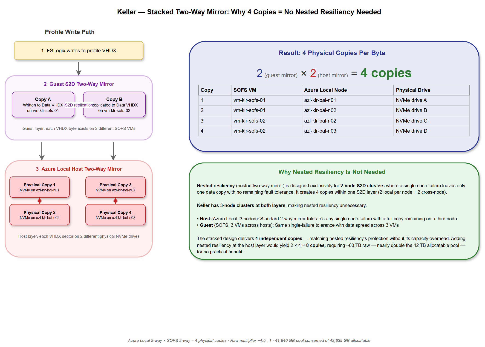
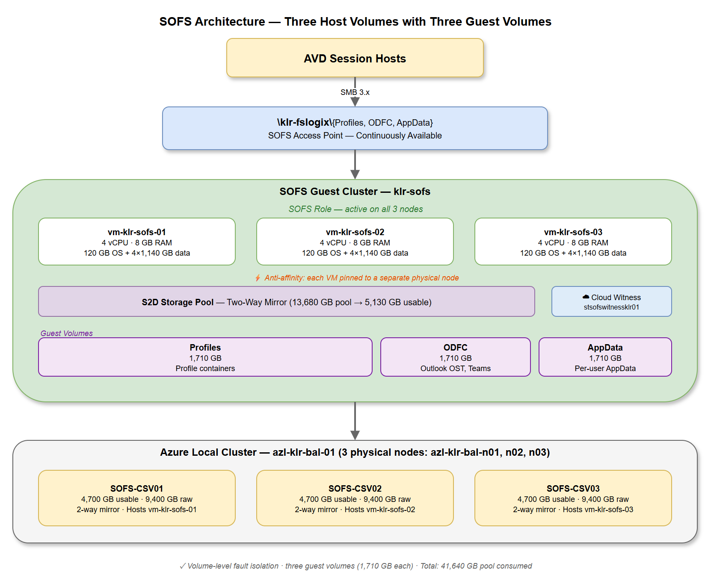
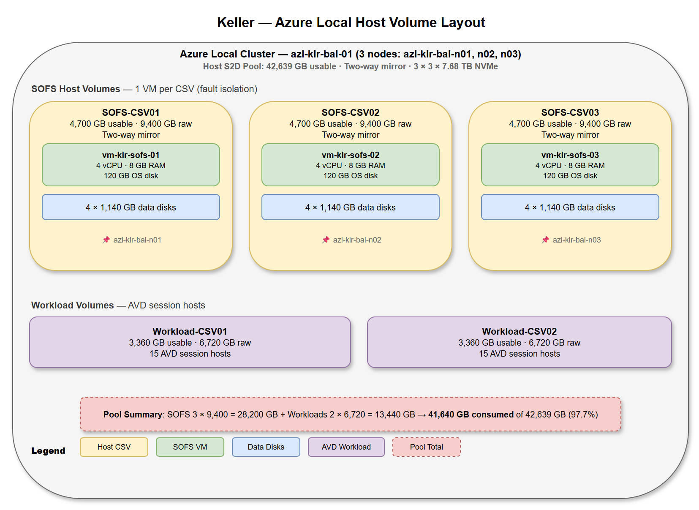
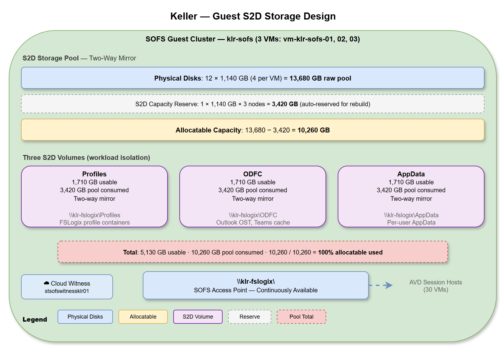
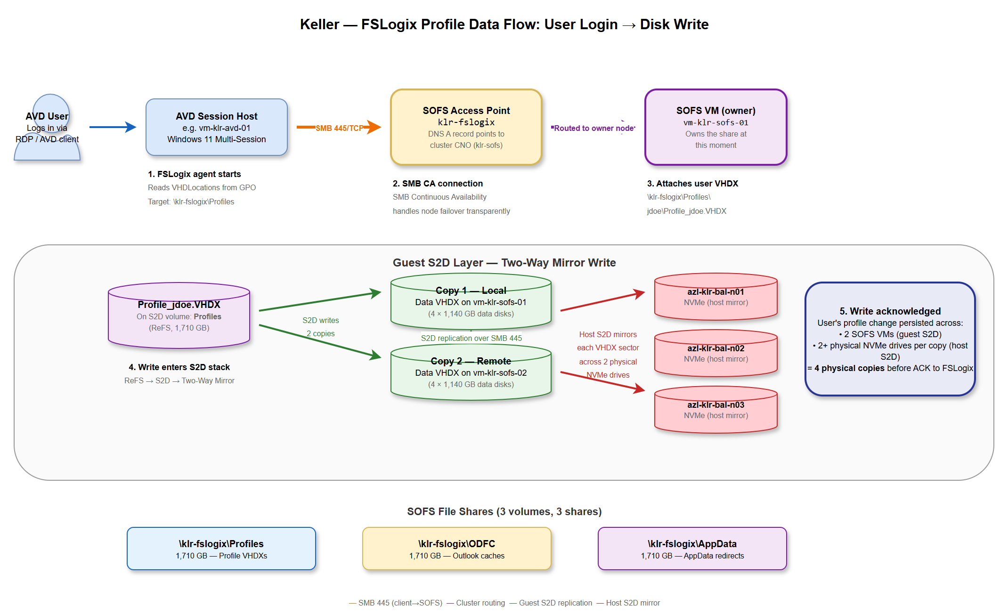
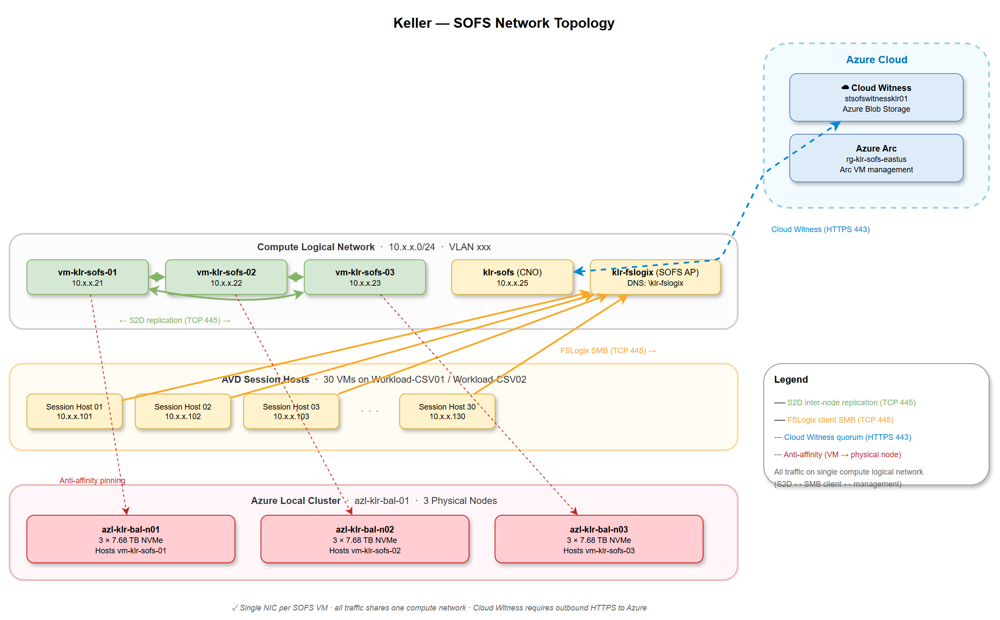
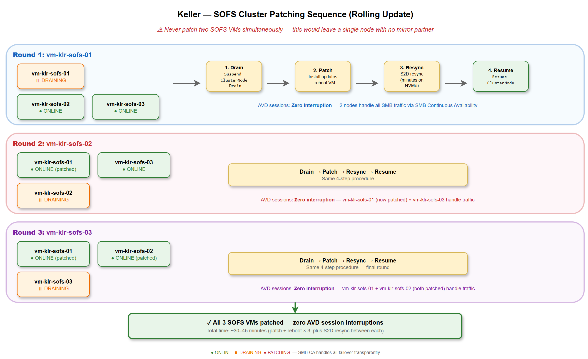
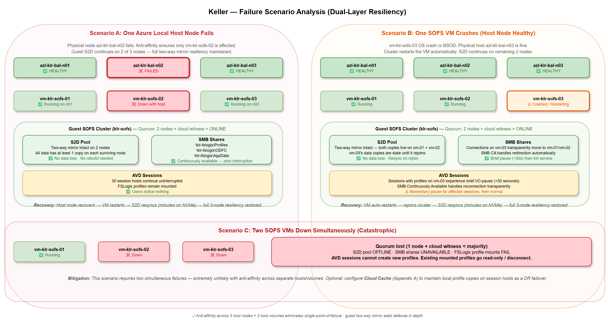
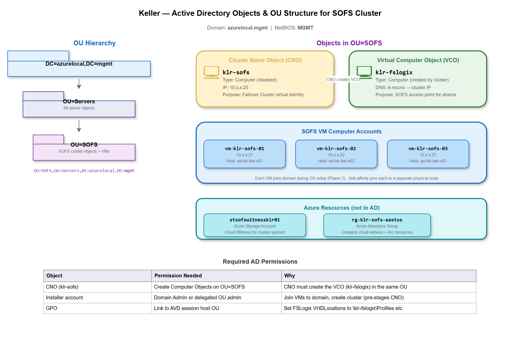
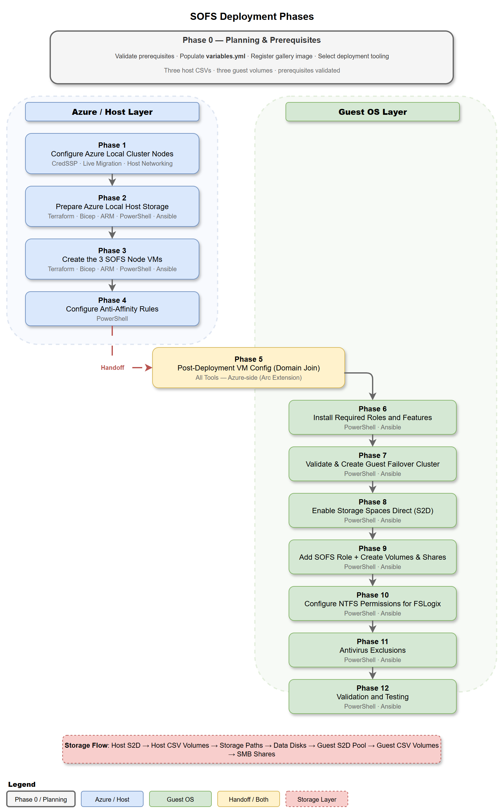

# Keller — Scale-Out File Server Design & Deployment on Azure Local

## Guest SOFS for AVD FSLogix Profiles

| | |
|---|---|
| **Version** | 1.0 |
| **Date** | March 2026 |
| **Customer** | Keller |
| **Prepared by** | TierPoint |

---

### What This Document Covers

This document is the complete design and deployment reference for a **3-node Scale-Out File Server (SOFS) guest cluster** running Storage Spaces Direct (S2D) on Azure Local, purpose-built to host FSLogix profile containers for Keller's Azure Virtual Desktop (AVD) session hosts.

The document is organized in four parts:

- **Part I — Azure Local Storage Design** covers Keller's hardware inventory and allocatable capacity, explains how two stacked mirror layers multiply raw consumption, walks through two viable storage scenarios (3-VM and 2-VM SOFS with two-way mirrors at both layers), eliminates scenarios that exceed the cluster's capacity, and selects the recommended configuration with a clear rationale.
- **Part II — SOFS Cluster Design** details the chosen architecture: VM specifications, host volume layout for fault isolation, guest S2D storage design with three FSLogix shares for workload isolation, network configuration, high availability and resiliency considerations, and Windows Server licensing requirements.
- **Part III — Implementation** provides the full 11-phase deployment from creating Azure Local host volumes and provisioning Arc VMs through guest cluster creation, S2D configuration, SOFS role setup, SMB share creation, NTFS permissions, antivirus exclusions, and validation. Every phase includes exact PowerShell or Azure CLI commands with Keller-specific resource names following Azure Cloud Adoption Framework (CAF) naming conventions. This guide uses PowerShell for step-by-step clarity. Fully automated solutions are also available using Terraform, Bicep, ARM templates, PowerShell scripts, and Ansible playbooks — see [Automation Scripts](#automation-scripts) in Part IV.
- **Part IV — Reference** consolidates the IP/name reference table, operational notes, AVD session host configuration (FSLogix registry keys, identity model), automation script inventory with links, and Microsoft documentation references. Appendix A covers optional Cloud Cache configuration for DR to Azure.

---

## Table of Contents

**Part I — Azure Local Storage Design**

1. [Hardware and Capacity Overview](#11-hardware-and-capacity-overview)
2. [Stacked Mirror Resiliency](#12-stacked-mirror-resiliency)
3. [Scenario Analysis](#13-scenario-analysis)
4. [Design Decision](#design-decision-scenario-1)

**Part II — SOFS Cluster Design**

6. [Architecture Overview](#21-architecture-overview)
7. [VM Configuration](#22-vm-configuration)
8. [Host Volume Layout](#23-host-volume-layout)
9. [Guest S2D Storage Design](#24-guest-s2d-storage-design)
10. [Network Configuration](#25-network-configuration)
11. [High Availability and Resiliency](#26-high-availability-and-resiliency)
12. [Licensing](#27-licensing)

**Part III — Implementation**

13. [Prerequisites](#prerequisites)
14. [Phase 1: Prepare the Azure Local Host Environment](#phase-1-prepare-the-azure-local-host-environment)
15. [Phase 2: Create the 3 SOFS Node VMs](#phase-2-create-the-3-sofs-node-vms)
16. [Phase 3: Configure Anti-Affinity Rules](#phase-3-configure-anti-affinity-rules)
17. [Phase 4: Post-Deployment VM Configuration](#phase-4-post-deployment-vm-configuration)
18. [Phase 5: Install Required Roles and Features](#phase-5-install-required-roles-and-features)
19. [Phase 6: Validate and Create the Guest Failover Cluster](#phase-6-validate-and-create-the-guest-failover-cluster)
20. [Phase 7: Enable Storage Spaces Direct (S2D)](#phase-7-enable-storage-spaces-direct-s2d)
21. [Phase 8: Add the Scale-Out File Server Role](#phase-8-add-the-scale-out-file-server-role)
22. [Phase 9: Configure NTFS Permissions for FSLogix](#phase-9-configure-ntfs-permissions-for-fslogix)
23. [Phase 10: Antivirus Exclusions](#phase-10-antivirus-exclusions)
24. [Phase 11: Validation and Testing](#phase-11-validation-and-testing)

**Part IV — Reference**

25. [IP and Name Reference](#ip-and-name-reference)
26. [Important Notes and Considerations](#important-notes-and-considerations)
27. [Considerations for AVD Deployment](#considerations-for-avd-deployment)
28. [Automation Scripts](#automation-scripts)
29. [Microsoft Documentation Links](#microsoft-documentation-links)
30. [Appendix A — Cloud Cache for DR to Azure](#appendix-a--cloud-cache-for-dr-to-azure-optional)
31. [Related Resources](#related-resources)

---

# Part I — Azure Local Storage Design

## 1.1 Hardware and Capacity Overview

Keller's Azure Local cluster consists of **3 physical nodes**, each equipped with **3 × 7.68 TB NVMe drives**. Storage Spaces Direct (S2D) manages all drives as a single distributed pool across all nodes.

### Workload Requirements

| Requirement | Usable Space Needed |
|-------------|---------------------|
| FSLogix profiles (SOFS cluster) | 5,120 GB (5 TB) |
| 30 AVD session hosts × 127 GB OS disks | 3,810 GB |

### Raw to Allocatable Capacity

| Item | Value |
|------|-------|
| Nodes | 3 |
| NVMe drives per node | 3 |
| Raw capacity per drive | 7.68 TB |
| Total raw capacity | 69.12 TB |
| Total formatted capacity | ~62.84 TB |
| S2D reserve (1 drive × 3 nodes) | 21.20 TB |
| **Allocatable capacity** | **41.64 TB (42,639 GB)** |

The S2D reserve exists so the cluster can automatically rebuild data after a drive failure. S2D reserves the formatted capacity of one drive per node — in this case, ~7.07 TB × 3 nodes = 21.20 TB. This reserve is not optional and cannot be used for volumes.

---

## 1.2 Stacked Mirror Resiliency

Mirror resiliency is evaluated at **two independent layers**:

- **Azure Local cluster layer** — The physical S2D pool where Cluster Shared Volumes (CSVs) are created to host SOFS VMs and AVD workload VMs.
- **SOFS cluster layer** — The virtual S2D pool inside the SOFS guest cluster, formed from VHDX data disks passed through from the Azure Local cluster. This is where the FSLogix profile volumes live.

These layers multiply. A **two-way mirror on Azure Local** hosting a **two-way mirror inside the SOFS cluster** means every byte of profile data exists in **2 × 2 = 4 physical copies**. A three-way at both layers would mean 9 copies. This is why several scenarios exceed the available capacity — the raw footprint stacks multiplicatively.

| Combination | Copies per Byte | Raw Multiplier |
|-------------|:-:|:-:|
| Azure Local 2-way × SOFS 2-way | 4 | ~4.5 : 1 |
| Azure Local 2-way × SOFS 3-way | 6 | ~6.2 : 1 |
| Azure Local 3-way × SOFS 2-way | 6 | ~6.8 : 1 |
| Azure Local 3-way × SOFS 3-way | 9 | ~9.3 : 1 |

> **The Azure Local two-way mirror already protects against physical disk and host node failures.** The guest S2D mirror adds a second resiliency layer at the VM level — defense in depth. Make sure the customer understands the raw footprint up front and that the cluster has headroom alongside existing workloads.



---

## 1.3 Scenario Analysis

The table below summarizes all practical combinations of Azure Local mirror level, SOFS VM count, and guest mirror level. Only two scenarios fit within Keller's 41.64 TB allocatable pool while meeting the 5,120 GB FSLogix requirement and hosting 30 AVD session hosts.

### Scenarios That Exceed Available Capacity

| Scenario | Azure Local Mirror | SOFS VMs | Guest Mirror | Pool Required | Verdict |
|:--------:|:------------------:|:--------:|:------------:|:-------------:|:-------:|
| 2 | 3-VM | 2-way | 3-way | ~55 TB | **Exceeds pool** |
| 3 | 3-VM | 3-way | 2-way | ~54 TB | **Exceeds pool** |
| 5 | 2-VM | 2-way | 3-way | ~50 TB | **Exceeds pool** |
| 6 | 2-VM | 3-way | 2-way | ~48 TB | **Exceeds pool** |

Any combination involving a three-way mirror at either layer pushes the raw pool requirement well past the 42,639 GB ceiling. These scenarios are not viable for this cluster.

---

### Scenario 1: 3-VM SOFS — Azure Local 2-Way / SOFS Cluster 2-Way (Recommended)

**✅ FITS — 2,910 GB workload headroom**

This is the recommended configuration. All volumes at both layers use two-way mirror, and the SOFS cluster runs three virtual machines for maximum fault tolerance within the guest cluster. Two-way mirror provides protection against a single node or drive failure at each layer.

#### Azure Local Cluster Volumes

| Volume | New-Volume Size | Mirror | Pool Consumed | Purpose |
|--------|----------------:|:------:|--------------:|---------|
| SOFS-CSV01 | 4,700 GB | 2-way | 9,400 GB | Hosts SOFS VM #1 |
| SOFS-CSV02 | 4,700 GB | 2-way | 9,400 GB | Hosts SOFS VM #2 |
| SOFS-CSV03 | 4,700 GB | 2-way | 9,400 GB | Hosts SOFS VM #3 |
| Workload-CSV01 | 3,360 GB | 2-way | 6,720 GB | AVD session hosts |
| Workload-CSV02 | 3,360 GB | 2-way | 6,720 GB | AVD session hosts |
| **Totals** | **20,820 GB** | | **41,640 GB** | |

> Workload usable: 6,720 GB | AVD needs: 3,810 GB | **Headroom: 2,910 GB**

#### SOFS VM Virtual Disks (per VM)

| Disk | Size | Purpose |
|------|-----:|---------|
| OS.vhdx | 120 GB | Windows Server operating system |
| Data01.vhdx | 1,140 GB | Passed to SOFS S2D pool |
| Data02.vhdx | 1,140 GB | Passed to SOFS S2D pool |
| Data03.vhdx | 1,140 GB | Passed to SOFS S2D pool |
| Data04.vhdx | 1,140 GB | Passed to SOFS S2D pool |
| **Total per VM (× 3 VMs)** | **4,680 GB** | Fits within 4,700 GB CSV |

#### SOFS Cluster Volumes (Guest S2D)

13,680 GB pool | 3,420 GB reserve | 10,260 GB allocatable:

| Volume | New-Volume Size | Mirror | Pool Consumed | Purpose |
|--------|----------------:|:------:|--------------:|---------|
| Profiles | 1,710 GB | 2-way | 3,420 GB | FSLogix profile containers |
| ODFC | 1,710 GB | 2-way | 3,420 GB | Office Data File Containers |
| AppData | 1,710 GB | 2-way | 3,420 GB | Per-user AppData |
| **Totals** | **5,130 GB usable** | | **10,260 GB** | |

**Pros:** Most efficient use of capacity. Nearly 3 TB of headroom on the workload volumes for future AVD growth. Three SOFS VMs provide the highest fault tolerance for the profile storage layer — one node can fail and the cluster continues with two healthy nodes and full resiliency.

**Cons:** Two-way mirror at the Azure Local layer means a second simultaneous drive or node failure during a rebuild could result in data loss. In practice, all-NVMe rebuild times are measured in minutes, so this window is very small.

---

### Scenario 4: 2-VM SOFS — Azure Local 2-Way / SOFS Cluster 2-Way (Alternative)

**✅ FITS — 3,010 GB workload headroom**

This configuration reduces the SOFS cluster from three VMs to two, freeing up one full CSV worth of pool capacity. The SOFS cluster uses a cloud witness for quorum. All volumes remain in a two-way mirror at both layers.

#### Azure Local Cluster Volumes

| Volume | New-Volume Size | Mirror | Pool Consumed | Purpose |
|--------|----------------:|:------:|--------------:|---------|
| SOFS-CSV01 | 7,000 GB | 2-way | 14,000 GB | Hosts SOFS VM #1 |
| SOFS-CSV02 | 7,000 GB | 2-way | 14,000 GB | Hosts SOFS VM #2 |
| Workload-CSV01 | 3,410 GB | 2-way | 6,820 GB | AVD session hosts |
| Workload-CSV02 | 3,410 GB | 2-way | 6,820 GB | AVD session hosts |
| **Totals** | **20,820 GB** | | **41,640 GB** | |

> Workload usable: 6,820 GB | AVD needs: 3,810 GB | **Headroom: 3,010 GB**

#### SOFS VM Virtual Disks (per VM)

| Disk | Size | Purpose |
|------|-----:|---------|
| OS.vhdx | 120 GB | Windows Server operating system |
| Data01.vhdx | 1,710 GB | Passed to SOFS S2D pool |
| Data02.vhdx | 1,710 GB | Passed to SOFS S2D pool |
| Data03.vhdx | 1,710 GB | Passed to SOFS S2D pool |
| Data04.vhdx | 1,710 GB | Passed to SOFS S2D pool |
| **Total per VM (× 2 VMs)** | **6,960 GB** | Fits within 7,000 GB CSV |

#### SOFS Cluster Volumes (Guest S2D)

13,680 GB pool | 3,420 GB reserve | 10,260 GB allocatable:

| Volume | New-Volume Size | Mirror | Pool Consumed | Purpose |
|--------|----------------:|:------:|--------------:|---------|
| Profiles | 1,710 GB | 2-way | 3,420 GB | FSLogix profile containers |
| ODFC | 1,710 GB | 2-way | 3,420 GB | Office Data File Containers |
| AppData | 1,710 GB | 2-way | 3,420 GB | Per-user AppData |
| **Totals** | **5,130 GB usable** | | **10,260 GB** | |

**Pros:** Best overall capacity efficiency. Over 3 TB of headroom for workload growth. Fewer VMs to manage and patch. Larger data VHDXs give the SOFS S2D pool more flexibility.

**Cons:** Two SOFS nodes mean **zero redundancy while one node is down for patching** — if the second node fails during that window, profile storage goes offline. The SOFS cluster tolerates exactly one node failure; the three-VM version tolerates one with continued redundancy. Requires a cloud witness or file share witness for quorum.

> **Patching note:** During maintenance windows, drain and reboot one SOFS VM at a time. Wait for the S2D resync to complete before patching the second node. On all-NVMe storage, resync is typically measured in minutes.

---

### Design Decision: Scenario 1

**Scenario 1 (3-VM SOFS, two-way mirror at both layers) is the recommended design for Keller.**

| Factor | Scenario 1 (3-VM) | Scenario 4 (2-VM) |
|--------|:------------------:|:------------------:|
| SOFS fault tolerance | 1 node failure, cluster stays redundant | 1 node failure, **cluster has zero redundancy** |
| Patching safety | Drain 1 of 3 — 2 healthy nodes remain | Drain 1 of 2 — **single point of failure** |
| Workload headroom | 2,910 GB | 3,010 GB |
| Management overhead | 3 VMs to patch | 2 VMs to patch |
| Pool utilization | 41,640 / 42,639 (97.7%) | 41,640 / 42,639 (97.7%) |

The 100 GB difference in workload headroom is negligible. The decisive factor is **patching safety**: in a 2-VM cluster, every patch window creates a single-point-of-failure window. With a 3-VM cluster, one node can be drained for maintenance while two nodes continue serving profiles with full two-way mirror resiliency. For a production AVD environment where FSLogix availability directly impacts user experience, the three-VM configuration is the right trade-off.

---

# Part II — SOFS Cluster Design

## 2.1 Architecture Overview

This design deploys a **3-node Windows Server guest cluster** running Storage Spaces Direct (S2D) with the Scale-Out File Server (SOFS) role, hosted on Keller's Azure Local cluster. The SOFS provides continuously available SMB shares for FSLogix profile containers used by AVD session hosts.

**Key design points:**

- 3 **Windows Server 2025 Datacenter: Azure Edition Core (Gen2)** VMs — `vm-klr-sofs-01`, `vm-klr-sofs-02`, `vm-klr-sofs-03`
- Each VM pinned to a separate Azure Local physical node (`azl-klr-bal-n01`, `azl-klr-bal-n02`, `azl-klr-bal-n03`) via anti-affinity rules
- All VMs connected to the compute network
- **Azure Local layer:** Three separate two-way mirror CSV volumes — one per SOFS VM (4,700 GB usable each, 9,400 GB raw each). Isolating each VM on its own volume eliminates shared-fate storage failures.
- **Guest S2D layer:** Two-way mirror provides 5,130 GB usable for FSLogix profiles across three volumes for workload isolation
- SOFS role presents three continuously available SMB shares via a single endpoint (`klr-fslogix`) to AVD session hosts: `Profiles`, `ODFC`, and `AppData`

**Architecture diagram:** Three host volumes (fault isolation) with three guest volumes (workload isolation).



> **Why three separate host volumes?** If all three SOFS VMs sit on a single Azure Local volume, that volume is a shared-fate dependency — a volume-level issue takes out the entire guest cluster. With three volumes, a single volume failure only affects one SOFS node. The guest S2D two-way mirror continues operating on the remaining two nodes with no data loss and no interruption to AVD sessions.

---

## 2.2 VM Configuration

Each SOFS VM is deployed from the **Windows Server 2025 Datacenter: Azure Edition Core (Gen2)** gallery image (marketplace SKU: `2025-datacenter-azure-edition-core`).

| Specification | Value |
|---------------|-------|
| **VM count** | 3 |
| **VM names** | `vm-klr-sofs-01`, `vm-klr-sofs-02`, `vm-klr-sofs-03` |
| **vCPU** | 4 per VM |
| **RAM** | 8 GB per VM |
| **OS disk** | 120 GB (dynamic VHDX) |
| **Data disks** | 4 × 1,140 GB per VM (dynamic VHDX) |
| **Total disk per VM** | 4,680 GB (fits within 4,700 GB CSV) |
| **OS** | Windows Server 2025 Datacenter: Azure Edition Core |
| **Domain** | `azurelocal.mgmt` |
| **Placement** | Anti-affinity — one VM per physical node |

> **Datacenter licensing is required** for Storage Spaces Direct. Standard edition does not support S2D.

---

## 2.3 Host Volume Layout

Three separate Azure Local CSV volumes are created — one per SOFS VM. Each volume holds one VM's OS disk and four data disks at full provisioned capacity. Two additional volumes host the AVD workload VMs.



| Volume | Usable Size | Raw (2-way) | Contents |
|--------|-------------|-------------|----------|
| `SOFS-CSV01` | 4,700 GB | 9,400 GB | vm-klr-sofs-01 (OS + 4 × 1,140 GB data) |
| `SOFS-CSV02` | 4,700 GB | 9,400 GB | vm-klr-sofs-02 (OS + 4 × 1,140 GB data) |
| `SOFS-CSV03` | 4,700 GB | 9,400 GB | vm-klr-sofs-03 (OS + 4 × 1,140 GB data) |
| `Workload-CSV01` | 3,360 GB | 6,720 GB | AVD session hosts (15 VMs) |
| `Workload-CSV02` | 3,360 GB | 6,720 GB | AVD session hosts (15 VMs) |
| **Total** | **20,820 GB** | **41,640 GB** | 97.7% of 42,639 GB pool |

> **Do not thin-provision the host volumes.** `New-Volume` uses fixed provisioning by default — leave it that way. Thin provisioning lets you over-commit the Azure Local storage pool by allocating more logical capacity than physical space exists, but for SOFS host volumes this creates more problems than it solves:
>
> - **Pool full = all volumes die.** If total writes exceed the physical pool capacity, S2D puts the pool into a degraded/read-only state. That's not one volume full — it's every SOFS VM going read-only simultaneously.
> - **Defeats fault isolation.** Three volumes on a shared thin pool are back to a shared-fate dependency on pool free space — exactly what separate volumes are designed to eliminate.
> - **Write-time allocation overhead.** Every write must find and allocate slabs from the pool. During a logon storm, that's an extra metadata operation per write. Fixed provisioning has pre-allocated extents — writes go straight to reserved space.
> - **Misleading capacity reporting.** Volumes report large free space while the underlying pool may be nearly full. Admin tools, PerfMon, and FSRM all show the logical number, not the physical reality.

---

## 2.4 Guest S2D Storage Design

Inside the 3-VM SOFS guest cluster, all 12 data disks (4 × 1,140 GB × 3 VMs) form a single S2D storage pool. Three separate S2D volumes are created — one per FSLogix workload — using a **three-share** layout for workload isolation.



| Item | Value |
|------|-------|
| Total S2D pool | 13,680 GB |
| S2D reserve (1 × 1,140 GB × 3 nodes) | 3,420 GB |
| **Allocatable** | **10,260 GB** |

| Volume | Size | Mirror | Pool Consumed | SMB Share | Contents |
|--------|-----:|:------:|--------------:|-----------|----------|
| `Profiles` | 1,710 GB | 2-way | 3,420 GB | `\\klr-fslogix\Profiles` | FSLogix profile containers |
| `ODFC` | 1,710 GB | 2-way | 3,420 GB | `\\klr-fslogix\ODFC` | Office Data File Containers (Outlook OST, Teams cache) |
| `AppData` | 1,710 GB | 2-way | 3,420 GB | `\\klr-fslogix\AppData` | Per-user AppData redirections |
| **Total** | **5,130 GB** | | **10,260 GB** | | |

### Why Three Shares?

Keller's deployment targets 30 AVD session hosts. While a single share works for small environments, three separate volumes provide meaningful operational advantages at this scale:

- **NTFS metadata isolation** — Each volume has its own MFT and change journal. Outlook OST writes hammering the ODFC change journal don't compete with profile writes for NTFS lock time on the Profiles volume.
- **Logon storm resilience** — Heavy AppData syncs (Chrome profiles, specialized apps) only slow the AppData volume. The Profiles volume stays responsive — Start Menu and Desktop load fast for everyone else.
- **FSRM quotas** — Per-volume File Server Resource Manager quotas let you hard-cap ODFC so one user's 50 GB Outlook cache can't eat into profile space. Impossible with a single volume.
- **Monitoring granularity** — Separate PerfMon counters per volume. "ODFC at 85%" is actionable. "FSLogixData at 60%" tells you nothing about what's growing.
- **Future migration path** — If Keller moves to Azure NetApp Files or tiered storage later, pre-separated data maps cleanly to different tiers (fast tier for Profiles, cheaper tier for ODFC/AppData).



---

## 2.5 Network Configuration

All SOFS VMs connect to the compute network via a single NIC. The AVD session hosts should be on the same network/VLAN for optimal SMB latency.

| Component | IP Address | Notes |
|-----------|:----------:|-------|
| `vm-klr-sofs-01` | 10.x.x.21 | S2D node — assign per site |
| `vm-klr-sofs-02` | 10.x.x.22 | S2D node — assign per site |
| `vm-klr-sofs-03` | 10.x.x.23 | S2D node — assign per site |
| `klr-sofs` (cluster CNO) | 10.x.x.25 | Failover cluster IP |
| `klr-fslogix` (SOFS access point) | — | Uses cluster IP; DNS A record |

> **Assign static IPs or DHCP reservations** before creating the guest cluster. All SOFS nodes must have stable, predictable IP addresses. Replace `10.x.x.*` with the actual compute subnet for the Baltimore datacenter.

**Firewall ports between SOFS VMs:**

| Port | Protocol | Purpose |
|------|----------|---------|
| 445 | TCP | SMB (S2D replication, CSV redirected I/O, client access) |
| 5445 | TCP | SMB over QUIC (if used) |
| 5985–5986 | TCP | WinRM / PowerShell Remoting |
| 135 | TCP | RPC Endpoint Mapper (cluster communication) |
| 49152–65535 | TCP | RPC dynamic ports (cluster, S2D) |
| 3343 | UDP | Cluster network driver |

**Between SOFS VMs and AVD session hosts:**

| Port | Protocol | Purpose |
|------|----------|---------|
| 445 | TCP | SMB (FSLogix profile access via `\\klr-fslogix\Profiles`) |



---

## 2.6 High Availability and Resiliency

### Anti-Affinity Rules

Each SOFS VM is pinned to a separate Azure Local physical node via a `DifferentNode` affinity rule. This ensures a single host failure only takes out one S2D node.

### Cloud Witness Quorum

The guest cluster uses an Azure Storage Account (`stsofswitnessklr01`) as a cloud witness. With 3 nodes + 1 cloud witness, quorum tolerates one node failure.

### Patching Procedure

1. **Drain** one SOFS VM at a time using `Suspend-ClusterNode -Drain`
2. **Patch and reboot** the drained VM
3. **Wait** for S2D resync to complete (minutes on all-NVMe)
4. **Repeat** for the next VM

Never patch two SOFS VMs simultaneously — this would leave a single node with no mirror partner.



### Failure Scenarios

| Failure | Impact | Recovery |
|---------|--------|----------|
| 1 SOFS VM down | S2D continues on 2 nodes, full mirror resiliency, zero interruption to AVD | VM restarts or is live-migrated |
| 1 Azure Local node down | Anti-affinity ensures only 1 SOFS VM affected — same as above | Node recovers, S2D resyncs |
| 1 Azure Local CSV volume offline | Only SOFS VM on that volume affected — same as above | Volume recovers, VM restarts |
| 2 SOFS VMs down simultaneously | **Profile storage offline** — FSLogix fails to mount | Restore VMs; Cloud Cache (Appendix A) provides continuity if configured |



---

## 2.7 Licensing

| Requirement | Details |
|-------------|---------|
| **OS** | Windows Server 2025 Datacenter: Azure Edition Core (Gen2) |
| **Licenses needed** | 3 (one per SOFS VM) |
| **Why Datacenter?** | Storage Spaces Direct (S2D) is only available in the Datacenter edition |
| **Existing rights?** | If Keller's Azure Local hosts are licensed with Windows Server Datacenter with Software Assurance or an active Azure Local subscription that includes Windows Server guest licensing, guest VM rights may already cover the SOFS VMs. **Check with your Microsoft licensing contact** — this is not always included and depends on how the Azure Local cluster was purchased and licensed. |

---

# Part III — Implementation

## Prerequisites

### Infrastructure

- Azure Local cluster (`azl-klr-bal-01`) with **3 physical nodes** (`azl-klr-bal-n01`, `azl-klr-bal-n02`, `azl-klr-bal-n03`)
- **41,640 GB of allocatable pool capacity** available on the Azure Local cluster for SOFS + workload volumes
- **Windows Server 2025 Datacenter: Azure Edition Core (Gen2)** gallery image registered on the Azure Local cluster (marketplace SKU: `2025-datacenter-azure-edition-core`)

### Licensing

- **Windows Server 2025 Datacenter: Azure Edition Core (Gen2)** is required for Storage Spaces Direct (S2D). Each of the 3 SOFS VMs must be licensed for Datacenter.
- If your Azure Local hosts are licensed with **Windows Server Datacenter with Software Assurance** or you have an active **Azure Local subscription** that includes Windows Server guest licensing, your guest VM rights may already cover the SOFS VMs. Check with your Microsoft licensing contact — this is **not always included** and depends on how the Azure Local cluster was purchased and licensed.
- Without existing guest rights, you will need 3 additional Windows Server 2025 Datacenter licenses (or a volume licensing agreement that covers them).

### Active Directory and DNS

- Active Directory domain environment (`azurelocal.mgmt`)
- DNS configured for the domain
- A **domain account with permissions to:**
  - Create Computer Objects in the target OU (`OU=SOFS,OU=Servers,DC=azurelocal,DC=mgmt`)
  - Join computers to the domain
  - Register DNS records (or pre-stage the DNS entries manually)
  - Create and manage SMB shares on the cluster
- Pre-stage the cluster CNO (`klr-sofs`) and SOFS access point (`klr-fslogix`) Computer Objects in AD if your environment restricts dynamic Computer Object creation — otherwise the account above must have `Create Computer Objects` permission on the target OU



> **Note on user domains:** The SOFS VMs are joined to TierPoint's management domain (`azurelocal.mgmt`). Keller's AVD users may authenticate from a different domain. Adjust SMB share permissions and NTFS ACLs accordingly — see Phase 8 and Phase 9.

### Tooling

- **Host volume creation** (Phase 1.1): PowerShell run directly on an **Azure Local cluster node** (or via remote PowerShell to the cluster). The `New-Volume` cmdlet is a Storage Spaces Direct operation — it does not go through Azure.
- **Azure resource provisioning** (Phases 1.2–2): Azure CLI (`az`) run from a **PowerShell** session. Install the Azure CLI and the `stack-hci-vm` extension. All commands in this guide use PowerShell variable syntax (`$variable`) and PowerShell line continuation (backtick `` ` ``), not bash.
- **Guest OS configuration** (Phases 4–11): Standard PowerShell remoting (`Enter-PSSession` / `Invoke-Command`) against the SOFS VMs from a management workstation with RSAT installed.

**Install from a management workstation (winget):**

```powershell
# Azure CLI
winget install --id Microsoft.AzureCLI --source winget

# Azure PowerShell (Az module)
winget install --id Microsoft.AzurePowerShell --source winget
```

After installing the Azure CLI, add the `stack-hci-vm` extension:

```powershell
az extension add --name stack-hci-vm --upgrade
```

> **RSAT** (Remote Server Administration Tools) is required for `Enter-PSSession`, `Invoke-Command`, and failover cluster management. Install it via Settings → Apps → Optional Features → Add a feature → search "RSAT", or:
>
> ```powershell
> Get-WindowsCapability -Name RSAT* -Online |
>     Where-Object { $_.State -ne 'Installed' } |
>     Add-WindowsCapability -Online
> ```

---

## Phase 1: Prepare the Azure Local Host Environment

### 1.1 — Create the Azure Local Two-Way Mirror Volumes

 

> **Run on:** Azure Local cluster node

Run this on an **Azure Local cluster node** (any node in the host cluster).

Create three separate two-way mirror CSV volumes for the SOFS VMs and two for AVD workloads. Each SOFS volume holds one VM's OS and data disks at full provisioned capacity.

```powershell
# ── Create three dedicated SOFS storage volumes ──
# One per SOFS VM for fault isolation
# Two-way mirror: 4,700 GB usable each = 9,400 GB raw each
$sofsVolumes = @("SOFS-CSV01", "SOFS-CSV02", "SOFS-CSV03")

foreach ($volName in $sofsVolumes) {
    New-Volume -FriendlyName $volName `
               -StoragePoolFriendlyName "S2D on azl-klr-bal-01" `
               -FileSystem CSVFS_ReFS `
               -ResiliencySettingName Mirror `
               -NumberOfDataCopies 2 `
               -Size 4700GB
}

# ── Create two workload volumes for AVD session hosts ──
$workloadVolumes = @("Workload-CSV01", "Workload-CSV02")

foreach ($volName in $workloadVolumes) {
    New-Volume -FriendlyName $volName `
               -StoragePoolFriendlyName "S2D on azl-klr-bal-01" `
               -FileSystem CSVFS_ReFS `
               -ResiliencySettingName Mirror `
               -NumberOfDataCopies 2 `
               -Size 3360GB
}
```

> **`-NumberOfDataCopies 2` is required.** On a 3-node Azure Local cluster, `-ResiliencySettingName Mirror` defaults to a three-way mirror. Without `-NumberOfDataCopies 2`, each volume would consume 3× raw instead of 2× — pushing the total well past the pool ceiling.

> **Why three SOFS volumes instead of one?** Each SOFS VM lives on its own CSV volume. If a single volume has an issue, only one SOFS node goes down — the guest S2D two-way mirror continues serving profiles from the remaining two nodes. A single shared volume would make anti-affinity rules meaningless because all three VMs would share the same storage fate.

Verify the volumes were created and are healthy:

```powershell
Get-VirtualDisk -CimSession "azl-klr-bal-01" |
    Where-Object { $_.FriendlyName -like "SOFS-CSV*" -or $_.FriendlyName -like "Workload-CSV*" } |
    Select-Object FriendlyName, ResiliencySettingName, NumberOfDataCopies, Size, HealthStatus

Get-ClusterSharedVolume -Cluster "azl-klr-bal-01" |
    Select-Object Name, State
```

The volumes will mount as CSVs — note the paths (e.g., `C:\ClusterStorage\SOFS-CSV01`). Each SOFS VM and its data disks will be created on its dedicated volume.

### 1.2 — Create Storage Paths in Azure

 

> **Run on:** Management workstation (Azure CLI)

Azure Local Arc VMs require **storage paths** — Azure resources that map to CSV paths on the cluster. Each SOFS volume needs a corresponding storage path so VMs and data disks can be placed on the correct volume.

```powershell
# ── Create storage paths — one per SOFS CSV volume ──
$subscription     = "<Your Subscription ID>"
$resourceGroup    = "rg-klr-sofs-eastus"
$location         = "eastus"
$customLocationID = "<Your Custom Location Resource ID>"

$storagePathDefs = @(
    @{ Name = "sp-klr-sofs-csv01"; Path = "C:\ClusterStorage\SOFS-CSV01" },
    @{ Name = "sp-klr-sofs-csv02"; Path = "C:\ClusterStorage\SOFS-CSV02" },
    @{ Name = "sp-klr-sofs-csv03"; Path = "C:\ClusterStorage\SOFS-CSV03" }
)

foreach ($sp in $storagePathDefs) {
    az stack-hci-vm storagepath create `
        --resource-group $resourceGroup `
        --custom-location $customLocationID `
        --location $location `
        --name $sp.Name `
        --path $sp.Path
}
```

After creation, capture the resource IDs for later phases:

```powershell
$storagePathIds = @{}
foreach ($sp in $storagePathDefs) {
    $nodeId = $sp.Name.Substring($sp.Name.Length - 2)
    $storagePathIds[$nodeId] = az stack-hci-vm storagepath show `
        --resource-group $resourceGroup `
        --name $sp.Name `
        --query id -o tsv
}

# Verify
$storagePathIds | Format-Table -AutoSize
```

### 1.3 — Verify Logical Network and Prerequisites

 

> **Run on:** Management workstation (Azure CLI)

Before creating VMs, ensure the following are in place:

```powershell
# Verify Azure CLI has the stack-hci-vm extension
az extension add --name stack-hci-vm --upgrade

# Set common variables
$subscription     = "<Your Subscription ID>"
$resourceGroup    = "rg-klr-sofs-eastus"
$location         = "eastus"
$customLocationID = "<Your Custom Location Resource ID>"
$imageName        = "img-klr-ws2025-dc-aze-core-g2-v1"
$logicalNetworkId = "<Your Compute Logical Network Resource ID>"

# Rebuild storage path IDs if needed
$storagePathNames = @("sp-klr-sofs-csv01", "sp-klr-sofs-csv02", "sp-klr-sofs-csv03")
$storagePathIds   = @{}

foreach ($spName in $storagePathNames) {
    $nodeId = $spName.Substring($spName.Length - 2)
    $storagePathIds[$nodeId] = az stack-hci-vm storagepath show `
        --resource-group $resourceGroup `
        --name $spName `
        --query id -o tsv
}
```

You need a **Windows Server 2025 Datacenter: Azure Edition Core (Gen2)** image (SKU: `2025-datacenter-azure-edition-core`) already registered as a gallery image on the Azure Local cluster, and a logical network configured for the compute network.

---

## Phase 2: Create the 3 SOFS Node VMs

### 2.1 — Create Network Interfaces

 

> **Run on:** Management workstation (Azure CLI)

Create a NIC for each SOFS VM on the compute logical network:

```powershell
$nodeIds = @("01", "02", "03")

foreach ($nodeId in $nodeIds) {
    az stack-hci-vm network nic create `
        --resource-group $resourceGroup `
        --custom-location $customLocationID `
        --location $location `
        --name "vm-klr-sofs-$nodeId-nic" `
        --subnet-id $logicalNetworkId
}
```

### 2.2 — Create the VMs

 

> **Run on:** Management workstation (Azure CLI)

Each VM is created on its dedicated storage volume:

```powershell
$nodeIds = @("01", "02", "03")

foreach ($nodeId in $nodeIds) {
    az stack-hci-vm create `
        --name "vm-klr-sofs-$nodeId" `
        --resource-group $resourceGroup `
        --custom-location $customLocationID `
        --location $location `
        --image $imageName `
        --admin-username "sofs_admin" `
        --admin-password "<YourSecurePassword>" `
        --computer-name "vm-klr-sofs-$nodeId" `
        --hardware-profile memory-mb="8192" processors="4" `
        --nics "vm-klr-sofs-$nodeId-nic" `
        --storage-path-id $storagePathIds[$nodeId] `
        --authentication-type all `
        --enable-agent true
}
```

### 2.3 — Create and Attach Data Disks

 

> **Run on:** Management workstation (Azure CLI)

Each VM needs 4 × 1,140 GB data disks for the S2D storage pool. Create the disks on each VM's dedicated storage path and attach them:

```powershell
$nodeIds     = @("01", "02", "03")
$diskNumbers = @(1, 2, 3, 4)

foreach ($nodeId in $nodeIds) {
    foreach ($diskNumber in $diskNumbers) {
        az stack-hci-vm disk create `
            --resource-group $resourceGroup `
            --custom-location $customLocationID `
            --location $location `
            --name "vm-klr-sofs-$nodeId-data$diskNumber" `
            --size-gb 1140 `
            --dynamic true `
            --storage-path-id $storagePathIds[$nodeId]
    }
}

# Attach the data disks to each VM
foreach ($nodeId in $nodeIds) {
    az stack-hci-vm disk attach `
        --resource-group $resourceGroup `
        --vm-name "vm-klr-sofs-$nodeId" `
        --disks "vm-klr-sofs-$nodeId-data1" "vm-klr-sofs-$nodeId-data2" "vm-klr-sofs-$nodeId-data3" "vm-klr-sofs-$nodeId-data4" `
        --yes
}
```

### 2.4 — Verify VMs and Disks

 

> **Run on:** Management workstation (Azure CLI)

```powershell
# List VMs
az stack-hci-vm list --resource-group $resourceGroup -o table

# Verify data disks on each VM
$nodeIds = @("01", "02", "03")

foreach ($nodeId in $nodeIds) {
    Write-Host "=== vm-klr-sofs-$nodeId ==="
    az stack-hci-vm show `
        --resource-group $resourceGroup `
        --name "vm-klr-sofs-$nodeId" `
        --query "{name:name, dataDisks:properties.storageProfile.dataDisks}"
}
```

### 2.5 — Verify VM Placement

 

> **Run on:** Azure Local cluster node

Azure Local Arc VMs are Hyper-V VMs under the hood and appear as cluster groups in the Windows Failover Cluster. Confirm each VM is running on a separate physical node:

```powershell
Get-ClusterGroup -Cluster "azl-klr-bal-01" |
    Where-Object { $_.Name -like "vm-klr-sofs*" } |
    Select-Object Name, OwnerNode, State
```

If any VMs share a node, live migrate them before proceeding:

```powershell
Move-ClusterVirtualMachineRole -Name "vm-klr-sofs-01" -Node "azl-klr-bal-n01" -Cluster "azl-klr-bal-01"
Move-ClusterVirtualMachineRole -Name "vm-klr-sofs-02" -Node "azl-klr-bal-n02" -Cluster "azl-klr-bal-01"
Move-ClusterVirtualMachineRole -Name "vm-klr-sofs-03" -Node "azl-klr-bal-n03" -Cluster "azl-klr-bal-01"
```

---

## Phase 3: Configure Anti-Affinity Rules

Anti-affinity rules ensure the three SOFS VMs always run on different Azure Local physical nodes so a single host failure only takes out one S2D node.

### 3.1 — Create the Anti-Affinity Rule

 

> **Run on:** Azure Local cluster node

```powershell
# Create anti-affinity rule (DifferentNode type)
New-ClusterAffinityRule -Name "SOFS-AntiAffinity" `
                        -RuleType DifferentNode `
                        -Cluster "azl-klr-bal-01"

# Add all three SOFS VMs to the rule
Add-ClusterGroupToAffinityRule -Groups "vm-klr-sofs-01","vm-klr-sofs-02","vm-klr-sofs-03" `
                               -Name "SOFS-AntiAffinity" `
                               -Cluster "azl-klr-bal-01"

# Enable the rule
Set-ClusterAffinityRule -Name "SOFS-AntiAffinity" `
                        -Enabled 1 `
                        -Cluster "azl-klr-bal-01"

# Verify the rule
Get-ClusterAffinityRule -Name "SOFS-AntiAffinity" -Cluster "azl-klr-bal-01"
```

Expected output:

```
Name                RuleType       Groups                                                  Enabled
----                -----------    -------                                                 -------
SOFS-AntiAffinity   DifferentNode  {vm-klr-sofs-01, vm-klr-sofs-02, vm-klr-sofs-03}       1
```

### 3.2 — Alternative: Legacy AntiAffinityClassNames Method

 

> **Run on:** Azure Local cluster node

If the `New-ClusterAffinityRule` cmdlet is not available (older builds), use the classic approach:

```powershell
$AntiAffinity = New-Object System.Collections.Specialized.StringCollection
$AntiAffinity.Add("SOFSCluster")

(Get-ClusterGroup -Name "vm-klr-sofs-01" -Cluster "azl-klr-bal-01").AntiAffinityClassNames = $AntiAffinity
(Get-ClusterGroup -Name "vm-klr-sofs-02" -Cluster "azl-klr-bal-01").AntiAffinityClassNames = $AntiAffinity
(Get-ClusterGroup -Name "vm-klr-sofs-03" -Cluster "azl-klr-bal-01").AntiAffinityClassNames = $AntiAffinity

# Verify
Get-ClusterGroup -Cluster "azl-klr-bal-01" |
    Where-Object { $_.Name -like "vm-klr-sofs*" } |
    Format-List Name, AntiAffinityClassNames
```

> **Note:** `AntiAffinityClassNames` is a *soft* rule — the cluster will *try* to keep VMs apart but will allow co-location if no other option exists (e.g., during host maintenance). The `New-ClusterAffinityRule` with `DifferentNode` is the preferred approach on Azure Local 23H2+ / Windows Server 2025.

---

## Phase 4: Post-Deployment VM Configuration

The VMs must be domain-joined before proceeding to Phase 5.

### 4.1 — Domain Join the SOFS VMs

 

> **Run on:** Each SOFS VM

```powershell
# Run on each SOFS VM — replace credentials as appropriate
$domain = "azurelocal.mgmt"
$ouPath = "OU=SOFS,OU=Servers,DC=azurelocal,DC=mgmt"
$credential = Get-Credential -Message "Enter domain join credentials"

Add-Computer -DomainName $domain `
             -OUPath $ouPath `
             -Credential $credential `
             -Restart -Force
```

> **Tip:** Script this across all three VMs from a management workstation:
>
> ```powershell
> $cred  = Get-Credential -Message "Domain join credentials"
> $nodes = "vm-klr-sofs-01","vm-klr-sofs-02","vm-klr-sofs-03"
> foreach ($node in $nodes) {
>     Invoke-Command -ComputerName $node -ScriptBlock {
>         Add-Computer -DomainName "azurelocal.mgmt" `
>                      -OUPath "OU=SOFS,OU=Servers,DC=azurelocal,DC=mgmt" `
>                      -Credential $using:cred `
>                      -Restart -Force
>     }
> }
> ```

### 4.2 — Verify Domain Join and Network Configuration

 

> **Run on:** Each SOFS VM

After reboot, connect to each SOFS VM and verify:

```powershell
# Verify domain membership
(Get-WmiObject Win32_ComputerSystem).Domain

# Verify hostname
hostname

# Verify network — should be on the compute network with correct IP
Get-NetIPAddress -AddressFamily IPv4 | Where-Object { $_.IPAddress -notlike "169.*" }

# Verify DNS resolution
Resolve-DnsName azurelocal.mgmt
```

### 4.3 — IP Address Reference

| VM Name | IP Address | Role |
|---------|:----------:|------|
| vm-klr-sofs-01 | 10.x.x.21 | S2D Node |
| vm-klr-sofs-02 | 10.x.x.22 | S2D Node |
| vm-klr-sofs-03 | 10.x.x.23 | S2D Node |

> **Note:** If the VMs were deployed with DHCP, assign static IPs or DHCP reservations before proceeding with cluster creation. Replace `10.x.x.*` with the actual compute subnet for the Baltimore datacenter.

---

## Phase 5: Install Required Roles and Features

 

> **Run on:** All three SOFS VMs

```powershell
# Install Failover Clustering, File Server, and S2D management tools
Install-WindowsFeature -Name Failover-Clustering,
                              FS-FileServer,
                              RSAT-Clustering-PowerShell,
                              RSAT-Clustering-Mgmt `
                       -IncludeManagementTools -Restart
```

### 5.1 — Firewall Considerations

 

> **Run on:** Each SOFS VM

Windows Firewall rules for Failover Clustering, S2D, and SMB are automatically created when the `Failover-Clustering` and `FS-FileServer` features are installed. Verify they are enabled:

```powershell
# Verify clustering firewall rules are enabled
Get-NetFirewallRule -Group "Failover Clusters" | Select-Object DisplayName, Enabled, Direction

# Verify SMB firewall rules (TCP 445) are enabled
Get-NetFirewallRule -Group "File and Printer Sharing" |
    Where-Object { $_.DisplayName -like "*SMB*" } |
    Select-Object DisplayName, Enabled, Direction
```

If your environment uses a hardened base image with Windows Firewall rules stripped, refer to the port table in [Section 2.5 — Network Configuration](#25-network-configuration) for the required ports.

---

## Phase 6: Validate and Create the Guest Failover Cluster

### 6.1 — Validate the Cluster

 

> **Run on:** Any one SOFS VM

```powershell
Test-Cluster -Node "vm-klr-sofs-01","vm-klr-sofs-02","vm-klr-sofs-03" `
             -Include "Inventory","Network","System Configuration"
```

> **Tip:** Skip the "Storage" tests since we're using S2D inside VMs, not shared SAS/FC storage. Review the validation report for any warnings.

### 6.2 — Create the Failover Cluster

 

> **Run on:** Any one SOFS VM

```powershell
New-Cluster -Name "klr-sofs" `
            -Node "vm-klr-sofs-01","vm-klr-sofs-02","vm-klr-sofs-03" `
            -StaticAddress "10.x.x.25" `
            -NoStorage
```

- **`-Name`**: The cluster CNO (Computer Name Object) — will be created in AD under `OU=SOFS,OU=Servers,DC=azurelocal,DC=mgmt`
- **`-StaticAddress`**: A free IP on the compute network for the cluster itself — replace `10.x.x.25` with the actual assigned IP
- **`-NoStorage`**: Skips automatic storage enumeration (S2D will handle this)

### 6.3 — Create the Cloud Witness Storage Account

 

> **Run on:** Management workstation (Azure CLI)

```powershell
# Create a storage account for the cloud witness (LRS is sufficient)
az storage account create `
    --name "stsofswitnessklr01" `
    --resource-group "rg-klr-sofs-eastus" `
    --location "eastus" `
    --sku Standard_LRS `
    --kind StorageV2 `
    --min-tls-version TLS1_2 `
    --allow-blob-public-access false

# Retrieve the access key
$witnessKey = (az storage account keys list `
    --account-name "stsofswitnessklr01" `
    --resource-group "rg-klr-sofs-eastus" `
    --query "[0].value" -o tsv)
```

### 6.4 — Configure the Cloud Witness

 

> **Run on:** Any one SOFS VM

```powershell
Set-ClusterQuorum -Cluster "klr-sofs" `
                  -CloudWitness `
                  -AccountName "stsofswitnessklr01" `
                  -AccessKey $witnessKey `
                  -Endpoint "core.windows.net"
```

> Alternatively, use a file share witness on an independent server (not one of the SOFS nodes). If you created the storage account outside this guide, replace `$witnessKey` with the actual key string.

---

## Phase 7: Enable Storage Spaces Direct (S2D)

### 7.1 — Clean the Data Disks

 

> **Run on:** Each SOFS VM

On each SOFS VM, ensure the data disks are raw/uninitialized:

```powershell
# Clears all non-OS disks
Get-Disk | Where-Object { $_.Number -ne 0 -and $_.IsBoot -eq $false } |
    Clear-Disk -RemoveData -RemoveOEM -Confirm:$false
```

### 7.2 — Enable S2D

 

> **Run on:** Any one SOFS VM

```powershell
Enable-ClusterStorageSpacesDirect -Cluster "klr-sofs" -Confirm:$false
```

> **Important for nested/guest S2D:** Since these are VMs, S2D treats all disks as capacity (flat — no caching tier). This is expected and correct.

### 7.3 — Apply Guest S2D Tuning (Registry)

 

> **Run on:** Each SOFS VM

Increase the S2D I/O timeout to handle the additional latency of running inside a VM:

```powershell
# Increase spaceport timeout (default 30 → 60 seconds)
Set-ItemProperty -Path "HKLM:\SYSTEM\CurrentControlSet\Services\spaceport\Parameters" `
                 -Name "HwTimeout" `
                 -Value 0x0000003C `
                 -Type DWord

# Disable automatic physical disk replacement (not applicable in VMs)
Get-StorageSubSystem Clus* |
    Set-StorageHealthSetting -Name "System.Storage.PhysicalDisk.AutoReplace.Enabled" -Value "False"
```

### 7.4 — Create the S2D Volumes

 

> **Run on:** Any one SOFS VM

Create three separate volumes for Profiles, ODFC, and AppData:

```powershell
# Profiles — 1,710 GB
New-Volume -FriendlyName "Profiles" `
           -StoragePoolFriendlyName "S2D on klr-sofs" `
           -FileSystem CSVFS_ReFS `
           -ResiliencySettingName Mirror `
           -NumberOfDataCopies 2 `
           -Size 1710GB

# ODFC (Office Data File Containers) — 1,710 GB
New-Volume -FriendlyName "ODFC" `
           -StoragePoolFriendlyName "S2D on klr-sofs" `
           -FileSystem CSVFS_ReFS `
           -ResiliencySettingName Mirror `
           -NumberOfDataCopies 2 `
           -Size 1710GB

# AppData — 1,710 GB
New-Volume -FriendlyName "AppData" `
           -StoragePoolFriendlyName "S2D on klr-sofs" `
           -FileSystem CSVFS_ReFS `
           -ResiliencySettingName Mirror `
           -NumberOfDataCopies 2 `
           -Size 1710GB
```

> **Note on `-NumberOfDataCopies 2`:** On a 3-node S2D cluster, the default mirror is three-way. You must explicitly specify `-NumberOfDataCopies 2` to force a two-way mirror. This consumes 10,260 GB of the 10,260 GB allocatable pool.

Verify:

```powershell
Get-Volume -CimSession "klr-sofs" |
    Where-Object { $_.FileSystemLabel -match "Profiles|ODFC|AppData" }

Get-VirtualDisk -CimSession "klr-sofs"
```

---

## Phase 8: Add the Scale-Out File Server Role

### 8.1 — Add the SOFS Cluster Role

 

> **Run on:** Any one SOFS VM

```powershell
Add-ClusterScaleOutFileServerRole -Name "klr-fslogix" -Cluster "klr-sofs"
```

- **`-Name`**: The **client access point** — the NetBIOS/DNS name clients connect to (e.g., `\\klr-fslogix\Profiles`). Creates a Computer Object in AD and a DNS A record.

> **AD and DNS permissions required:** The cluster CNO (`klr-sofs$`) must have permission to create a Computer Object for the SOFS access point (`klr-fslogix`) in the target OU. If your AD environment restricts this, pre-stage the `klr-fslogix` Computer Object and grant the `klr-sofs$` CNO full control over it. The command also registers a DNS A record — if dynamic DNS updates are restricted, create the A record manually first.

Verify:

```powershell
Get-ClusterGroup -Cluster "klr-sofs" | Where-Object { $_.GroupType -eq "ScaleOutFileServer" }
```

### 8.2 — Create the FSLogix SMB Shares

 

> **Run on:** Any one SOFS VM

```powershell
# Helper: create a Continuously Available share on a named CSV volume
function New-SOFSShare {
    param([string]$VolumeName, [string]$ShareName)
    $csv = (Get-ClusterSharedVolume -Cluster "klr-sofs" |
        Where-Object { $_.SharedVolumeInfo.FriendlyVolumeName -match $VolumeName }
    ).SharedVolumeInfo.FriendlyVolumeName
    $path = "$csv\$ShareName"
    New-Item -Path $path -ItemType Directory -Force | Out-Null
    New-SmbShare -Name $ShareName `
                 -Path $path `
                 -ScopeName "klr-fslogix" `
                 -ContinuouslyAvailable $true `
                 -CachingMode None `
                 -FullAccess "MGMT\Domain Admins" `
                 -ChangeAccess "MGMT\AVDUsers" `
                 -FolderEnumerationMode AccessBased
}

New-SOFSShare -VolumeName "Profiles" -ShareName "Profiles"
New-SOFSShare -VolumeName "ODFC"     -ShareName "ODFC"
New-SOFSShare -VolumeName "AppData"  -ShareName "AppData"
```

> **Important:** Replace `MGMT\AVDUsers` with the actual security group for Keller's AVD users. If Keller's users are on a different domain than `azurelocal.mgmt`, use the fully qualified group reference from that domain (e.g., `KELLER\AVD-Users`). A cross-domain trust must be in place for this to work.

> **Critical settings:**
> - **`-ContinuouslyAvailable $true`** — Required for SOFS. Enables transparent failover via SMB3 persistent handles.
> - **`-CachingMode None`** — Disables offline file caching (FSLogix manages its own caching).
> - **`-ScopeName "klr-fslogix"`** — Associates the share with the SOFS cluster role, not a single node.

---

## Phase 9: Configure NTFS Permissions for FSLogix

 

> **Run on:** Any one SOFS VM

FSLogix requires specific NTFS permissions on each profile share. The following function applies the correct ACL to a share root folder:

```powershell
function Set-FSLogixNTFS {
    param(
        [string]$SharePath,
        [string]$UserGroup = "MGMT\AVDUsers",
        [string]$AdminGroup = "MGMT\Domain Admins"
    )

    $acl = Get-Acl $SharePath
    $acl.SetAccessRuleProtection($true, $false)  # Disable inheritance, remove inherited

    # CREATOR OWNER — Modify (subfolders and files only)
    $acl.AddAccessRule((New-Object System.Security.AccessControl.FileSystemAccessRule(
        "CREATOR OWNER", "Modify", "ContainerInherit,ObjectInherit", "InheritOnly", "Allow")))

    # AVD Users — Modify (this folder only) — allows creating their profile folder
    $acl.AddAccessRule((New-Object System.Security.AccessControl.FileSystemAccessRule(
        $UserGroup, "Modify", "None", "None", "Allow")))

    # Domain Admins — Full Control (this folder, subfolders, and files)
    $acl.AddAccessRule((New-Object System.Security.AccessControl.FileSystemAccessRule(
        $AdminGroup, "FullControl", "ContainerInherit,ObjectInherit", "None", "Allow")))

    # SYSTEM — Full Control
    $acl.AddAccessRule((New-Object System.Security.AccessControl.FileSystemAccessRule(
        "NT AUTHORITY\SYSTEM", "FullControl", "ContainerInherit,ObjectInherit", "None", "Allow")))

    Set-Acl -Path $SharePath -AclObject $acl
}

# Apply to all three share directories
Set-FSLogixNTFS -SharePath "C:\ClusterStorage\Profiles\Profiles"
Set-FSLogixNTFS -SharePath "C:\ClusterStorage\ODFC\ODFC"
Set-FSLogixNTFS -SharePath "C:\ClusterStorage\AppData\AppData"
```

> **Why this structure:** Each user's FSLogix agent creates a subfolder (by SID) and a VHDX inside it. CREATOR OWNER ensures users can only modify their own profile folder. The "Modify, this folder only" entry for the user group lets the agent create the initial folder.
>
> **Cross-domain note:** If Keller's AVD users are on a different domain, replace `MGMT\AVDUsers` with the appropriate group from Keller's domain. The `-UserGroup` parameter makes this explicit.

---

## Phase 10: Antivirus Exclusions

### 10.1 — Antivirus Exclusions on SOFS Nodes

 

> **Run on:** Each SOFS VM

Configure Microsoft Defender to exclude the S2D storage paths and VHDX files:

```powershell
# Exclude CSV volume paths (all ClusterStorage)
Add-MpPreference -ExclusionPath "C:\ClusterStorage"

# Exclude VHD/VHDX file extensions
Add-MpPreference -ExclusionExtension ".VHD"
Add-MpPreference -ExclusionExtension ".VHDX"

# Exclude cluster-related processes
Add-MpPreference -ExclusionProcess "clussvc.exe"
Add-MpPreference -ExclusionProcess "csvfs.sys"

# Verify exclusions
Get-MpPreference | Select-Object ExclusionPath, ExclusionExtension, ExclusionProcess
```

> If using a third-party AV product, configure equivalent exclusions through that product's management console.

### 10.2 — Antivirus Exclusions on AVD Session Hosts (When Deployed)

 

> **Run on:** Each AVD session host (future)

When you deploy Keller's AVD session hosts, configure FSLogix exclusions to prevent profile corruption:

```powershell
# FSLogix processes
Add-MpPreference -ExclusionProcess "frxsvc.exe"
Add-MpPreference -ExclusionProcess "frxdrv.sys"
Add-MpPreference -ExclusionProcess "frxccd.sys"

# FSLogix application path
Add-MpPreference -ExclusionPath "$env:ProgramFiles\FSLogix\Apps"

# VHDX mount points
Add-MpPreference -ExclusionPath "$env:TEMP\intlMountPoints"

# VHD/VHDX file extensions
Add-MpPreference -ExclusionExtension ".VHD"
Add-MpPreference -ExclusionExtension ".VHDX"
```

---

## Phase 11: Validation and Testing

### 11.1 — Verify SOFS Access

 

> **Run on:** Management workstation

From any machine on the compute network:

```powershell
"Profiles","ODFC","AppData" | ForEach-Object {
    [PSCustomObject]@{ Share = $_; Accessible = (Test-Path "\\klr-fslogix\$_") }
}

Get-SmbShare -CimSession "vm-klr-sofs-01" -Name "Profiles","ODFC","AppData" |
    Select-Object Name, ScopeName, ContinuouslyAvailable, CachingMode
```

### 11.2 — Test Failover

 

> **Run on:** Management workstation

1. Log into an AVD session so a FSLogix profile is mounted.
2. Identify which SOFS node currently owns the connection:

```powershell
Get-SmbOpenFile -CimSession "vm-klr-sofs-01","vm-klr-sofs-02","vm-klr-sofs-03" |
    Where-Object { $_.Path -like "*Profiles*" -or $_.Path -like "*ODFC*" -or $_.Path -like "*AppData*" }
```

3. Drain the owning SOFS VM's host node to simulate failure:

```powershell
# On the Azure Local cluster — drain the host node
Suspend-ClusterNode -Name "azl-klr-bal-n01" -Cluster "azl-klr-bal-01" -Drain
```

4. Verify the user's session remains connected (SMB3 transparent failover handles the reconnection).

### 11.3 — Verify Anti-Affinity

 

> **Run on:** Management workstation or Azure Local cluster node

```powershell
# Confirm all three SOFS VMs are on separate physical nodes
Get-ClusterGroup -Cluster "azl-klr-bal-01" |
    Where-Object { $_.Name -like "vm-klr-sofs*" } |
    Select-Object Name, OwnerNode

# Verify the rule is active
Get-ClusterAffinityRule -Name "SOFS-AntiAffinity" -Cluster "azl-klr-bal-01"
```

**Deployment Phases Overview:**



---

# Part IV — Reference

## IP and Name Reference

| Component | Name / Value | Purpose |
|-----------|-------------|---------|
| **Azure Local cluster** | `azl-klr-bal-01` | Physical cluster |
| **Physical node 1** | `azl-klr-bal-n01` | Azure Local host |
| **Physical node 2** | `azl-klr-bal-n02` | Azure Local host |
| **Physical node 3** | `azl-klr-bal-n03` | Azure Local host |
| **Azure Local Volume 1** | `SOFS-CSV01` (4,700 GB, 2-way mirror) | Hosts vm-klr-sofs-01 (9,400 GB raw) |
| **Azure Local Volume 2** | `SOFS-CSV02` (4,700 GB, 2-way mirror) | Hosts vm-klr-sofs-02 (9,400 GB raw) |
| **Azure Local Volume 3** | `SOFS-CSV03` (4,700 GB, 2-way mirror) | Hosts vm-klr-sofs-03 (9,400 GB raw) |
| **Workload Volume 1** | `Workload-CSV01` (3,360 GB, 2-way mirror) | AVD session hosts (6,720 GB raw) |
| **Workload Volume 2** | `Workload-CSV02` (3,360 GB, 2-way mirror) | AVD session hosts (6,720 GB raw) |
| **SOFS VM 1** | `vm-klr-sofs-01` / 10.x.x.21 | S2D node (120 GB OS + 4 × 1,140 GB data) |
| **SOFS VM 2** | `vm-klr-sofs-02` / 10.x.x.22 | S2D node (120 GB OS + 4 × 1,140 GB data) |
| **SOFS VM 3** | `vm-klr-sofs-03` / 10.x.x.23 | S2D node (120 GB OS + 4 × 1,140 GB data) |
| **Guest cluster CNO** | `klr-sofs` / 10.x.x.25 | Failover cluster name |
| **SOFS access point** | `klr-fslogix` | Client access (`\\klr-fslogix\<share>`) |
| **Profiles volume** | `Profiles` (1,710 GB, 2-way mirror) | `\\klr-fslogix\Profiles` — Profile containers |
| **ODFC volume** | `ODFC` (1,710 GB, 2-way mirror) | `\\klr-fslogix\ODFC` — Office Data File Containers |
| **AppData volume** | `AppData` (1,710 GB, 2-way mirror) | `\\klr-fslogix\AppData` — Per-user AppData |
| **Cloud witness** | `stsofswitnessklr01` | Azure Storage Account quorum witness |
| **Anti-affinity rule** | `SOFS-AntiAffinity` | Keeps VMs on separate Azure Local nodes |
| **Resource group** | `rg-klr-sofs-eastus` | Azure resource group |
| **AD domain** | `azurelocal.mgmt` (NetBIOS: `MGMT`) | TierPoint management domain |
| **AD OU** | `OU=SOFS,OU=Servers,DC=azurelocal,DC=mgmt` | SOFS computer objects |

> **IP addresses** shown as `10.x.x.*` are placeholders. Assign from the Baltimore datacenter compute subnet during implementation.

---

## Important Notes and Considerations

**Licensing:** Windows Server 2025 Datacenter: Azure Edition Core (Gen2) is required for S2D, and guest VM licensing is not always included with Azure Local. See [Prerequisites — Licensing](#licensing).

**Supportability:** Microsoft's official guidance is that S2D in guest VMs is supported on Windows Server (not Azure Local OS as the guest). Since Keller is running Windows Server 2025 Datacenter: Azure Edition Core (Gen2) *inside* the VMs on an Azure Local host, this is a supported configuration. Do not mix the Azure Local cluster's own S2D storage volumes with SOFS shares on the same cluster — the guest cluster approach keeps these cleanly separated.

**Network:** All SOFS VMs should be on the same compute network/VLAN as the AVD session hosts for optimal latency. If Keller has a dedicated storage VLAN, a second NIC could be added to each SOFS VM for intra-cluster (S2D replication) traffic, but for most deployments a single compute network NIC is sufficient.

**Capacity planning:** This design provisions 5,130 GB usable (5 TB + headroom) for FSLogix profiles, spread across three volumes. The guest S2D two-way mirror consumes 10,260 GB of the 10,260 GB allocatable pool. Data disks are dynamically provisioned, so day-one consumption will be much lower than the ceiling — it grows as profiles are written. Monitor utilization and expand Azure Local volumes and VM data disks if growth exceeds projections.

**Backup and DR:** SOFS with continuously available shares requires special backup considerations. Standard VSS-based backup tools may not work directly against the SOFS share. Consider FSLogix Cloud Cache (see [Appendix A](#appendix-a--cloud-cache-for-dr-to-azure-optional)) or a backup agent inside the guest cluster that can back up the FSLogix VHDX files on a schedule during off-hours when profiles are not mounted.

---

## Considerations for AVD Deployment

> **This section is not part of the SOFS deployment itself.** These are items to plan for when deploying Keller's AVD session hosts that will consume the SOFS shares.

### How FSLogix Maps Users to Shares

Users never see a mapped drive or UNC path — the **FSLogix agent** (`frxsvc.exe`) on each session host handles everything automatically via a kernel-mode filter driver:

1. You configure `VHDLocations` (see registry keys below) pointing to `\\klr-fslogix\Profiles`.
2. At user logon, the FSLogix filter driver intercepts the profile load, connects to the share using the user's **AD Kerberos identity**, and creates (or mounts) a per-user VHDX inside a folder named `<SID>_<Username>`.
3. The driver redirects `C:\Users\<Username>` into the mounted VHDX — completely transparent to the user and all applications.

### Identity Model: AD Domain Join Is Required

On Azure Local, AVD session hosts **must be AD domain-joined**. Pure Entra ID join is not supported for Azure Local Arc VMs — that option is only available for cloud-hosted Azure VMs.

| Component | Identity | Auth to SOFS |
|---|---|---|
| AVD session host | AD domain member | Kerberos — native |
| User at logon | AD domain user | Kerberos TGS for `\\klr-fslogix` |
| SOFS cluster | AD domain member (`azurelocal.mgmt`) | Kerberos — native |

> **Cross-domain note:** If Keller's AVD users are on a different domain than `azurelocal.mgmt`, ensure an AD trust exists between the two domains. The NTFS permissions (Phase 9) and SMB share permissions (Phase 8) reference the AVD user group — adjust those group references to match Keller's user domain.

### FSLogix Registry Configuration (Three Shares)

**Profile Containers** point to the `Profiles` share:

```
HKLM\SOFTWARE\FSLogix\Profiles
    Enabled                          REG_DWORD    1
    VHDLocations                     REG_MULTI_SZ \\klr-fslogix\Profiles
    SizeInMBs                        REG_DWORD    30000
    VolumeType                       REG_SZ       VHDX
    FlipFlopProfileDirectoryName     REG_DWORD    1
```

**Office Data File Containers (ODFC)** point to the `ODFC` share:

```
HKLM\SOFTWARE\Policies\FSLogix\ODFC
    Enabled                          REG_DWORD    1
    VHDLocations                     REG_MULTI_SZ \\klr-fslogix\ODFC
    VolumeType                       REG_SZ       VHDX
    FlipFlopProfileDirectoryName     REG_DWORD    1
    IncludeOutlookPersonalization    REG_DWORD    1
```

> When using separate ODFC containers, Outlook OST files, Teams cache, and OneDrive data are stored in the ODFC VHDX instead of inside the profile container. This keeps Profile containers smaller and allows independent sizing.

**AppData redirection** can use folder redirection GPO to `\\klr-fslogix\AppData\%USERNAME%` or a separate FSLogix container — choose based on Keller's user persona requirements.

**GPO Path:** `Computer Configuration → Administrative Templates → FSLogix → Profile Containers`

**Network placement:** AVD session hosts should be on the same compute network/VLAN as the SOFS VMs. Same-subnet placement eliminates routing hops and provides the best login/logoff performance.

**Profile sizing:** Plan FSLogix max profile size (`SizeInMBs`) based on user workload. The default 30 GB is generous for most office workers. Monitor actual usage after deployment and adjust.

---

## Automation Scripts

The [`azurelocal-sofs-fslogix`](https://github.com/AzureLocal/azurelocal-sofs-fslogix) repository includes automation tooling for every phase of the SOFS deployment.

### Central Configuration

| File | Description |
|------|-------------|
| [`config/variables.example.yml`](https://github.com/AzureLocal/azurelocal-sofs-fslogix/blob/main/config/variables.example.yml) | Example configuration — copy to `config/variables.yml` and populate with Keller-specific values. Key Vault URI references are used for secrets. |

### Phase 1 — Azure Resource Provisioning

| Tool | Path | Status | Description |
|------|------|--------|-------------|
|  | [`src/terraform/`](https://github.com/AzureLocal/azurelocal-sofs-fslogix/tree/main/src/terraform) |  | Full IaC using `azapi` + `azurerm` providers. Creates resource group, Key Vault, cloud witness storage, NICs, Arc VMs, and data disks. Auto-generates Ansible inventory. |
|  | [`src/bicep/`](https://github.com/AzureLocal/azurelocal-sofs-fslogix/tree/main/src/bicep) |  | Subscription-scope Bicep deployment with modules for VMs, NICs, disks, and cloud witness. |
|  | [`src/arm/`](https://github.com/AzureLocal/azurelocal-sofs-fslogix/tree/main/src/arm) |  | Legacy ARM JSON templates — maintained for environments that require JSON. **Bicep is recommended.** |
|  | [`src/powershell/Deploy-SOFS-Azure.ps1`](https://github.com/AzureLocal/azurelocal-sofs-fslogix/blob/main/src/powershell/Deploy-SOFS-Azure.ps1) |  | Azure CLI wrapper script. Use when IaC is not required. |
|  | [`src/ansible/playbooks/deploy-azure-resources.yml`](https://github.com/AzureLocal/azurelocal-sofs-fslogix/blob/main/src/ansible/playbooks/deploy-azure-resources.yml) |  | Runs on `localhost` using Azure CLI. Creates the same Azure resources. |

### Phases 3–11 — Guest Cluster Configuration

| Tool | Path | Phases | Status | Description |
|------|------|--------|--------|-------------|
|  | [`src/powershell/Configure-SOFS-Cluster.ps1`](https://github.com/AzureLocal/azurelocal-sofs-fslogix/blob/main/src/powershell/Configure-SOFS-Cluster.ps1) | 3–11 |  | Comprehensive WinRM/PSRemoting-based script. Idempotent — safe to re-run. |
|  | [`src/ansible/playbooks/configure-sofs-cluster.yml`](https://github.com/AzureLocal/azurelocal-sofs-fslogix/blob/main/src/ansible/playbooks/configure-sofs-cluster.yml) | 5–11 |  | WinRM+Kerberos playbook. Does **not** handle anti-affinity (Phases 3–4). |

### Supplemental Scripts

| Script | Path | Status | Description |
|--------|------|--------|-------------|
|  `New-SOFSDeployment.ps1` | [`src/powershell/`](https://github.com/AzureLocal/azurelocal-sofs-fslogix/blob/main/src/powershell/New-SOFSDeployment.ps1) |  | SOFS role + SMB share creation (Phases 8–9) |
|  `Set-FSLogixShare.ps1` | [`src/powershell/`](https://github.com/AzureLocal/azurelocal-sofs-fslogix/blob/main/src/powershell/Set-FSLogixShare.ps1) |  | NTFS/SMB permissions + FSLogix registry keys (Phases 9–10) |
|  `configure-fslogix.yml` | [`src/ansible/playbooks/`](https://github.com/AzureLocal/azurelocal-sofs-fslogix/blob/main/src/ansible/playbooks/configure-fslogix.yml) |  | FSLogix registry settings on AVD session hosts |
|  `Test-SOFSDeployment.ps1` | [`tests/`](https://github.com/AzureLocal/azurelocal-sofs-fslogix/blob/main/tests/Test-SOFSDeployment.ps1) |  | Full post-deployment validation |

### CI/CD Pipeline Examples

| Directory | CI/CD | Description |
|-----------|-------|-------------|
| [`examples/pipelines/azure-devops/`](https://github.com/AzureLocal/azurelocal-sofs-fslogix/tree/main/examples/pipelines/azure-devops) |  | Azure DevOps YAML pipeline definitions |
| [`examples/pipelines/github-actions/`](https://github.com/AzureLocal/azurelocal-sofs-fslogix/tree/main/examples/pipelines/github-actions) |  | GitHub Actions workflow files |
| [`examples/pipelines/gitlab/`](https://github.com/AzureLocal/azurelocal-sofs-fslogix/tree/main/examples/pipelines/gitlab) |  | GitLab CI/CD pipeline definitions |

> **Terraform and Bicep handle only Phase 1** (Azure resource provisioning). Guest OS cluster configuration (Phases 3–11) requires the PowerShell script or Ansible playbook — infrastructure-as-code tools cannot configure Windows Failover Clustering or S2D inside the guest OS.

---

## Microsoft Documentation Links

### Azure Local

- [Azure Local overview](https://learn.microsoft.com/azure/azure-local/overview)
- [Azure Local deployment overview](https://learn.microsoft.com/azure/azure-local/deploy/deployment-overview)
- [Plan volumes in Azure Local](https://learn.microsoft.com/azure/azure-local/concepts/plan-volumes)
- [Create volumes on Azure Local](https://learn.microsoft.com/azure/azure-local/manage/create-volumes)
- [Create storage path for Azure Local](https://learn.microsoft.com/azure/azure-local/manage/create-storage-path)
- [Create Arc VMs on Azure Local](https://learn.microsoft.com/azure/azure-local/manage/create-arc-virtual-machines)

### Storage Spaces Direct

- [Storage Spaces Direct overview](https://learn.microsoft.com/windows-server/storage/storage-spaces/storage-spaces-direct-overview)
- [Plan volumes in Storage Spaces Direct](https://learn.microsoft.com/windows-server/storage/storage-spaces/plan-volumes)
- [Understand the storage pool cache](https://learn.microsoft.com/windows-server/storage/storage-spaces/understand-the-cache)
- [Fault tolerance and storage efficiency](https://learn.microsoft.com/windows-server/storage/storage-spaces/storage-spaces-fault-tolerance)
- [Nested resiliency for Storage Spaces Direct](https://learn.microsoft.com/windows-server/storage/storage-spaces/nested-resiliency)

### Scale-Out File Server

- [Scale-Out File Server for application data overview](https://learn.microsoft.com/windows-server/failover-clustering/sofs-overview)
- [Use Scale-Out File Server for Hyper-V or SQL Server](https://learn.microsoft.com/windows-server/failover-clustering/deploy-a-scale-out-file-server)
- [SMB Multichannel](https://learn.microsoft.com/windows-server/storage/file-server/smb-multichannel)
- [SMB Direct (SMB over RDMA)](https://learn.microsoft.com/windows-server/storage/file-server/smb-direct)

### Windows Server Failover Clustering

- [Failover Clustering overview](https://learn.microsoft.com/windows-server/failover-clustering/failover-clustering-overview)
- [Configure a cloud witness](https://learn.microsoft.com/windows-server/failover-clustering/deploy-cloud-witness)
- [Cluster-Aware Updating (CAU)](https://learn.microsoft.com/windows-server/failover-clustering/cluster-aware-updating)

### FSLogix

- [FSLogix overview](https://learn.microsoft.com/fslogix/overview-what-is-fslogix)
- [FSLogix profile containers](https://learn.microsoft.com/fslogix/concepts-fslogix-profile-containers)
- [ODFC containers](https://learn.microsoft.com/fslogix/concepts-fslogix-office-containers)
- [Configure profile container](https://learn.microsoft.com/fslogix/tutorial-configure-profile-containers)
- [FSLogix Cloud Cache](https://learn.microsoft.com/fslogix/concepts-fslogix-cloud-cache)
- [FSLogix storage options](https://learn.microsoft.com/fslogix/concepts-container-storage-options)
- [FSLogix exclusions for antivirus](https://learn.microsoft.com/fslogix/overview-prerequisites#configure-antivirus-file-and-folder-exclusions)

### Azure Virtual Desktop

- [Azure Virtual Desktop overview](https://learn.microsoft.com/azure/virtual-desktop/overview)
- [FSLogix for Azure Virtual Desktop](https://learn.microsoft.com/azure/virtual-desktop/fslogix-containers-azure-files)
- [Session host VM sizing](https://learn.microsoft.com/azure/virtual-desktop/session-host-vm-sizing-guidelines)

### Azure Cloud Adoption Framework

- [Define your naming convention](https://learn.microsoft.com/azure/cloud-adoption-framework/ready/azure-best-practices/resource-naming)
- [Resource abbreviations](https://learn.microsoft.com/azure/cloud-adoption-framework/ready/azure-best-practices/resource-abbreviations)
- [Azure Well-Architected Framework](https://learn.microsoft.com/azure/well-architected/)

---

## Appendix A — Cloud Cache for DR to Azure (Optional)

FSLogix Cloud Cache provides near-real-time replication of profile data to a secondary storage provider — typically Azure Blob Storage or Azure Files — without requiring separate backup infrastructure.

### How It Works

Cloud Cache replaces `VHDLocations` with `CCDLocations`. Instead of writing directly to the SOFS share, the FSLogix agent writes to a **local cache on the session host** first, then asynchronously flushes to all configured providers:

1. **Primary provider:** SOFS (`\\klr-fslogix\Profiles`) — same SMB share as the non-Cloud Cache configuration
2. **Secondary provider:** Azure Blob Storage — provides DR copy in Azure

If the SOFS becomes temporarily unavailable, Cloud Cache serves from the local cache. The user continues working with no interruption. At sign-out, Cloud Cache ensures all providers are synchronized before completing.

### CCDLocations Registry Configuration

Configure on each AVD session host (or via GPO):

```
HKLM\SOFTWARE\FSLogix\Profiles
    Enabled                       REG_DWORD    1
    CCDLocations                  REG_SZ       type=smb,name="SOFS",connectionString=\\klr-fslogix\Profiles;type=azure,name="AzureBlob",connectionString="|fslogix/<KEY-NAME>|"
    ClearCacheOnLogoff            REG_DWORD    1
    FlipFlopProfileDirectoryName  REG_DWORD    1
```

For the three-share layout, configure `CCDLocations` separately for each:

- **Profiles:** `type=smb,name="SOFS-Profiles",connectionString=\\klr-fslogix\Profiles;type=azure,...`
- **ODFC:** Configure under `HKLM\SOFTWARE\Policies\FSLogix\ODFC` with the ODFC share and a separate Azure container
- **AppData:** Configure AppData redirection separately if using Cloud Cache

### When to Use Cloud Cache

| Scenario | Recommendation |
|----------|---------------|
| DR requirement for profile data | **Use Cloud Cache** — provides automatic Azure replication |
| Single-site, no DR requirement | **SOFS alone is sufficient** — simpler, fewer moving parts |
| Multi-site AVD with shared profiles | **Use Cloud Cache** — enables cross-site profile access |
| Regulatory requirement for off-site backup | **Use Cloud Cache** — Azure Blob is the off-site copy |

### Considerations

- Cloud Cache adds write amplification — every profile write goes to the local cache and all providers
- Session host local disk must have sufficient free space for the cache (plan for at least 50% of average profile size per concurrent user)
- Azure Blob Storage costs accrue based on data stored and write transactions
- Cloud Cache supports up to 4 providers in any combination of SMB and Azure Blob

---

## Related Resources

| | |
|---|---|
| **SOFS Repository** | [AzureLocal/azurelocal-sofs-fslogix](https://github.com/AzureLocal/azurelocal-sofs-fslogix) |
| **AVD Repository** | [AzureLocal/aurelocal-avd](https://github.com/AzureLocal/aurelocal-avd) |
| **Website** | [azurelocal.cloud](https://azurelocal.cloud) |
| **Prepared by** | TierPoint |
| **Customer** | Keller |
